# Cahier d'Analyse — Xkorienta

> **Projet :** Xkorienta (anciennement QuizLock)
> **Version :** 1.0
> **Date :** Avril 2026
> **Statut :** MVP validé

---

## Table des matières

1. [Contexte et présentation du projet](#1-contexte-et-présentation-du-projet)
2. [Objectifs du projet](#2-objectifs-du-projet)
3. [Périmètre et limites du MVP](#3-périmètre-et-limites-du-mvp)
4. [Acteurs du système](#4-acteurs-du-système)
5. [Diagramme de cas d'utilisation](#5-diagramme-de-cas-dutilisation)
6. [Description détaillée des cas d'utilisation](#6-description-détaillée-des-cas-dutilisation)
7. [Diagrammes de séquence](#7-diagrammes-de-séquence)
8. [Diagrammes d'états](#8-diagrammes-détats)
9. [Diagramme d'activité](#9-diagramme-dactivité)
10. [Exigences non fonctionnelles](#10-exigences-non-fonctionnelles)
11. [Règles métier](#11-règles-métier)
12. [Contraintes et risques](#12-contraintes-et-risques)
13. [Glossaire](#13-glossaire)

---

## 1. Contexte et présentation du projet

### 1.1 Contexte général

Xkorienta est une plateforme éducative numérique conçue pour le système scolaire centrafricain/camerounais. Elle s'adresse aux établissements secondaires et supérieurs opérant dans un contexte bilingue (francophone/anglophone) et multi-cycle (primaire, secondaire, technique, BTS/HND, licence, master, doctorat).

Le système éducatif ciblé est caractérisé par :
- Une dualité linguistique forte (sous-systèmes Francophone et Anglophone)
- Des cycles académiques variés, de la maternelle au doctorat
- Un accès inégal au numérique, d'où la nécessité d'un mode freemium (sans compte)
- Un fort besoin d'orientation scolaire et professionnelle pour les lycéens

### 1.2 Problèmes identifiés

| # | Problème | Impact |
|---|----------|--------|
| P1 | Absence d'outil d'évaluation numérique adapté au contexte local | Enseignants contraints à l'évaluation papier, sans analytics |
| P2 | Difficultés d'orientation scolaire et professionnelle | Choix de filières non éclairés, taux d'échec post-bac élevé |
| P3 | Manque de suivi individualisé des apprenants | Impossible de détecter précocement les élèves en difficulté |
| P4 | Isolation des enseignants dans la création de contenu | Pas de mutualisation ni de collaboration pédagogique |
| P5 | Accès limité aux ressources d'auto-évaluation | Les élèves ne peuvent pas s'entraîner en dehors de la classe |

### 1.3 Solution apportée

Xkorienta propose :
- Un **moteur d'évaluation** (QCM, vrai/faux, questions ouvertes, études de cas) avec correction automatisée
- Un **module d'orientation** (xkorienta) guidant les lycéens vers les filières et écoles adaptées à leur profil
- Un **espace collaboratif** permettant aux enseignants de créer, partager et gérer des examens
- Un **système de gamification** motivant l'engagement des apprenants (XP, badges, classements)
- Un **accès freemium** via des mini-tests publics sans nécessiter de compte

---

## 2. Objectifs du projet

### 2.1 Objectifs fonctionnels

- **OBJ-F01 :** Permettre aux enseignants de créer, publier et gérer des examens en ligne
- **OBJ-F02 :** Permettre aux élèves de passer des examens et de consulter leurs résultats
- **OBJ-F03 :** Fournir un système d'auto-évaluation par concepts avec échelle à 7 niveaux
- **OBJ-F04 :** Proposer un module d'orientation personnalisé (xkorienta) aux élèves de terminale
- **OBJ-F05 :** Offrir un tableau de bord analytique pour les enseignants et les administrateurs
- **OBJ-F06 :** Sécuriser les examens contre la triche (plein écran, changement d'onglet)
- **OBJ-F07 :** Gérer les absences légitimes via un système de codes de retard
- **OBJ-F08 :** Permettre l'accès freemium (mini-tests publics sans inscription)

### 2.2 Objectifs non fonctionnels

- **OBJ-NF01 :** Performance — réponse API < 2 secondes en charge normale
- **OBJ-NF02 :** Disponibilité — uptime ≥ 99,5 %
- **OBJ-NF03 :** Sécurité — authentification JWT, hachage bcrypt, validation entrées
- **OBJ-NF04 :** Maintenabilité — architecture en couches, couverture de tests ≥ 80 %
- **OBJ-NF05 :** Accessibilité — interface responsive, support mobile

---

## 3. Périmètre et limites du MVP

### 3.1 Inclus dans le MVP

```
✅ Inscription / Connexion (email, mot de passe, Google OAuth)
✅ Gestion des profils utilisateurs
✅ Création et gestion des écoles
✅ Création et gestion des classes
✅ Création d'examens (V3 et V4 multi-chapitres)
✅ Passage d'examens avec correction automatique (QCM, V/F)
✅ Auto-évaluation par concepts
✅ Tableau de bord enseignant et élève
✅ Analytics de classe et individuels
✅ Gamification (XP, badges, classements)
✅ Forums de classe
✅ Module d'orientation (xkorienta)
✅ Mini-tests publics (freemium, sans compte)
✅ Système de codes de retard
✅ Notifications
✅ Messagerie
```

### 3.2 Hors périmètre (versions futures)

```
🔲 Paiements en ligne (abonnements premium)
🔲 Correction automatique des questions ouvertes par IA (partielle)
🔲 Application mobile native (iOS / Android)
🔲 Intégration LMS externe (Moodle, Canvas)
🔲 Vidéoconférence intégrée
🔲 Certification numérique vérifiable
```

---

## 4. Acteurs du système

### 4.1 Acteurs principaux

| Acteur | Rôle | Description |
|--------|------|-------------|
| **Visiteur** | Non authentifié | Accède aux mini-tests publics et à la page d'orientation sans compte |
| **Étudiant (Student)** | Apprenant authentifié | Passe des examens, consulte ses résultats, utilise le module d'orientation |
| **Enseignant (Teacher)** | Créateur de contenu | Crée des examens, gère des classes, consulte les analytics |
| **Administrateur école (School Admin)** | Gestionnaire d'établissement | Valide les classes, gère les enseignants, accède aux statistiques école |
| **Inspecteur (Inspector)** | Validateur pédagogique | Valide ou refuse les examens soumis par les enseignants |
| **Administrateur système (Admin)** | Super administrateur | Gère l'ensemble de la plateforme, valide les écoles |

### 4.2 Acteurs secondaires (systèmes externes)

| Acteur | Type | Rôle |
|--------|------|------|
| **MongoDB** | Base de données | Persistance de toutes les données |
| **Google OAuth** | Service tiers | Authentification via compte Google |
| **GitHub OAuth** | Service tiers | Authentification via compte GitHub |
| **Pusher** | Service temps réel | Notifications et surveillance d'examens en temps réel |
| **HuggingFace** | Service IA | Reformulation et génération de questions |
| **Nodemailer / SMTP** | Service email | Envoi d'emails (réinitialisation MDP, notifications) |

---

## 5. Diagramme de cas d'utilisation

### 5.1 Vue globale du système

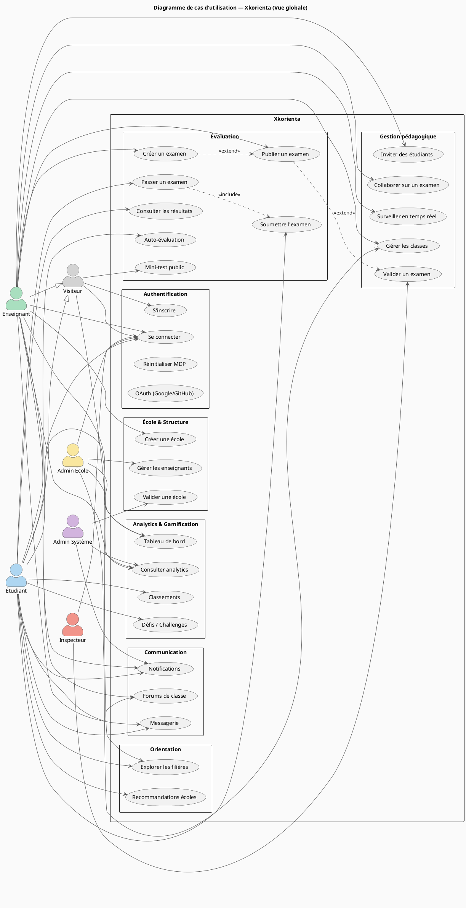

### 5.2 Cas d'utilisation — Module Évaluation (zoom)

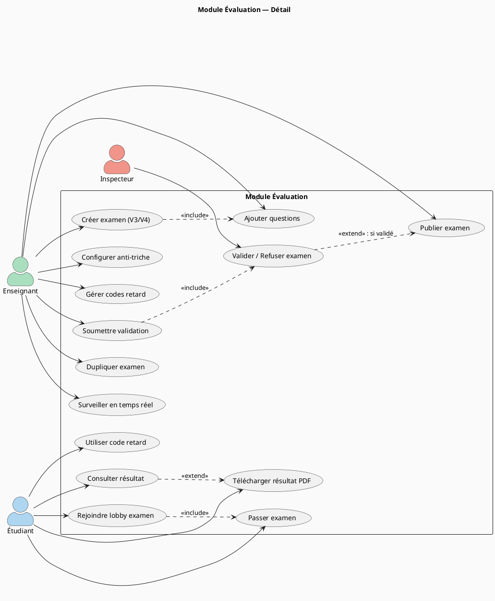

---

## 6. Description détaillée des cas d'utilisation

### UC-01 : S'inscrire sur la plateforme

| Champ | Valeur |
|-------|--------|
| **Identifiant** | UC-01 |
| **Nom** | Inscription utilisateur |
| **Acteur principal** | Visiteur |
| **Préconditions** | L'utilisateur n'a pas de compte existant |
| **Postconditions** | Compte créé, utilisateur redirigé vers l'onboarding |
| **Priorité** | Haute |

**Scénario nominal :**
1. Le visiteur accède à la page `/register`
2. Il saisit son nom, son email (ou téléphone), et son mot de passe
3. Il sélectionne sa catégorie (Enseignant ou Étudiant)
4. Le système valide les données (format email, force MDP ≥ 8 caractères)
5. Le système hache le mot de passe (bcrypt, salt=12)
6. Le compte est créé en base de données
7. L'utilisateur est redirigé vers `/onboarding`

**Scénarios alternatifs :**
- A1 : Email déjà utilisé → Message d'erreur 409 "Email déjà enregistré"
- A2 : Inscription via Google OAuth → Redirection OAuth, récupération du profil Google
- A3 : Inscription via numéro de téléphone (sans email) → Identifiant = téléphone

**Scénarios d'erreur :**
- E1 : Données invalides → Réponse 400 avec messages de validation champ par champ
- E2 : Serveur indisponible → Page d'erreur 500

---

### UC-02 : Se connecter

| Champ | Valeur |
|-------|--------|
| **Identifiant** | UC-02 |
| **Nom** | Authentification |
| **Acteur principal** | Tout utilisateur enregistré |
| **Préconditions** | L'utilisateur possède un compte actif |
| **Postconditions** | Session JWT créée, utilisateur redirigé selon son rôle |
| **Priorité** | Haute |

**Scénario nominal :**
1. L'utilisateur saisit son email/téléphone et son mot de passe
2. Le système vérifie les credentials via `POST /api/auth/verify`
3. Le backend compare le mot de passe avec le hash bcrypt
4. Un token JWT est généré (expiration 30 jours)
5. La session est enrichie avec le rôle, l'école, et les permissions
6. Redirection selon le rôle : `/dashboard/student`, `/dashboard/teacher`, etc.

**Scénarios alternatifs :**
- A1 : Connexion Google OAuth → Vérification du `id_token` sur le backend Google
- A2 : Compte non onboardé → Redirection vers `/onboarding`

**Scénarios d'erreur :**
- E1 : Identifiants incorrects → 401 "Identifiants invalides"
- E2 : Compte non trouvé → 404

---

### UC-03 : Créer un examen (V4)

| Champ | Valeur |
|-------|--------|
| **Identifiant** | UC-03 |
| **Nom** | Création d'examen multi-chapitres |
| **Acteur principal** | Enseignant |
| **Préconditions** | Enseignant authentifié, classe existante |
| **Postconditions** | Examen en état DRAFT sauvegardé |
| **Priorité** | Haute |

**Scénario nominal :**
1. L'enseignant accède au builder V4 (`/dashboard/teacher/exams/builder-v4`)
2. Il configure les métadonnées (titre, matière, classe, durée)
3. Il crée un ou plusieurs chapitres avec pondération
4. Il ajoute des questions (QCM, V/F, ouvertes, étude de cas) par chapitre
5. Il configure les options (mélange questions/réponses, anti-triche, feedback immédiat)
6. Il sauvegarde le brouillon → statut DRAFT
7. Il soumet pour validation → statut PENDING_VALIDATION

**Scénarios alternatifs :**
- A1 : Sauvegarde automatique toutes les 30 secondes (autosave)
- A2 : Duplication d'un examen existant → création d'un clone DRAFT
- A3 : Génération de questions par IA (HuggingFace) → ajout automatique

**Scénarios d'erreur :**
- E1 : Aucune question ajoutée → Impossible de soumettre, message 400
- E2 : Titre manquant → Validation bloquante

---

### UC-04 : Passer un examen

| Champ | Valeur |
|-------|--------|
| **Identifiant** | UC-04 |
| **Nom** | Session d'examen |
| **Acteur principal** | Étudiant |
| **Préconditions** | Examen publié, étudiant inscrit dans la classe |
| **Postconditions** | Tentative enregistrée avec score, étudiant voit ses résultats |
| **Priorité** | Haute |

**Scénario nominal :**
1. L'étudiant accède au lobby de l'examen
2. Il vérifie les informations (durée, nombre de questions, règles)
3. Il démarre l'examen → tentative créée en base (statut STARTED)
4. Le système charge les questions (mélangées si configuré)
5. L'étudiant répond aux questions, le temps est décompté
6. Il soumet l'examen → tentative passe en COMPLETED
7. Le score est calculé automatiquement
8. L'étudiant est redirigé vers la page de résultat

**Scénarios alternatifs :**
- A1 : Connexion coupée → Token de reprise (resume token) permet de continuer
- A2 : Utilisation d'un code retard → Examen alternatif débloqué
- A3 : Détection d'événement anti-triche → Alerte enregistrée, enseignant notifié en temps réel

**Scénarios d'erreur :**
- E1 : Temps écoulé → Soumission automatique, statut EXPIRED
- E2 : Tentative déjà existante → Blocage (une seule tentative par défaut)

---

### UC-05 : Module d'orientation (xkorienta)

| Champ | Valeur |
|-------|--------|
| **Identifiant** | UC-05 |
| **Nom** | Orientation scolaire et professionnelle |
| **Acteur principal** | Étudiant, Visiteur |
| **Préconditions** | Aucune (accessible sans compte) |
| **Postconditions** | Recommandations d'écoles et filières affichées |
| **Priorité** | Haute |

**Scénario nominal :**
1. L'utilisateur accède à `/xkorienta` ou `/dashboard/student/orientation`
2. Il renseigne son profil : niveau actuel, résultats, préférences
3. Le système analyse le profil via `PredictionEngine` et `AIInsightsService`
4. Les écoles et filières compatibles sont affichées avec scores de compatibilité
5. L'utilisateur peut filtrer par type d'établissement, localisation, frais
6. Il consulte le détail d'une filière ou école
7. Il peut sauvegarder ses favoris (si connecté)

---

## 7. Diagrammes de séquence

### 7.1 Séquence : Authentification par identifiants

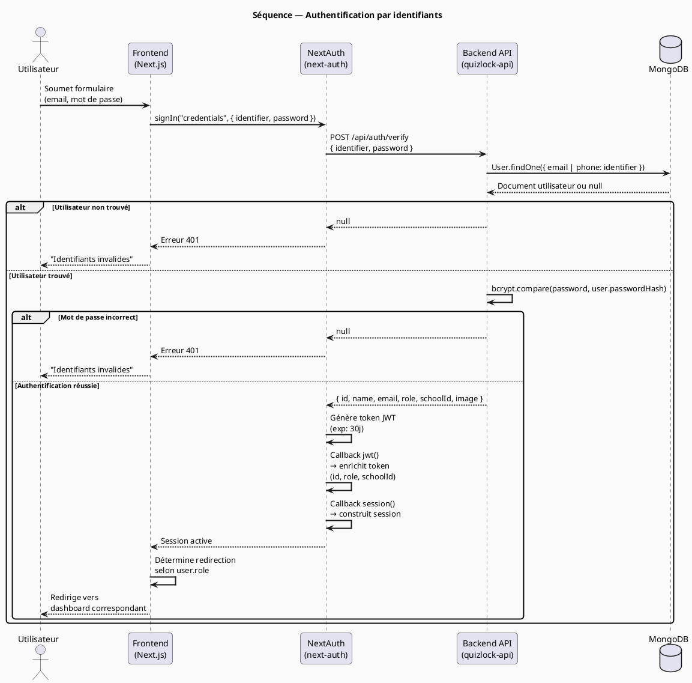

### 7.2 Séquence : Création et publication d'un examen

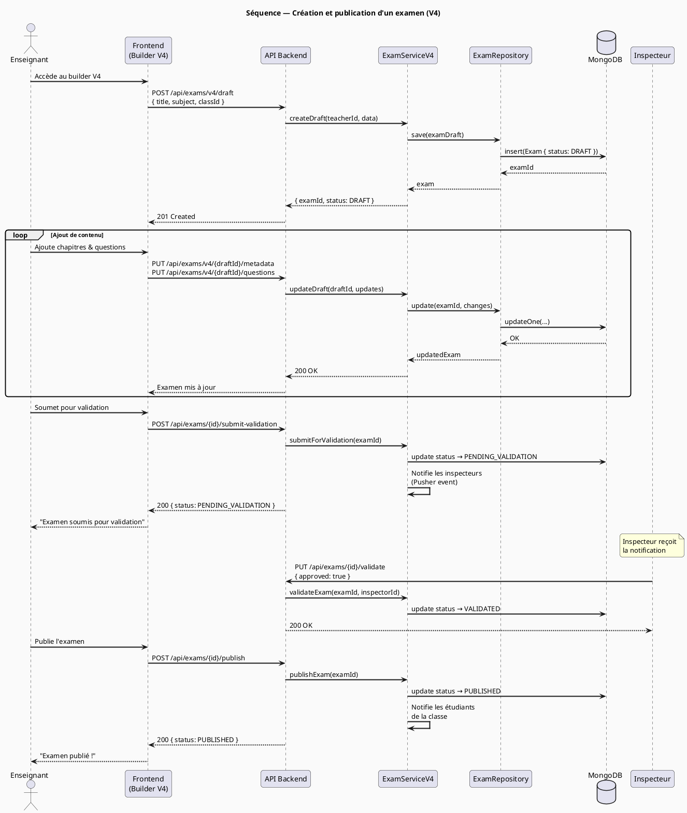

### 7.3 Séquence : Passage d'un examen

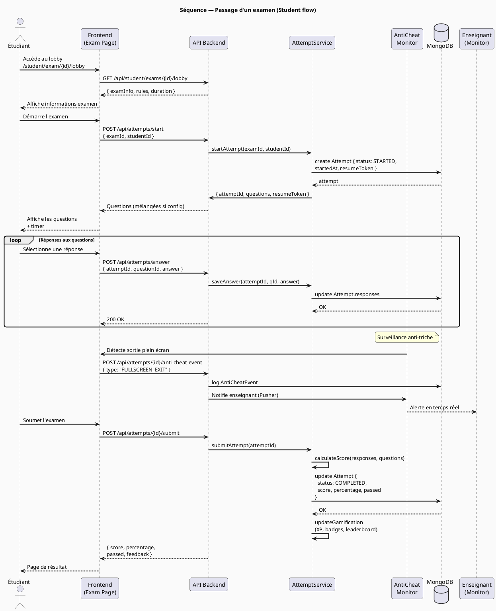

### 7.4 Séquence : Orientation (module xkorienta)

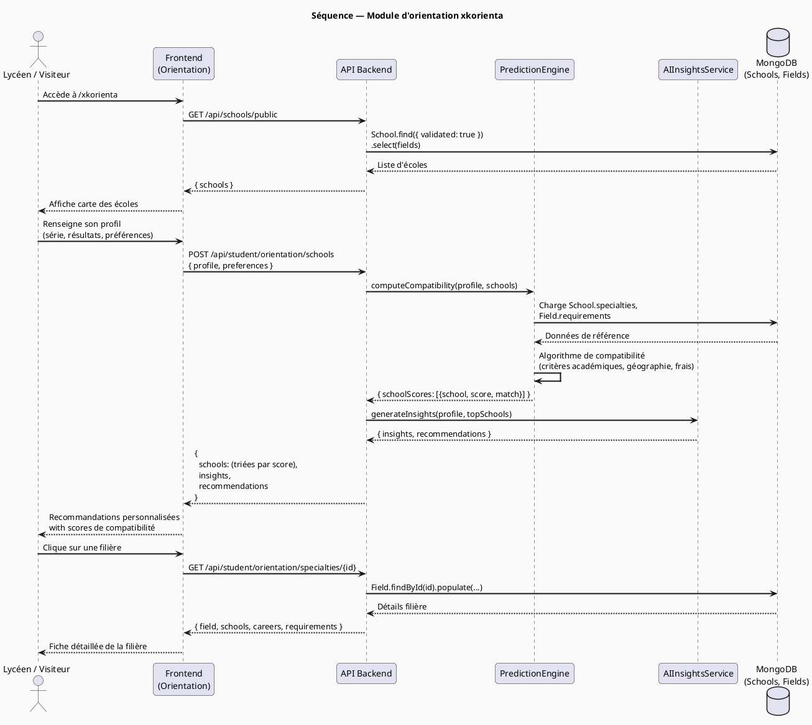

---

## 8. Diagrammes d'états

### 8.1 Cycle de vie d'un examen

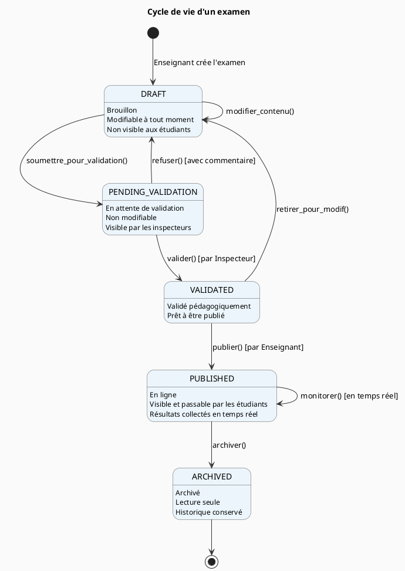

### 8.2 Cycle de vie d'une tentative d'examen

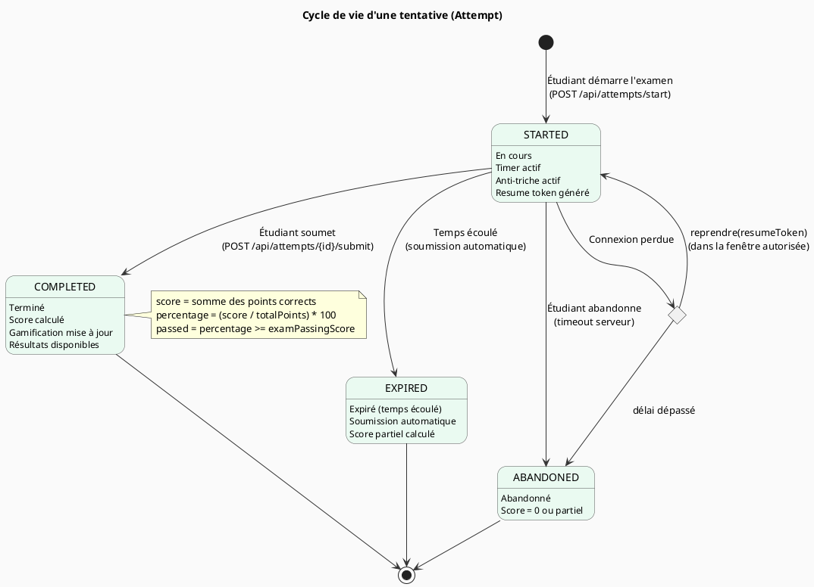

### 8.3 Cycle de vie d'une école

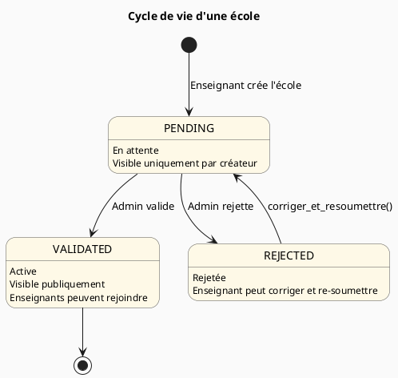

---

## 9. Diagramme d'activité

### 9.1 Processus d'inscription et d'onboarding

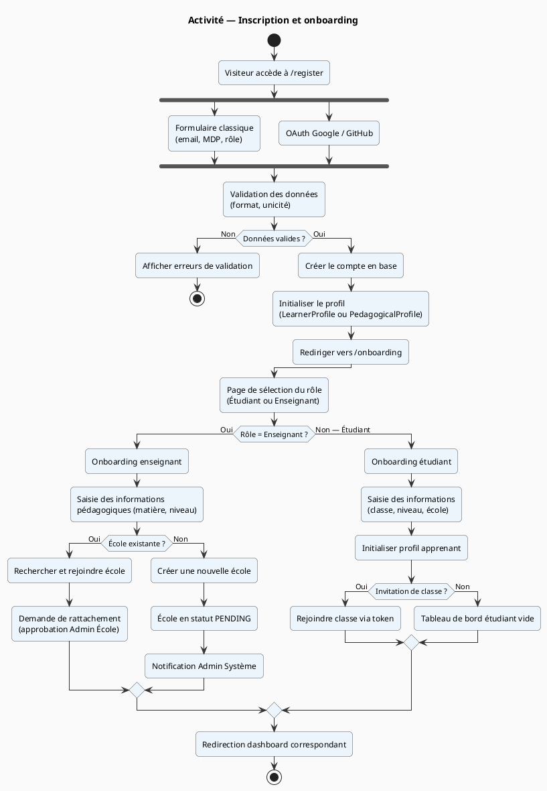

### 9.2 Processus complet de passage d'examen

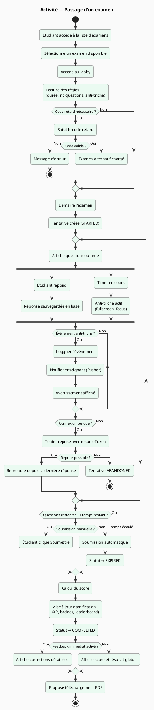

---

## 10. Exigences non fonctionnelles

### 10.1 Performance

| Exigence | Cible | Mesure |
|----------|-------|--------|
| Temps de réponse API (95e percentile) | < 2 s | Charge normale (50 utilisateurs simultanés) |
| Temps de chargement page initiale | < 3 s | Sur connexion 3G |
| Throughput | ≥ 200 requêtes/min | Pic de charge (examens simultanés) |
| Démarrage d'une tentative | < 1 s | Incluant la génération du token |

### 10.2 Sécurité

| Exigence | Implémentation |
|----------|---------------|
| Authentification | JWT, expiration 30 jours, refresh token |
| Hachage des mots de passe | bcrypt, salt rounds = 12 |
| Validation des entrées | Zod + mongoose-sanitize (prévention NoSQL injection) |
| Protection XSS | sanitize-html sur toutes les entrées HTML |
| Protection CSRF | NextAuth CSRF token intégré |
| Rate limiting | Implémenté sur les endpoints sensibles (login, register) |
| Headers de sécurité | Helmet.js (X-Frame-Options, HSTS, CSP) |
| Exposition minimale | Pas de stack trace en production, pas de données sensibles dans les réponses |

### 10.3 Disponibilité et fiabilité

| Exigence | Cible |
|----------|-------|
| Disponibilité | ≥ 99,5 % (hors maintenance planifiée) |
| Sauvegarde des données | Quotidienne, rétention 30 jours |
| Reprise après incident | RTO ≤ 1 heure |
| Résistance aux pannes réseau | Resume token pour les tentatives en cours |

### 10.4 Maintenabilité

| Exigence | Cible |
|----------|-------|
| Couverture de tests | ≥ 80 % de couverture de branches |
| Architecture | Couches séparées : Controller → Service → Repository |
| Documentation API | Swagger/OpenAPI intégré |
| Typage | TypeScript strict mode, zéro `any` |

### 10.5 Accessibilité et compatibilité

| Exigence | Cible |
|----------|-------|
| Navigateurs supportés | Chrome, Firefox, Safari, Edge (2 dernières versions) |
| Résolution minimale | 360px (mobile) |
| Internationalisation | Français, Anglais (next-intl) |
| Mode hors ligne | Non requis dans le MVP |

---

## 11. Règles métier

### 11.1 Gestion des examens

| ID | Règle |
|----|-------|
| RM-E01 | Un examen ne peut être publié qu'après avoir été validé par un inspecteur |
| RM-E02 | Un étudiant ne peut pas passer un examen s'il n'est pas inscrit dans la classe associée |
| RM-E03 | Par défaut, un étudiant ne peut passer un examen qu'une seule fois |
| RM-E04 | Tout événement anti-triche est loggué et visible par l'enseignant en temps réel |
| RM-E05 | Lorsque le temps est écoulé, l'examen est soumis automatiquement |
| RM-E06 | Un code de retard ne peut être utilisé qu'une seule fois et a une date d'expiration |
| RM-E07 | Le score est calculé côté serveur — jamais côté client |
| RM-E08 | Un examen archivé ne peut pas être republié |

### 11.2 Gestion des utilisateurs et rôles

| ID | Règle |
|----|-------|
| RM-U01 | Un enseignant doit être rattaché à une école validée pour créer des classes |
| RM-U02 | Un administrateur école ne peut gérer que son propre établissement |
| RM-U03 | La connexion est possible par email ou par numéro de téléphone |
| RM-U04 | Les mots de passe doivent contenir au minimum 8 caractères |
| RM-U05 | L'image de profil est stockée en base de données ; elle n'est jamais insérée dans le token JWT |

### 11.3 Gamification

| ID | Règle |
|----|-------|
| RM-G01 | Les points d'XP sont attribués uniquement à la complétion d'une tentative avec statut COMPLETED |
| RM-G02 | Un badge ne peut être attribué qu'une seule fois par utilisateur |
| RM-G03 | Le classement (leaderboard) est calculé quotidiennement et mis en cache |
| RM-G04 | Une série (streak) est réinitialisée si l'étudiant ne se connecte pas pendant 24 heures |

### 11.4 Accès freemium

| ID | Règle |
|----|-------|
| RM-F01 | Les mini-tests publics sont accessibles sans compte (session invité) |
| RM-F02 | Les résultats des sessions invités ne sont pas sauvegardés de façon permanente |
| RM-F03 | Un utilisateur invité ne peut pas accéder aux fonctionnalités sociales (forums, messagerie) |

---

## 12. Contraintes et risques

### 12.1 Contraintes techniques

| Contrainte | Description |
|------------|-------------|
| **CT-01** | MongoDB comme seul système de stockage (pas de base relationnelle) |
| **CT-02** | Cookie NextAuth limité à 4 Ko par chunk — les images base64 ne peuvent pas être stockées dans le JWT |
| **CT-03** | Next.js 16 (App Router) — architecture SSR/SSG à respecter |
| **CT-04** | Dépendance à Pusher pour le temps réel (service tiers payant) |

### 12.2 Contraintes métier

| Contrainte | Description |
|------------|-------------|
| **CM-01** | Support obligatoire du système scolaire camerounais bilingue (franco/anglophone) |
| **CM-02** | Certains utilisateurs n'ont pas d'adresse email — le téléphone doit suffire |
| **CM-03** | Accès freemium requis pour les populations à faible connectivité |

### 12.3 Risques identifiés

| ID | Risque | Probabilité | Impact | Mitigation |
|----|--------|-------------|--------|------------|
| R01 | Surcharge lors d'examens simultanés | Moyenne | Élevé | Pagination des questions, mise en cache |
| R02 | Perte de tentative en cas de coupure réseau | Élevée | Élevé | Resume token côté serveur |
| R03 | Dépassement des limites de cookies (JWT trop volumineux) | Haute | Moyen | Ne jamais stocker base64 dans le JWT |
| R04 | Dépendance à HuggingFace pour la génération IA | Faible | Faible | Fonctionnalité optionnelle, fallback manuel |
| R05 | Scalabilité MongoDB en forte charge | Faible | Élevé | Index sur toutes les colonnes de recherche, pagination obligatoire |

---

## 13. Glossaire

| Terme | Définition |
|-------|------------|
| **Attempt** | Tentative de passage d'un examen par un étudiant |
| **Anti-triche** | Mécanisme détectant les comportements suspects pendant un examen (changement d'onglet, sortie plein écran) |
| **Builder V4** | Interface de création d'examens multi-chapitres avec pondération |
| **Code retard (LateCode)** | Code alphanumérique permettant à un étudiant absent d'accéder à un examen alternatif |
| **Draft** | Brouillon d'examen, état initial non visible des étudiants |
| **Freemium** | Mode d'accès sans compte permettant de passer des mini-tests publics |
| **Gamification** | Système de points (XP), badges et classements pour motiver les apprenants |
| **Inspecteur** | Rôle chargé de valider pédagogiquement les examens avant publication |
| **JWT** | JSON Web Token — format de token utilisé pour les sessions utilisateur |
| **LearnerProfile** | Profil pédagogique complet d'un étudiant (styles d'apprentissage, progression, gamification) |
| **Pusher** | Service tiers de communication temps réel (WebSocket) |
| **Resume token** | Token permettant à un étudiant de reprendre un examen interrompu |
| **Self-assessment** | Auto-évaluation par concepts, permettant à l'étudiant de mesurer sa maîtrise sur une échelle à 7 niveaux |
| **Xkorienta** | Module d'orientation scolaire et professionnelle intégré à la plateforme |

---

*Document établi sur la base du MVP validé de la plateforme Xkorienta — Avril 2026*
*Pour toute modification, soumettre une demande de revue documentaire.*
