# Cahier de Conception — Xkorienta

> **Projet :** Xkorienta (anciennement QuizLock)
> **Version :** 1.0
> **Date :** Avril 2026
> **Statut :** MVP — Architecture de référence

---

## Table des matières

1. [Introduction et choix architecturaux](#1-introduction-et-choix-architecturaux)
2. [Architecture générale du système](#2-architecture-générale-du-système)
3. [Diagramme de composants](#3-diagramme-de-composants)
4. [Diagramme de déploiement](#4-diagramme-de-déploiement)
5. [Architecture en couches (Backend)](#5-architecture-en-couches-backend)
6. [Modèle de données](#6-modèle-de-données)
7. [Conception de l'API REST](#7-conception-de-lapi-rest)
8. [Architecture de sécurité](#8-architecture-de-sécurité)
9. [Architecture temps réel](#9-architecture-temps-réel)
10. [Architecture frontend](#10-architecture-frontend)
11. [Stratégie de tests](#11-stratégie-de-tests)
12. [Décisions architecturales (ADR)](#12-décisions-architecturales-adr)

---

## 1. Introduction et choix architecturaux

### 1.1 Positionnement architectural

Xkorienta adopte une architecture **monorepo découplé** composée de deux applications Next.js indépendantes :

| Application | Rôle | Port | Framework |
|-------------|------|------|-----------|
| `quizlock-app` | Frontend / BFF | 3000 | Next.js 16 (App Router) |
| `quizlock-api` | Backend API | 3001 | Next.js 16 (API Routes) + Mongoose |

Les deux applications communiquent via HTTP REST. Le frontend agit comme un BFF (_Backend for Frontend_) en proxifiant les appels vers l'API et en gérant la session utilisateur via NextAuth.

### 1.2 Justification des choix technologiques

| Choix | Technologie | Justification |
|-------|-------------|---------------|
| Runtime | Node.js / TypeScript | Typage strict, écosystème npm riche, full-stack JS unifié |
| Framework | Next.js 16 | SSR/SSG, App Router, API Routes, déploiement standalone |
| Base de données | MongoDB (Mongoose) | Flexibilité du schéma, adapté aux données pédagogiques hétérogènes, scalabilité horizontale |
| Authentification | NextAuth v4 | OAuth intégré (Google, GitHub), JWT sessions, extensible |
| Communication temps réel | Pusher | WebSocket managé, idéal pour la surveillance d'examens sans infrastructure complexe |
| Hachage | bcrypt (salt=12) | Standard de l'industrie pour les mots de passe |
| Validation | Zod + mongoose-sanitize | Double validation (schéma + NoSQL injection) |
| CSS | Tailwind CSS v4 | Utility-first, cohérence UI, build optimisé |
| Animations | Framer Motion | Transitions fluides, API déclarative |
| Graphiques | Recharts | Composants React natifs, léger |

---

## 2. Architecture générale du système

### 2.1 Vue d'ensemble

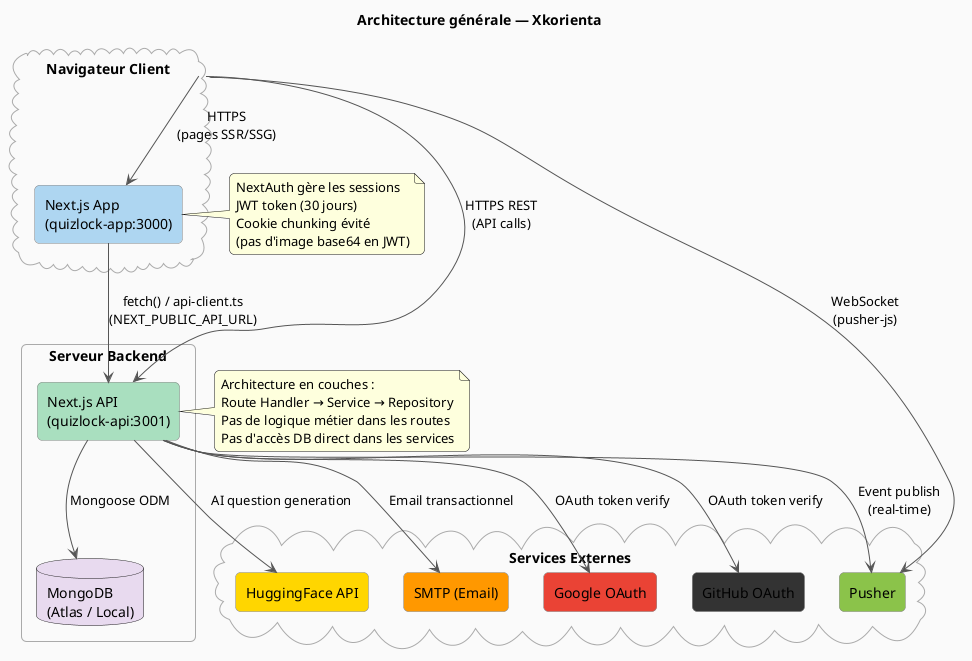

---

## 3. Diagramme de composants

### 3.1 Composants Backend

```plantuml
@startuml COMP_Backend
skinparam backgroundColor #FAFAFA
skinparam componentStyle rectangle
skinparam componentBorderColor #888888
skinparam packageBorderColor #AAAAAA
skinparam ArrowColor #555555
skinparam roundcorner 10

title Composants Backend — quizlock-api

package "API Layer (Route Handlers)" as API #EBF5FB {
  component "[auth/*]" as AuthRoutes
  component "[exams/*]" as ExamRoutes
  component "[attempts/*]" as AttemptRoutes
  component "[classes/*]" as ClassRoutes
  component "[schools/*]" as SchoolRoutes
  component "[student/*]" as StudentRoutes
  component "[teacher/*]" as TeacherRoutes
  component "[admin/*]" as AdminRoutes
  component "[public/*]" as PublicRoutes
  component "[user/profile]" as UserRoutes
  component "[forums/*]" as ForumRoutes
  component "[notifications/*]" as NotifRoutes
}

package "Service Layer" as SVC #EAFAF1 {
  component "AuthService" as AuthSvc
  component "ExamServiceV4" as ExamSvc
  component "AttemptService" as AttemptSvc
  component "ClassService" as ClassSvc
  component "SchoolService" as SchoolSvc
  component "SelfAssessmentService" as SASvc
  component "GamificationService" as GameSvc
  component "LeaderboardService" as LBSvc
  component "PredictionEngine" as PredSvc
  component "AIInsightsService" as AISvc
  component "HuggingFaceService" as HFSvc
  component "LateCodeService" as LCSvc
  component "ForumService" as ForumSvc
  component "NotificationService" as NotifSvc
}

package "Repository Layer" as REPO #FEF9E7 {
  component "UserRepository" as UserRepo
  component "ExamRepository" as ExamRepo
  component "AttemptRepository" as AttemptRepo
  component "ClassRepository" as ClassRepo
  component "SchoolRepository" as SchoolRepo
  component "QuestionRepository" as QRepo
  component "LearnerProfileRepository" as LPRepo
  component "LateCodeRepository" as LCRepo
  component "ForumRepository" as ForumRepo
  component "InvitationRepository" as InvRepo
}

package "Models (Mongoose)" as MODELS #F9EBEA {
  component "User" as UserModel
  component "Exam" as ExamModel
  component "Attempt" as AttemptModel
  component "Class" as ClassModel
  component "School" as SchoolModel
  component "Question" as QuestionModel
  component "LearnerProfile" as LPModel
  component "SelfAssessmentResult" as SAModel
  component "LateCode" as LCModel
  component "Forum / ForumPost" as ForumModel
  component "Notification" as NotifModel
  component "Challenge / Badge" as GameModel
}

package "Cross-cutting Concerns" as CC #F4ECF7 {
  component "withRole() Middleware" as RoleMiddleware
  component "rateLimiter" as RateLimiter
  component "sanitize()" as Sanitizer
  component "fileUploadSecurity" as FileSecure
  component "securityHeaders" as Headers
  component "EventPublisher (Pusher)" as EventPub
}

' API → Service
AuthRoutes --> AuthSvc
ExamRoutes --> ExamSvc
AttemptRoutes --> AttemptSvc
ClassRoutes --> ClassSvc
SchoolRoutes --> SchoolSvc
StudentRoutes --> SASvc
StudentRoutes --> GameSvc
AdminRoutes --> SchoolSvc
PublicRoutes --> AttemptSvc
NotifRoutes --> NotifSvc

' Service → Repository
AuthSvc --> UserRepo
ExamSvc --> ExamRepo
ExamSvc --> QRepo
AttemptSvc --> AttemptRepo
AttemptSvc --> ExamRepo
ClassSvc --> ClassRepo
SchoolSvc --> SchoolRepo
GameSvc --> LPRepo
LCSvc --> LCRepo
ForumSvc --> ForumRepo

' Repository → Models
UserRepo --> UserModel
ExamRepo --> ExamModel
AttemptRepo --> AttemptModel
ClassRepo --> ClassModel
SchoolRepo --> SchoolModel
QRepo --> QuestionModel
LPRepo --> LPModel
LCRepo --> LCModel
ForumRepo --> ForumModel

' Middleware intercepts all routes
RoleMiddleware .up.> AuthRoutes : applies to
RateLimiter .up.> AuthRoutes : applies to
Sanitizer .up.> AuthRoutes : applies to

' Event publisher
AttemptSvc --> EventPub : publishes events
ExamSvc --> EventPub : publishes events
EventPub --> Pusher : WebSocket

@enduml
```

### 3.2 Composants Frontend

```plantuml
@startuml COMP_Frontend
skinparam backgroundColor #FAFAFA
skinparam componentStyle rectangle
skinparam componentBorderColor #888888
skinparam packageBorderColor #AAAAAA
skinparam ArrowColor #555555
skinparam roundcorner 10

title Composants Frontend — quizlock-app

package "App Router (Pages)" as Pages #EBF5FB {
  component "/ (Landing)" as LandingPage
  component "/login\n/register" as AuthPages
  component "/dashboard/student/*" as StudentPages
  component "/dashboard/teacher/*" as TeacherPages
  component "/dashboard/admin/*" as AdminPages
  component "/student/exam/*" as ExamPages
  component "/xkorienta" as OrientPage
  component "/mini-test/*" as MiniTestPages
  component "/settings" as SettingsPage
}

package "API Routes (BFF)" as BFFAPI #E8DAEF {
  component "api/auth/[...nextauth]" as AuthAPI
  component "api/health" as HealthAPI
}

package "Components (UI)" as UIComp #EAFAF1 {
  component "shadcn/ui (Radix)" as ShadcnComp
  component "ExamBuilder V4" as ExamBuilderComp
  component "ExamTaker" as ExamTakerComp
  component "Analytics Charts\n(Recharts)" as ChartComp
  component "OrientationMap" as OrientComp
  component "Leaderboard" as LBComp
  component "Forum Components" as ForumComp
  component "Notification System" as NotifComp
}

package "Lib / Utilities" as Lib #FEF9E7 {
  component "api-client.ts\n(HTTP abstraction)" as ApiClient
  component "auth.ts\n(NextAuth config)" as AuthConfig
  component "useSession()" as SessionHook
  component "next-intl\n(i18n)" as I18n
  component "Pusher client\n(pusher-js)" as PusherClient
}

package "External Services" as Ext #F9EBEA {
  component "NextAuth\n(JWT sessions)" as NextAuth
  component "quizlock-api:3001" as BackendAPI
}

' Pages use components
StudentPages --> ChartComp
StudentPages --> LBComp
StudentPages --> ForumComp
TeacherPages --> ExamBuilderComp
TeacherPages --> ChartComp
ExamPages --> ExamTakerComp
OrientPage --> OrientComp

' Pages use auth
AuthPages --> NextAuth
StudentPages --> SessionHook
TeacherPages --> SessionHook

' API calls
ApiClient --> BackendAPI
StudentPages --> ApiClient
TeacherPages --> ApiClient
ExamTakerComp --> ApiClient

' Real-time
ExamTakerComp --> PusherClient
NotifComp --> PusherClient

' Auth
AuthConfig --> NextAuth
AuthAPI --> AuthConfig

@enduml
```

---

## 4. Diagramme de déploiement

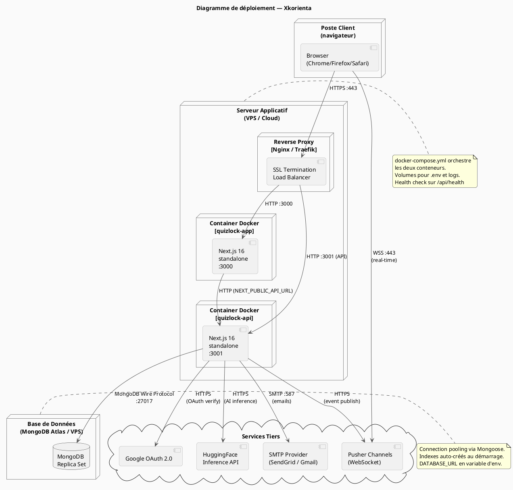

---

## 5. Architecture en couches (Backend)

### 5.1 Principe de séparation des responsabilités

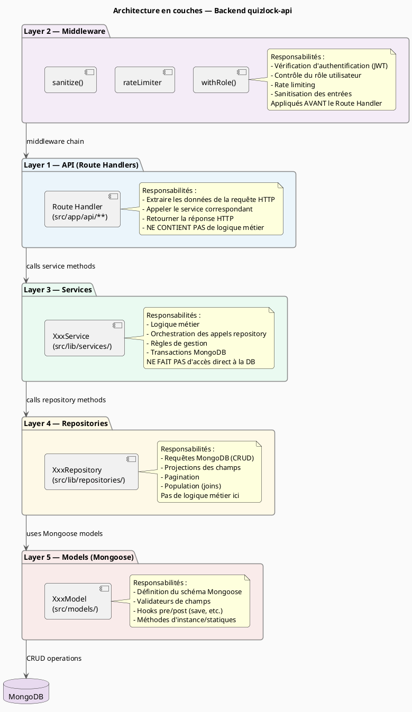

### 5.2 Exemple de flux : Soumission d'une tentative

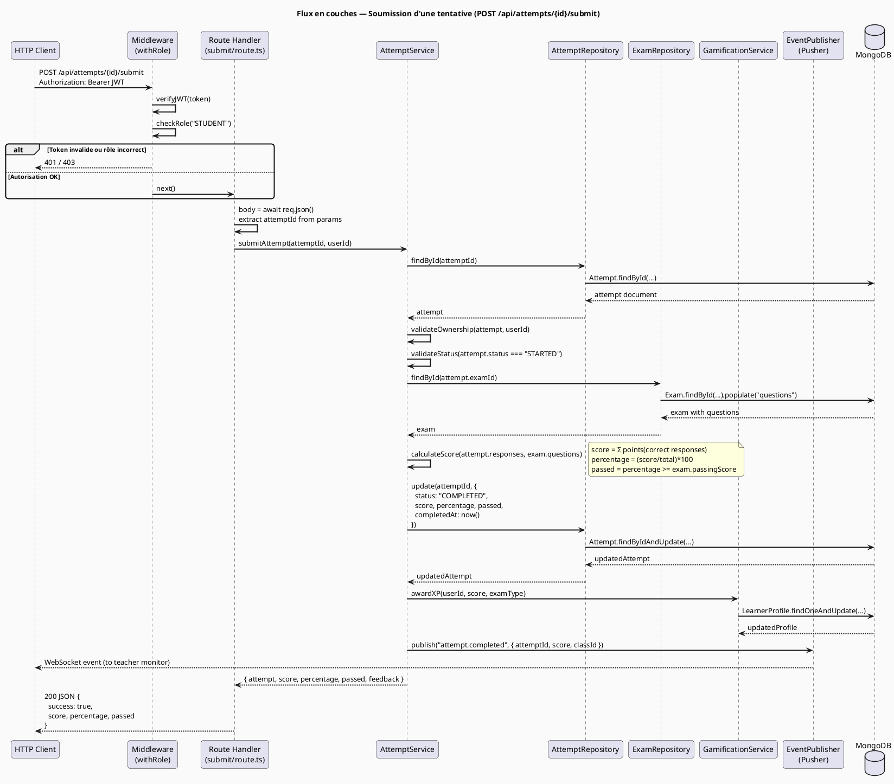

---

## 6. Modèle de données

### 6.1 Diagramme Entité-Relation (ER) — Entités principales

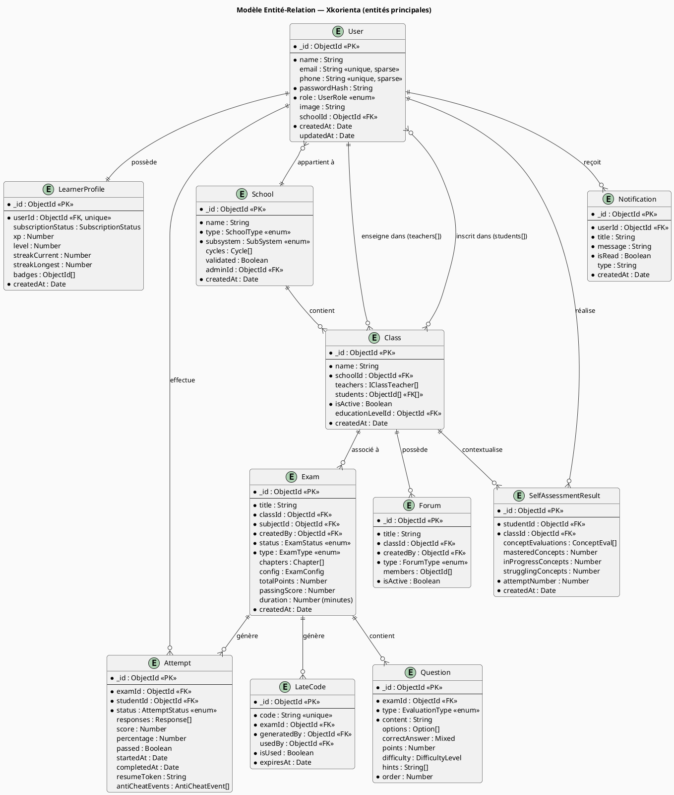

### 6.2 Détail du modèle Exam (V4 multi-chapitres)

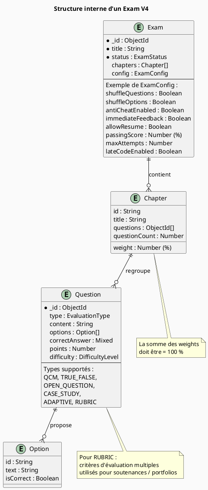

---

## 7. Conception de l'API REST

### 7.1 Conventions de l'API

| Convention | Valeur |
|------------|--------|
| Format | JSON |
| Authentification | Bearer JWT (Header : `Authorization: Bearer <token>`) |
| Versionnement | Implicite via chemins (`/api/exams/v4/...`) |
| Codes HTTP | Standard REST (200, 201, 400, 401, 403, 404, 409, 500) |
| Pagination | Query params : `?page=1&limit=20` |
| Réponse succès | `{ success: true, data: {...} }` ou `{ success: true, <resource>: {...} }` |
| Réponse erreur | `{ success: false, message: "...", errors?: [...] }` |

### 7.2 Endpoints principaux

```plantuml
@startuml API_Endpoints
skinparam backgroundColor #FAFAFA
skinparam packageBorderColor #888888
skinparam componentBorderColor #AAAAAA
skinparam ArrowColor #555555

title Cartographie des endpoints principaux

package "Auth" #EBF5FB {
  component "POST /api/auth/register" as R1
  component "POST /api/auth/verify" as R2
  component "POST /api/auth/google/verify" as R3
  component "POST /api/auth/forgot-password" as R4
  component "POST /api/auth/reset-password" as R5
}

package "Exams" #EAFAF1 {
  component "GET|POST /api/exams" as E1
  component "GET|PUT|DELETE /api/exams/{id}" as E2
  component "POST /api/exams/{id}/submit-validation" as E3
  component "PUT /api/exams/{id}/validate" as E4
  component "POST /api/exams/{id}/publish" as E5
  component "POST /api/exams/{id}/duplicate" as E6
  component "GET /api/exams/{id}/results" as E7
  component "GET /api/exams/{id}/monitor" as E8
  component "POST /api/exams/v4/draft" as E9
  component "PUT /api/exams/v4/{id}/metadata" as E10
}

package "Attempts" #FEF9E7 {
  component "POST /api/attempts/start" as A1
  component "POST /api/attempts/{id}/submit" as A2
  component "GET /api/attempts/{id}/resume" as A3
  component "POST /api/attempts/{id}/anti-cheat-event" as A4
  component "POST /api/attempts/answer" as A5
}

package "Classes & Schools" #F9EBEA {
  component "GET|POST /api/classes" as C1
  component "GET|PUT|DELETE /api/classes/{id}" as C2
  component "GET|POST /api/schools" as S1
  component "GET|PUT|DELETE /api/schools/{id}" as S2
  component "POST /api/admin/schools/{id}/validate" as S3
}

package "Student" #F4ECF7 {
  component "GET /api/student/exams" as ST1
  component "GET /api/student/analytics" as ST2
  component "GET /api/student/leaderboard" as ST3
  component "GET|POST /api/self-assessments/submit" as ST4
  component "GET /api/student/orientation/schools" as ST5
}

package "User & Profiles" #E8DAEF {
  component "GET|PUT /api/user/profile" as U1
  component "GET|PUT /api/profiles/learner" as U2
  component "GET|PUT /api/profiles/pedagogical" as U3
}

@enduml
```

### 7.3 Contrats d'interface — Endpoints critiques

**POST /api/attempts/start**
```
Request Body:
{
  "examId": "ObjectId",
  "lateCode"?: "string"       // optionnel, si retardataire
}

Response 201:
{
  "success": true,
  "attempt": {
    "_id": "ObjectId",
    "status": "STARTED",
    "startedAt": "ISO8601",
    "resumeToken": "uuid-v4",
    "timeLimit": 3600          // secondes
  },
  "questions": [               // mélangées si config
    {
      "_id": "ObjectId",
      "type": "QCM",
      "content": "...",
      "options": [{ "id": "...", "text": "..." }],
      "points": 2
      // correctAnswer ABSENT de la réponse
    }
  ]
}

Errors:
  400 - Examen non accessible
  403 - Étudiant non inscrit dans la classe
  409 - Tentative déjà en cours
```

**POST /api/attempts/{id}/submit**
```
Request Body: {} (empty — toutes les réponses déjà sauvegardées)

Response 200:
{
  "success": true,
  "score": 14,
  "totalPoints": 20,
  "percentage": 70,
  "passed": true,
  "feedback"?: {              // si immediateFeedback activé
    "questions": [
      {
        "questionId": "...",
        "correct": true,
        "correctAnswer": "...",
        "explanation": "..."
      }
    ]
  }
}
```

---

## 8. Architecture de sécurité

### 8.1 Flux d'authentification et d'autorisation

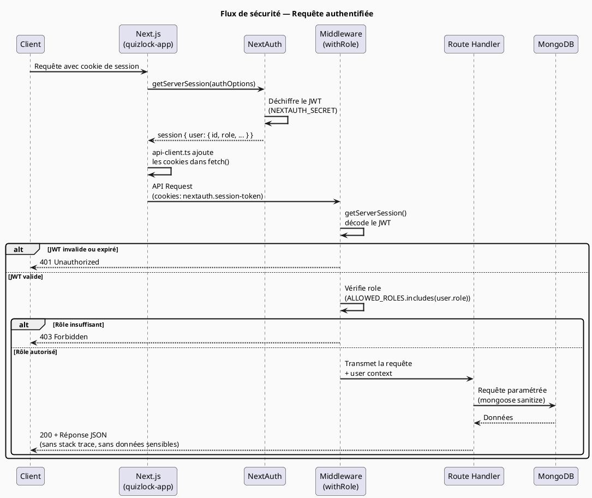

### 8.2 Matrice des contrôles de sécurité

| Vecteur d'attaque | Contrôle mis en place | Couche |
|-------------------|----------------------|--------|
| **Injection NoSQL** | `mongoose-sanitize` sur toutes les entrées | Service/Repository |
| **XSS** | `sanitize-html` sur le contenu HTML | Service |
| **Injection SQL** | N/A (MongoDB, pas de SQL) | — |
| **CSRF** | Token CSRF NextAuth (intégré) | Frontend/NextAuth |
| **Brute force** | Rate limiter sur `/api/auth/*` | Middleware |
| **JWT forgé** | Vérification HMAC avec NEXTAUTH_SECRET | NextAuth |
| **Exposition mot de passe** | bcrypt (salt=12), jamais loggué | Service |
| **Cookie overflow** | Image base64 jamais dans le JWT | NextAuth config |
| **Privilege escalation** | `withRole()` middleware sur chaque route | Middleware |
| **Exposition stack trace** | `try/catch` global, réponses d'erreur génériques | Route Handlers |
| **Headers HTTP** | Helmet.js (CSP, HSTS, X-Frame-Options) | Middleware global |
| **CORS** | Origines autorisées configurées | next.config.ts |
| **Données sensibles en réponse** | Sélection explicite des champs (`.select()`) | Repository |

### 8.3 Hachage et stockage des mots de passe

```
1. Inscription :
   passwordHash = await bcrypt.hash(plainPassword, 12)
   → Stocké dans User.passwordHash

2. Connexion :
   const valid = await bcrypt.compare(plainPassword, user.passwordHash)
   → Jamais de comparaison en clair

3. Réinitialisation :
   → Token temporaire haché en SHA-256
   → Expiration : 1 heure
   → Usage unique (invalidé après utilisation)
```

---

## 9. Architecture temps réel

### 9.1 Conception du système temps réel (Pusher)

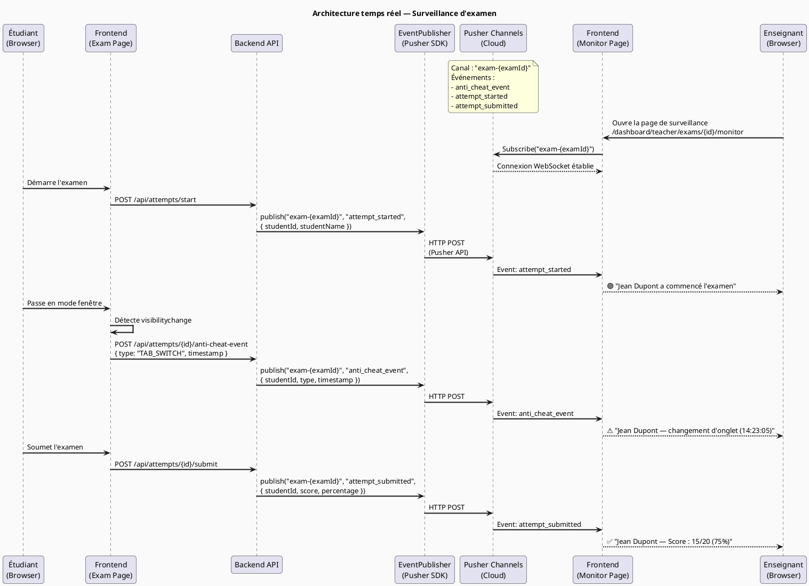

### 9.2 Structure des événements Pusher

| Canal | Événement | Déclencheur | Payload |
|-------|-----------|-------------|---------|
| `exam-{examId}` | `attempt_started` | Démarrage tentative | `{ studentId, studentName, startedAt }` |
| `exam-{examId}` | `attempt_submitted` | Soumission | `{ studentId, score, percentage, passed }` |
| `exam-{examId}` | `anti_cheat_event` | Événement suspects | `{ studentId, type, timestamp }` |
| `user-{userId}` | `notification` | Nouvelle notification | `{ title, message, type }` |
| `class-{classId}` | `exam_published` | Publication examen | `{ examId, examTitle, dueDate }` |

---

## 10. Architecture frontend

### 10.1 Organisation des routes (App Router)

```plantuml
@startuml FE_Routes
skinparam backgroundColor #FAFAFA
skinparam packageBorderColor #888888
skinparam componentBorderColor #AAAAAA
skinparam ArrowColor #555555
skinparam roundcorner 10

title Structure des routes — quizlock-app (App Router)

package "/ (Public)" #EBF5FB {
  component "Landing Page" as LP
  component "/login\n/register\n/forgot-password" as AuthR
  component "/mini-test/*\n(freemium)" as MiniR
  component "/xkorienta\n(orientation publique)" as OrientR
  component "/join/{token}\n(invitation)" as JoinR
}

package "/(dashboard)" #EAFAF1 {
  note : Layout avec sidebar, navbar,\nguard d'authentification

  package "student/*" #D5F5E3 {
    component "/ — Dashboard" as SD
    component "/classes/*" as SC
    component "/exams" as SE
    component "/history/*" as SH
    component "/analytics\n/progression" as SA
    component "/leaderboard\n/challenges" as SG
    component "/orientation/*" as SO
    component "/forums/*\n/messages" as SF
  }

  package "teacher/*" #D6EAF8 {
    component "/ — Dashboard" as TD
    component "/classes/*" as TC
    component "/exams/*\n(create, builder-v4)" as TE
    component "/syllabus/*" as TSyl
    component "/schools/*\n/school" as TS
    component "/students/*" as TSt
    component "/forums/*\n/messages" as TF
  }

  package "admin/*" #FEF9E7 {
    component "/ — Dashboard" as AD
    component "/schools/*" as AS
    component "/classes\n/teachers" as AC
    component "/notifications\n/compose" as AN
  }

  component "/settings" as SET
}

package "/student/exam/*" #F9EBEA {
  note : Routes hors dashboard\n(plein écran pour l'examen)
  component "/{id}/lobby\n/{id}/take\n/{id}/result" as ExamFlow
}

LP --> AuthR : unauthenticated flow
AuthR --> SD : après login student
AuthR --> TD : après login teacher
AuthR --> AD : après login admin
ExamFlow -.-> SD : après résultat

@enduml
```

### 10.2 Gestion de l'état et des données

| Mécanisme | Usage | Implémentation |
|-----------|-------|----------------|
| **Session NextAuth** | Identité utilisateur (id, rôle, nom) | `useSession()` hook |
| **State local (useState)** | Formulaires, UI state temporaire | React hooks |
| **API fetching** | Données serveur (pas de SWR/React Query dans MVP) | `api-client.ts` + `useEffect` |
| **URL state** | Filtres, pagination, onglets actifs | `useSearchParams()` |
| **Pusher client** | Événements temps réel | `pusher-js` + `useEffect` |
| **Cookie session** | JWT utilisateur — limité à 4 Ko par chunk | NextAuth chunking |

### 10.3 Stratégie de chargement des données

```
Page Server Component :
  → Utilise getServerSession() pour l'authentification
  → Peut appeler l'API directement côté serveur
  → Passe les données initiales en props aux Client Components

Page Client Component :
  → Utilise useSession() pour accéder à la session
  → Utilise api-client.ts pour les requêtes dynamiques
  → useEffect pour les chargements conditionnels (ex: avatar depuis l'API)

Images / Avatars :
  → JAMAIS stockés dans le JWT (trop volumineux)
  → Chargés depuis GET /api/user/profile au montage du composant
  → Stockés en MongoDB (base64) — évolution prévue vers stockage objet (S3)
```

---

## 11. Stratégie de tests

### 11.1 Pyramide de tests

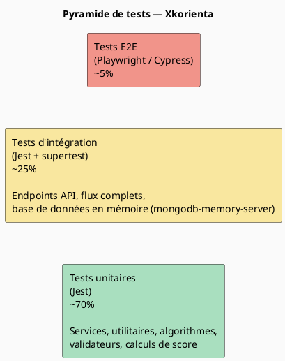

### 11.2 Organisation des tests

```
quizlock-api/__tests__/
├── unit/
│   ├── models/          → Tests des modèles Mongoose (validations, hooks)
│   ├── lib/
│   │   ├── services/    → Tests unitaires des services (mocks des repos)
│   │   ├── patterns/    → Tests des patterns (Strategy, AccessHandler)
│   │   └── factories/   → Tests des factories
│   └── seed/            → Tests des seeders
├── integration/
│   └── api/             → Tests des endpoints (supertest + mongodb-memory-server)
│       ├── auth.test.ts
│       ├── exams.test.ts
│       ├── attempts.test.ts
│       └── onboarding.test.ts
└── helpers/
    ├── db-setup.ts      → Configuration MongoDB en mémoire
    ├── mock-data.ts     → Fixtures de test
    └── test-utils.tsx   → Utilitaires partagés
```

### 11.3 Couverture minimale requise

| Catégorie | Cible |
|-----------|-------|
| Services | ≥ 85 % |
| Repositories | ≥ 75 % |
| Route Handlers | ≥ 70 % |
| Modèles/Validateurs | ≥ 90 % |
| Global | ≥ 80 % |

### 11.4 Standards de rédaction des tests

```typescript
// Standard TDD appliqué sur le projet
describe('[FeatureName]', () => {
  describe('[methodName]', () => {

    it('should [comportement attendu] when [condition nominale]', async () => {
      // Arrange
      const mockData = buildMockData();
      jest.spyOn(repository, 'findById').mockResolvedValue(mockData);

      // Act
      const result = await service.doSomething(mockData._id);

      // Assert
      expect(result.success).toBe(true);
      expect(result.score).toBeGreaterThan(0);
    });

    it('should throw [erreur] when [condition invalide]', async () => {
      // Test des cas d'erreur
      await expect(service.doSomething(null)).rejects.toThrow('...');
    });

    it('should sanitize SQL injection attempt', async () => {
      // Test de sécurité
      const malicious = "'; DROP TABLE users; --";
      const result = await service.findByName(malicious);
      expect(result).toEqual([]);
    });

  });
});
```

---

## 12. Décisions architecturales (ADR)

### ADR-001 : Two Next.js apps au lieu d'un monolithe

| Champ | Valeur |
|-------|--------|
| **Statut** | Accepté |
| **Contexte** | Besoin de séparer frontend et backend pour la scalabilité et le déploiement indépendant |
| **Décision** | Deux applications Next.js distinctes : `quizlock-app` (port 3000) et `quizlock-api` (port 3001) |
| **Conséquences** | (+) Déploiement indépendant, séparation des responsabilités, scalabilité horizontale. (-) Double configuration, deux `package.json` à maintenir |

---

### ADR-002 : MongoDB plutôt qu'une base relationnelle

| Champ | Valeur |
|-------|--------|
| **Statut** | Accepté |
| **Contexte** | Les données pédagogiques (questions, réponses, structures d'examens) sont hétérogènes et évoluent fréquemment |
| **Décision** | MongoDB avec Mongoose comme ODM |
| **Conséquences** | (+) Flexibilité du schéma, documents imbriqués pour les chapitres/questions, pas de migrations structurelles. (-) Pas de contraintes de clés étrangères, risque d'incohérence des références si non géré côté application |

---

### ADR-003 : JWT sessions sans base de données (stateless)

| Champ | Valeur |
|-------|--------|
| **Statut** | Accepté |
| **Contexte** | Simplicité de déploiement, pas de session store à gérer |
| **Décision** | JWT signé avec NEXTAUTH_SECRET, expiration 30 jours, sessions stateless |
| **Conséquences** | (+) Scalabilité horizontale native, pas de Redis nécessaire. (-) Impossible de révoquer une session avant expiration — mitigation : expiration courte pour les rôles sensibles |

---

### ADR-004 : Pas d'image base64 dans le JWT

| Champ | Valeur |
|-------|--------|
| **Statut** | Accepté |
| **Contexte** | Les images de profil en base64 peuvent dépasser 1 Mo, ce qui génère des centaines de chunks de cookies (limite 4 Ko/cookie) et provoque des pertes de données au rechargement |
| **Décision** | Le champ `image` est explicitement exclu du token JWT. Les avatars sont chargés via `GET /api/user/profile` au montage du composant |
| **Conséquences** | (+) Sessions légères, fiables. (-) Un appel API supplémentaire pour l'avatar. Évolution future : stockage objet (S3/R2) avec URLs signées |

---

### ADR-005 : Architecture V3/V4 parallèle pour les examens

| Champ | Valeur |
|-------|--------|
| **Statut** | Accepté |
| **Contexte** | L'évolution vers les examens multi-chapitres (V4) devait coexister avec les examens simples (V3) sans casser l'existant |
| **Décision** | Routes parallèles `/api/exams/v4/*` avec `ExamServiceV4` dédié. V3 maintenu pour compatibilité |
| **Conséquences** | (+) Pas de rupture de compatibilité, déploiement progressif. (-) Duplication partielle de code à résorber dans une future version unifiée |

---

### ADR-006 : Pusher pour le temps réel plutôt que WebSocket natif

| Champ | Valeur |
|-------|--------|
| **Statut** | Accepté |
| **Contexte** | La surveillance d'examens en temps réel nécessite des WebSockets. Next.js (serveur stateless) ne supporte pas nativement les WebSockets persistants |
| **Décision** | Pusher Channels comme service managé de WebSocket |
| **Conséquences** | (+) Pas d'infrastructure WebSocket à gérer, SDK client et serveur. (-) Dépendance à un service tiers payant, coût variable selon le volume |

---

*Document de référence de l'architecture Xkorienta — Avril 2026*
*Toute modification de ces décisions doit faire l'objet d'un nouvel ADR avec justification.*
