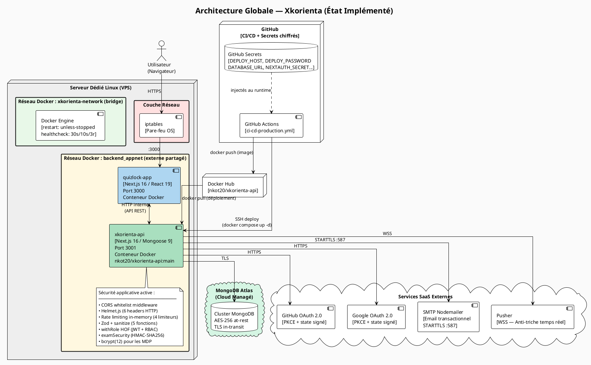
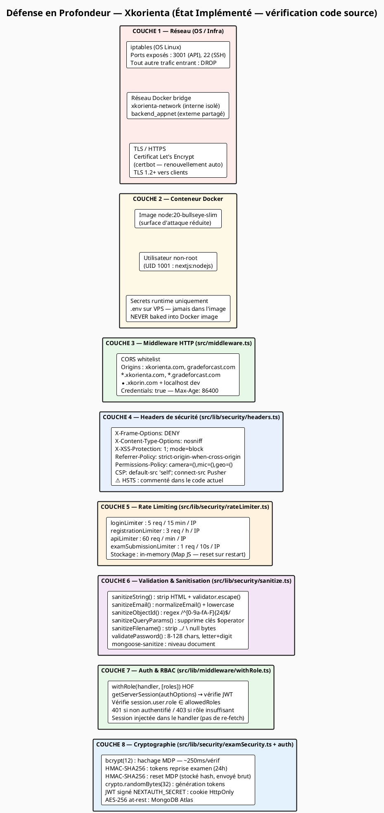
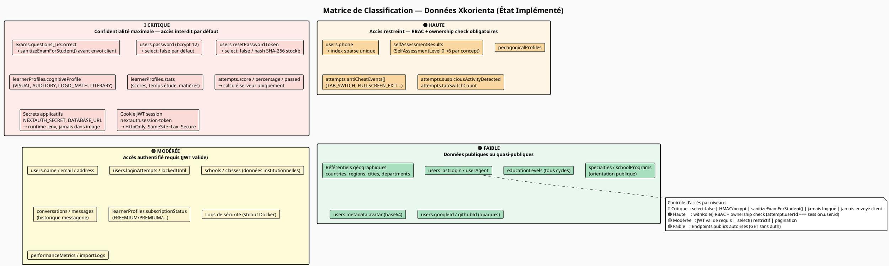
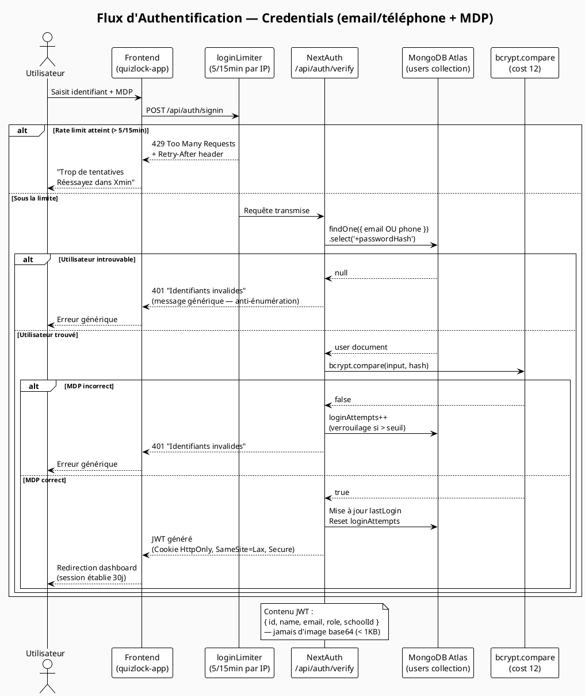
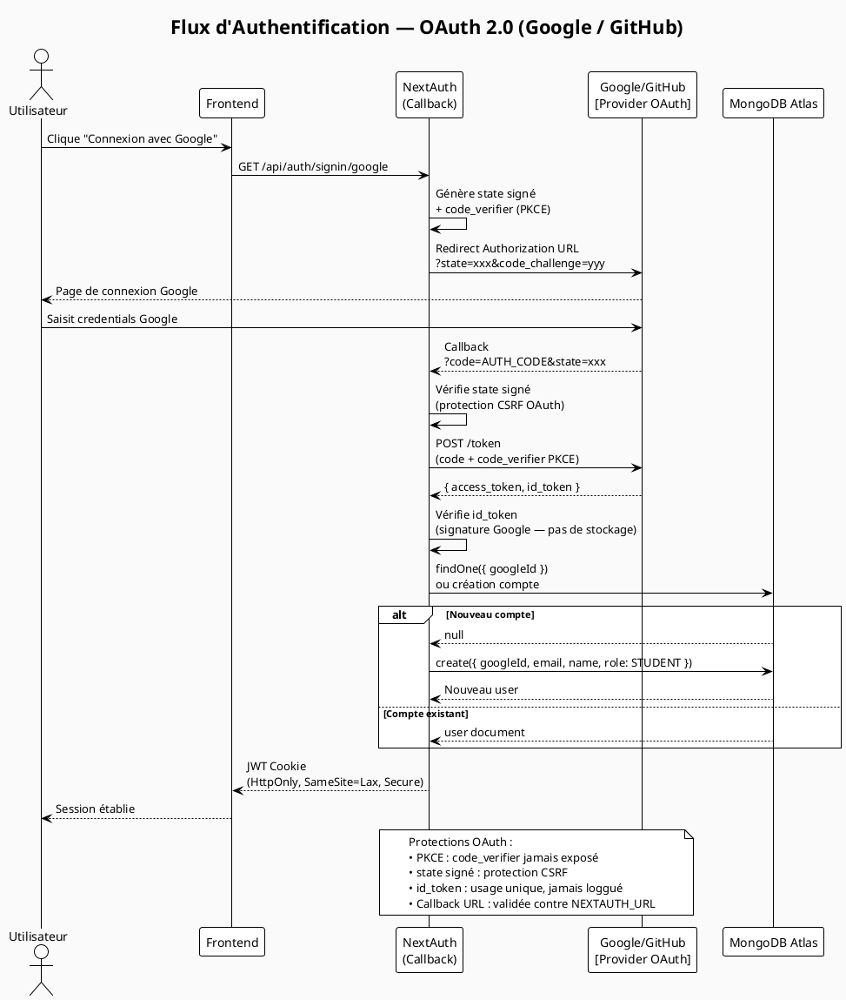
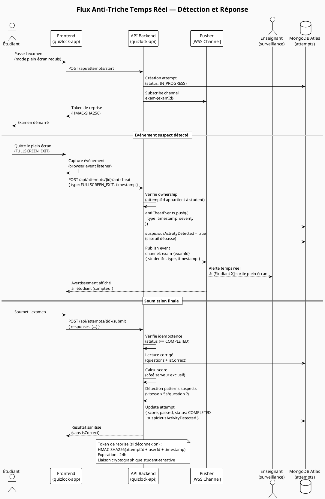

# Cahier de Sécurité — Xkorienta

> **Projet :** Xkorienta (anciennement QuizLock / GradeForcast)
> **Référentiel :** OWASP Top 10 (2021), OWASP ASVS v4.0, RGPD (UE 2016/679), Loi n°2010/012 (Cameroun — cybersécurité et protection des données)
> **Version :** 2.0 — Avril 2026
> **Classification :** Document interne — Confidentiel
> **Auteur :** ELOHIM JUNIOR TAGNE WAMBO
> **Validation :** Direction Technique M4M

---

## Table des matières

1. [Introduction et contexte](#1-introduction-et-contexte)
2. [Architecture & Hébergement (Infrastructure Layer)](#2-architecture--hébergement-infrastructure-layer)
3. [Cartographie des Données (Data Inventory & Classification)](#3-cartographie-des-données-data-inventory--classification)
4. [Posture de sécurité et philosophie](#4-posture-de-sécurité-et-philosophie)
5. [Authentification et gestion des identités](#5-authentification-et-gestion-des-identités)
6. [Gestion des sessions et tokens JWT](#6-gestion-des-sessions-et-tokens-jwt)
7. [Contrôle d'accès et autorisation (RBAC)](#7-contrôle-daccès-et-autorisation-rbac)
8. [Protection contre les injections](#8-protection-contre-les-injections)
9. [Protection contre les attaques volumétriques (DDoS & Rate Limiting)](#9-protection-contre-les-attaques-volumétriques-ddos--rate-limiting)
10. [Sécurité des fichiers uploadés](#10-sécurité-des-fichiers-uploadés)
11. [Headers HTTP et Content Security Policy](#11-headers-http-et-content-security-policy)
12. [Sécurité des examens et intégrité des données](#12-sécurité-des-examens-et-intégrité-des-données)
13. [Protection des données sensibles](#13-protection-des-données-sensibles)
14. [Sécurité des communications (TLS/CORS)](#14-sécurité-des-communications-tlscors)
15. [Journalisation, monitoring et détection d'incidents](#15-journalisation-monitoring-et-détection-dincidents)
16. [Conformité réglementaire et RGPD](#16-conformité-réglementaire-et-rgpd)
17. [Score de maturité sécurité](#17-score-de-maturité-sécurité)
18. [Annexes et références](#18-annexes-et-références)

---

## 1. Introduction et contexte

### 1.1 Présentation du projet

**Xkorienta** est une plateforme éducative numérique conçue pour le système éducatif camerounais (francophone et anglophone). Elle permet aux enseignants de créer des évaluations, aux étudiants de passer des examens en ligne, et aux institutions de suivre les performances académiques. La plateforme intègre également un module d'orientation scolaire et professionnelle.

### 1.2 Périmètre du document

Ce cahier de sécurité constitue un **récapitulatif exhaustif de la posture de sécurité** de la plateforme Xkorienta. Il documente :

- L'architecture technique et l'infrastructure d'hébergement
- La cartographie complète des données traitées
- L'ensemble des mécanismes de sécurité implémentés à chaque couche
- La conformité avec les référentiels OWASP et les réglementations applicables
- Le niveau de maturité sécuritaire atteint

### 1.3 Parties prenantes

| Rôle | Responsabilité |
|------|---------------|
| **Direction Technique (DG M4M)** | Approbation des choix d'architecture et des politiques de sécurité |
| **Équipe Backend** | Implémentation des contrôles de sécurité applicatifs |
| **Équipe Frontend** | Respect des bonnes pratiques côté client (CSP, HttpOnly, sanitisation) |
| **DevOps** | Sécurisation de l'infrastructure, CI/CD, monitoring |
| **DPO (futur)** | Conformité RGPD et protection des données personnelles |

---

## 2. Architecture & Hébergement (Infrastructure Layer)

### 2.1 Modèle d'infrastructure

L'infrastructure de Xkorienta est de type **hybride** : le calcul applicatif repose sur un **serveur dédié (VPS) auto-géré**, tandis que la persistance des données est confiée à un **service cloud managé (MongoDB Atlas)**. Il ne s'agit ni d'un hébergement sur cloud public (AWS/Azure/GCP) ni d'un datacenter privé d'entreprise.

| Couche | Composant | Type | Localisation |
|--------|-----------|------|-------------|
| **Calcul applicatif** | VPS Linux (serveur dédié) | Infrastructure propre — administrée par l'équipe DevOps | Datacenter hébergeur (accès SSH) |
| **Persistance des données** | MongoDB Atlas | Cloud managé (multi-cloud Atlas) | Atlas Cloud (chiffrement at-rest AES-256 + TLS) |
| **Registre d'images** | Docker Hub (`nkot20/xkorienta-api`) | Cloud public (Docker Inc.) | Hub.docker.com |
| **Pipeline CI/CD** | GitHub Actions | Cloud public (GitHub) | github.com — secrets chiffrés |
| **WebSocket temps réel** | Pusher SaaS | Cloud public (Pusher Ltd.) | Pusher cloud — WSS |
| **Email transactionnel** | SMTP (Nodemailer) | Service externe | STARTTLS port 587 |
| **OAuth** | Google OAuth 2.0 / GitHub OAuth | Cloud public (Google / GitHub) | accounts.google.com / github.com |

**Classification du modèle** : Architecture **hybride centralisée** — un seul nœud de calcul (VPS), base de données cloud managée, services SaaS tiers.

**Périmètre de responsabilité directe** : Le VPS, sa configuration réseau (iptables), le runtime Docker et le fichier `.env` sont sous la responsabilité directe de l'équipe DevOps M4M. MongoDB Atlas est sous responsabilité partagée (configuration Atlas = équipe, infrastructure physique Atlas = MongoDB Inc.).

### 2.2 Architecture globale

L'architecture de Xkorienta suit un modèle **client-serveur hybride** : un frontend Next.js servi côté client et un backend API RESTful découplé, tous deux conteneurisés sur le même VPS, avec une base de données cloud managée.



**Tableau des composants :**

| Composant | Image / Technologie | Port exposé | Réseau Docker |
|-----------|---------------------|-------------|---------------|
| **Backend API** (`xkorienta-api`) | `nkot20/xkorienta-api:main` — Next.js 16, Mongoose 9, Node.js 20 | `3001:3001` | `xkorienta-network` + `backend_appnet` |
| **Base de données** | MongoDB Atlas (cloud managé) | TLS 27017 (cloud) | — (externe) |
| **WebSocket** | Pusher SaaS | WSS (443) | — (externe) |
| **Email** | SMTP via Nodemailer | STARTTLS 587 | — (externe) |
| **OAuth** | Google / GitHub | HTTPS 443 | — (externe) |

**Composants principaux :**

| Composant | Technologie | Rôle | Port |
|-----------|-------------|------|------|
| **Frontend (quizlock-app)** | Next.js 16, React 19, TypeScript | Interface utilisateur, SSR, routage | 3000 |
| **Backend API (quizlock-api)** | Next.js 16 (App Router), Mongoose 9, TypeScript | API REST, logique métier, authentification | 3001 |
| **Base de données** | MongoDB Atlas (version managée) | Persistance des données | 27017 (cloud) |
| **WebSocket** | Pusher (SaaS) | Notifications temps réel, anti-triche live | WSS |
| **Email** | SMTP (Nodemailer) | Emails transactionnels (reset MDP, invitations) | 587 |
| **Registre Docker** | Docker Hub (`nkot20/xkorienta-api`) | Stockage et distribution des images Docker | — |

### 2.3 Containerisation et déploiement

**Configuration Docker (docker-compose.yml actuel) :**

| Paramètre | Valeur configurée | Impact sécurité |
|-----------|------------------|----------------|
| **Image** | `nkot20/xkorienta-api:${TAG:-main}` | Tag fixé sur `main` — pas de `latest` flottant en prod |
| **Container name** | `xkorienta-api` | Identification unique pour le monitoring |
| **Restart policy** | `unless-stopped` | Redémarrage automatique sur crash (résilience) |
| **Port binding** | `3001:3001` | Un seul port exposé — surface minimale |
| **Variables d'env** | Fichier `.env` sur le serveur + variables inline | Secrets jamais dans l'image Docker |
| **Healthcheck** | `node -e require('http').get(...)` → `/api/health` | Intervalle 30s, timeout 10s, 3 retries, start_period 40s |
| **Réseau 1** | `xkorienta-network` (bridge — isolé) | Isolation réseau entre services |
| **Réseau 2** | `backend_appnet` (external — partagé) | Communication avec d'autres services sur le même VPS |
| **Secrets injectés** | `DATABASE_URL`, `NEXTAUTH_URL`, `NEXTAUTH_SECRET`, `FRONTEND_URL` | Variables sensibles chargées au runtime uniquement |

**Variables d'environnement runtime (secrets) :**

| Variable | Contenu | Stockage |
|----------|---------|---------|
| `DATABASE_URL` | URI MongoDB Atlas (avec credentials) | Fichier `.env` sur VPS + GitHub Secret |
| `NEXTAUTH_SECRET` | Clé de signature JWT (aléatoire) | Fichier `.env` sur VPS + GitHub Secret |
| `NEXTAUTH_URL` | URL publique de l'API | Fichier `.env` sur VPS + GitHub Secret |
| `GOOGLE_CLIENT_ID/SECRET` | Credentials OAuth Google | Fichier `.env` sur VPS |
| `GITHUB_CLIENT_ID/SECRET` | Credentials OAuth GitHub | Fichier `.env` sur VPS |
| `PUSHER_APP_ID/KEY/SECRET` | Credentials Pusher | Fichier `.env` sur VPS |
| `SMTP_*` | Credentials email | Fichier `.env` sur VPS |

**Pipeline CI/CD — `ci-cd-production.yml` (4 jobs séquentiels) :**

```plantuml
@startuml cicd_pipeline
!theme plain
skinparam backgroundColor #FAFAFA
skinparam defaultFontName Arial

title Pipeline CI/CD — GitHub Actions ci-cd-production.yml (État Implémenté)

|#AED6F1|Job 1 : build|
start
:Déclencheur : push → branche main;
:Checkout du code source (actions/checkout@v4);
:Docker Buildx setup (docker/setup-buildx-action@v3);
:Login Docker Hub\n(secrets: DOCKER_USER, DOCKER_PASSWORD);
:Build & Push image multi-stage
─────────────────────────────────
Tags : nkot20/xkorienta-api:{ref_name}
       nkot20/xkorienta-api:latest
Build-arg : NODE_ENV=production
Cache : GitHub Actions cache (GHA);
:Upload artifact source archive (1 day retention);

|#A9DFBF|Job 2 : test_unit (continue-on-error)|
:npm ci (lockfile exact);
:ESLint → npm run lint;
:TypeScript → npx tsc --noEmit;
note right
  continue-on-error: true
  Les erreurs de lint/tsc
  ne bloquent PAS le pipeline
end note

|#F9E79F|Job 3 : build_test (continue-on-error)|
:npm ci;
:npm run build (Next.js)
──────────────────────────
Env injectés depuis GitHub Secrets :
DATABASE_URL, NEXTAUTH_SECRET, NEXTAUTH_URL;

|#F1948A|Job 4 : deploy (environment: production)|
:Checkout + install sshpass;
:Vérification DEPLOY_PATH et DEPLOY_HOST secrets;
:Création archive deploy-files.tar.gz\n(docker-compose.yml uniquement);
:Upload via sshpass SCP → VPS\n(DEPLOY_HOST:DEPLOY_PORT);
:Connexion SSH → VPS\n(sshpass + StrictHostKeyChecking=no);
:Mise à jour image dans docker-compose.yml\n(sed → nkot20/xkorienta-api:main);
:docker compose down → pull app → up -d;
:Sanity check : curl http://127.0.0.1:3001/api/health;
:docker image prune -f (images dangling uniquement);
:Déploiement terminé;
stop

@enduml
```

| Job CI/CD | `needs` | `continue-on-error` | Secrets utilisés |
|-----------|---------|---------------------|-----------------|
| `build` | — | Non | `DOCKER_USER`, `DOCKER_PASSWORD` |
| `test_unit` | `build` | **Oui** | Aucun |
| `build_test` | `test_unit` | **Oui** | `DATABASE_URL`, `NEXTAUTH_SECRET`, `NEXTAUTH_URL` |
| `deploy` | `build_test` | Non | `DEPLOY_HOST`, `DEPLOY_USER`, `DEPLOY_PASSWORD`, `DEPLOY_PORT`, `DEPLOY_PATH` |

### 2.4 Mécanismes de résilience

| Mécanisme | Implémentation concrète | Source vérifiée |
|-----------|------------------------|----------------|
| **Healthcheck Docker** | `node -e require('http').get('http://localhost:3001/api/health', ...)` — intervalle 30s, timeout 10s, 3 retries, start_period 40s | `docker-compose.yml` |
| **Redémarrage automatique** | `restart: unless-stopped` — redémarre automatiquement sur crash ou reboot OS sauf arrêt manuel | `docker-compose.yml` |
| **Connexion MongoDB résiliente** | Pool de connexions Mongoose avec cache global (`global.mongoose`), reconnexion automatique sur coupure réseau | Code Mongoose / lib/db |
| **Build reproductible** | `npm ci` dans le CI (install exacte depuis `package-lock.json`) + cache GitHub Actions (`type=gha`) | `ci-cd-production.yml` |
| **Nettoyage post-déploiement** | `docker image prune -f` (images dangling uniquement — ne touche pas aux images des autres services) | `ci-cd-production.yml` |
| **Backup MongoDB** | Snapshots automatiques gérés par MongoDB Atlas (selon le plan souscrit) | Géré par Atlas |
| **Plan de reprise (DR)** | Redéploiement via pipeline CI/CD (re-push vers `main`), restauration de données depuis snapshot Atlas | CI/CD + Atlas |
| **Sanity check post-déploiement** | `curl -sf http://127.0.0.1:3001/api/health` exécuté depuis le serveur après `docker compose up -d` | `ci-cd-production.yml` |

**Diagramme de résilience et flux de reprise :**

```plantuml
@startuml resilience
!theme plain
skinparam backgroundColor #FAFAFA
skinparam defaultFontName Arial

title Mécanismes de Résilience — Xkorienta (État Actuel)

rectangle "Résilience Applicative" #E8F8E8 {
  card "Docker restart: unless-stopped\nRedémarre sur crash / reboot OS\n(sauf docker stop manuel)" as r1 #A9DFBF
  card "Docker Healthcheck\nGET /api/health\n30s interval / 10s timeout / 3 retries\nstart_period: 40s" as r2 #A9DFBF
  card "Mongoose Connection Pool\nCaching global + reconnexion auto\nsur coupure réseau MongoDB" as r3 #A9DFBF
}

rectangle "Résilience CI/CD" #E8F0FE {
  card "Pipeline GitHub Actions\nRedéploiement déclenché par push main\nRollback : re-push d'un commit antérieur" as r4 #AED6F1
  card "Image Docker versionnée\nnkot20/xkorienta-api:main sur Docker Hub\nHistorique des images disponible" as r5 #AED6F1
  card "Sanity check post-deploy\ncurl /api/health après chaque déploiement\nAlerte si échec (⚠️ warning non bloquant)" as r6 #AED6F1
}

rectangle "Résilience Données" #FEF9E7 {
  card "MongoDB Atlas Snapshots\nSauvegardes automatiques\n(fréquence selon plan Atlas)" as r7 #F9E79F
  card "Isolation des données\nbase dédiée par environnement\n(dev / production)" as r8 #F9E79F
}

rectangle "Point de défaillance unique (SPOF)" #FDECEA {
  card "Instance applicative unique\nPas de clustering actuel\n(1 seul VPS / 1 seul conteneur)" as spof #F1948A
}

note bottom of spof
  Un crash serveur = indisponibilité totale de l'API.
  Le restart: unless-stopped couvre les crashs applicatifs
  mais pas une panne matérielle ou réseau du VPS.
end note

@enduml
```



### 2.5 Dispositifs de sécurisation implémentés

**Vue par couche — état actuel du code (vérification source) :**



**Tableau de synthèse des mécanismes de sécurité :**

| Couche | Mécanisme | Détail implémenté | Fichier source |
|--------|-----------|------------------|---------------|
| **Réseau** | Pare-feu iptables | Ports ouverts : 3001, 22 | Config OS |
| **Réseau** | Isolation Docker | `xkorienta-network` (bridge) + `backend_appnet` (externe) | `docker-compose.yml` |
| **Transport** | TLS Let's Encrypt | HTTPS + certbot autorenewal | Config serveur |
| **Transport** | HSTS | **Commenté dans le code** (`headers.ts` ligne 37) — à vérifier config serveur | `src/lib/security/headers.ts` |
| **Conteneur** | Non-root user | UID 1001 (`nextjs:nodejs`) | `Dockerfile` |
| **Conteneur** | Image slim | `node:20-bullseye-slim` | `Dockerfile` |
| **IAM** | GitHub Secrets | DEPLOY_*, DATABASE_URL, NEXTAUTH_SECRET | GitHub repo settings |
| **IAM** | `.env` runtime | Jamais dans l'image Docker | VPS filesystem |
| **HTTP** | CORS whitelist | `src/middleware.ts` — 6 origines autorisées + sous-domaines | `src/middleware.ts` |
| **HTTP** | Headers sécurité | 6 headers actifs (HSTS commenté) | `src/lib/security/headers.ts` |
| **HTTP** | CSP | `default-src 'self'`, Pusher WSS autorisé | `src/lib/security/headers.ts` |
| **Limite** | Rate limiting | 4 limiteurs in-memory (Map JS) | `src/lib/security/rateLimiter.ts` |
| **Validation** | Sanitisation | 6 fonctions `sanitize*` + mongoose-sanitize | `src/lib/security/sanitize.ts` |
| **Auth** | JWT + RBAC | `withRole()` HOF — vérifie session + rôle | `src/lib/middleware/withRole.ts` |
| **Crypto** | Hachage MDP | bcrypt cost 12 | `src/lib/auth/...` |
| **Crypto** | Tokens sécurisés | HMAC-SHA256 + crypto.randomBytes(32) | `src/lib/security/examSecurity.ts` |
| **Données** | Chiffrement at-rest | AES-256 — MongoDB Atlas | Géré Atlas |
| **Données** | Chiffrement transit BD | TLS — connexion Mongoose → Atlas | Mongoose config |

---

## 3. Cartographie des Données (Data Inventory & Classification)

### 3.1 Vue d'ensemble des flux de données

Xkorienta collecte, traite et stocke des données à travers cinq canaux principaux. Chaque flux transite par un pipeline de validation avant écriture en base.

```plantuml
@startuml dfd_flux_global
!theme plain
skinparam backgroundColor #FAFAFA
skinparam defaultFontName Arial
skinparam ArrowColor #2C3E50

title DFD Niveau 1 — Flux de Données Xkorienta (Collections MongoDB réelles)

actor "Étudiant\n[STUDENT]" as student
actor "Enseignant\n[TEACHER]" as teacher
actor "Admin École\n[SCHOOL_ADMIN]" as schooladmin
actor "Super Admin\n[DG_M4M]" as superadmin

boundary "API Backend\n[quizlock-api :3001]" as api

box "Pipeline Sécurité (src/lib/security)" #EBF5FB
  control "1. sanitizeQueryParams()\n2. sanitizeObjectId()\n3. sanitizeString()\nZod schema validation" as sanit
end box

database "MongoDB Atlas\n[AES-256 at-rest / TLS transit]" as db {
  collections "users\n[PII — index sparse email/phone]" as c_users
  collections "attempts\n[TTL index 24h]" as c_attempts
  collections "learnerProfiles\n[profil cognitif/abonnement]" as c_learner
  collections "pedagogicalProfiles" as c_peda
  collections "exams / questions\n[isCorrect select:false vers client]" as c_exams
  collections "schools / classes" as c_schools
  collections "importLogs (90j)\nconversations / messages" as c_ops
}

cloud "Services Externes" as ext {
  component "Google / GitHub\n[OAuth 2.0 PKCE]" as oauth
  component "Pusher WSS\n[événements anti-triche]" as pusher
  component "SMTP\n[reset MDP, invitations]" as smtp
}

' Flux inscription / connexion
student -right-> api : POST /api/auth/register\n(name, email|phone, password)
teacher -right-> api : POST /api/auth/signin\n(OAuth ou credentials)
api --> sanit : Toutes les entrées
sanit --> c_users : CREATE / UPDATE\n(password = bcrypt 12)
api --> oauth : Redirect OAuth\n(PKCE + state signé)
oauth --> api : id_token vérifié
api --> smtp : Email reset MDP\n(token HMAC-SHA256)

' Flux examen étudiant
student -right-> api : POST /api/attempts/submit\n(responses brutes)
api --> sanit : Validation entrées
sanit --> c_attempts : READ examen (corrigé)\nWRITE résultat calculé
c_attempts --> api : score (calculé serveur)\nSans isCorrect
api --> pusher : Événements anti-triche\n(TAB_SWITCH, FULLSCREEN_EXIT...)

' Flux enseignant
teacher -right-> api : POST /api/exams (créer examen)\nPOST /api/classes (gérer classe)
api --> sanit
sanit --> c_exams : WRITE questions + isCorrect
sanit --> c_schools : WRITE classe

' Flux admin
schooladmin -right-> api : Gestion école
superadmin -right-> api : Validation écoles, users
api --> c_schools : WRITE statut validation
api --> c_learner : READ/WRITE profil abonnement
api --> c_peda : READ/WRITE profil péda

note right of c_attempts
  TTL Index MongoDB :
  { expiresAt: 1 }, { expireAfterSeconds: 86400 }
  → Suppression automatique après 24h
end note

note right of c_users
  Champs protégés :
  • password : sélectionné via .select('+password')
  • resetPasswordToken : select: false
  • resetPasswordExpires : select: false
  → Jamais retournés par défaut dans les queries
end note
@enduml
```

---

### 3.2 Données Personnelles — PII (Personally Identifiable Information)

Sources : Formulaire d'inscription, OAuth Google/GitHub, saisie profil.
Collection principale : `users`

| Champ MongoDB | Type de donnée | Source de collecte | Mode de stockage | Sensibilité | Durée de rétention |
|---------------|---------------|-------------------|-----------------|-------------|-------------------|
| `users.name` | Nom complet | Formulaire inscription / OAuth callback | Texte clair (chiffré at-rest Atlas AES-256) | 🟡 Modérée | Durée de vie du compte |
| `users.email` | Adresse email | Formulaire / OAuth (Google, GitHub) | Texte clair — index `sparse: true`, `unique: true` | 🟡 Modérée | Durée de vie du compte |
| `users.phone` | Numéro de téléphone | Formulaire inscription (identifiant alternatif Cameroun) | Texte clair — index `sparse: true`, `unique: true` | 🟠 Haute | Durée de vie du compte |
| `users.metadata.address` | Adresse postale | Saisie profil (facultatif) | Texte clair | 🟡 Modérée | Durée de vie du compte |
| `users.metadata.avatar` | Photo / Avatar | Upload utilisateur | Stocké en base64 dans MongoDB | 🟢 Faible | Durée de vie du compte |
| `users.googleId` | ID opaque Google | Callback OAuth Google | Chaîne opaque unique | 🟢 Faible | Durée de vie du compte |
| `users.githubId` | ID opaque GitHub | Callback OAuth GitHub | Chaîne opaque unique | 🟢 Faible | Durée de vie du compte |
| `users.studentCode` | Code étudiant interne | Système d'identification | Texte clair — index `sparse: true`, `unique: true` | 🟡 Modérée | Durée de vie du compte |
| `users.emailVerified` | Statut vérification email | Processus d'inscription | Booléen | 🟢 Faible | Durée de vie du compte |
| `users.isActive` | Statut compte | Gestion admin | Booléen | 🟢 Faible | Durée de vie du compte |
| `attempts.ipAddress` | Adresse IP | Extraction automatique — header HTTP (`x-forwarded-for`, `x-real-ip`) | Texte clair | 🟡 Modérée | **TTL 24h** (index `expireAfterSeconds: 86400`) |
| `attempts.userAgent` | User Agent navigateur | Extraction automatique — header HTTP | Texte clair | 🟢 Faible | **TTL 24h** (même TTL que l'attempt) |

**Protections PII appliquées :**
- `select: false` sur `resetPasswordToken` et `resetPasswordExpires` → jamais retournés par les queries Mongoose
- `.select('-password')` ou `.select('+password')` explicite sur toutes les queries User
- Index `sparse: true` : email et téléphone peuvent être `null` sans violer la contrainte `unique`
- IP address collectée uniquement pour les tentatives d'examen, supprimée automatiquement après 24h

---

### 3.3 Données Sensibles — Parcours éducatif et scoring cognitif

| Donnée | Collection MongoDB | Source de collecte | Mode de stockage | Sensibilité | Durée de rétention |
|--------|-------------------|-------------------|-----------------|-------------|-------------------|
| **Réponses aux questions** | `attempts` (tableau `responses`) | Soumission examen par l'étudiant | Tableau d'ObjectIds (questionId + selectedOptionId) | 🔴 Critique | **TTL 24h** (auto-suppression) |
| **Score calculé** | `attempts.score`, `attempts.maxScore` | Calcul côté serveur exclusif (`calculateScore()`) | Nombre entier | 🔴 Critique | TTL 24h (attempt) puis résultats agrégés selon durée examen |
| **Pourcentage de réussite** | `attempts.percentage` | Calcul côté serveur | Nombre 0-100 | 🔴 Critique | Idem score |
| **Statut de passage** | `attempts.passed` | Calcul côté serveur | Booléen | 🔴 Critique | Idem score |
| **Réponses correctes** | `exams.questions[].options[].isCorrect` | Saisie enseignant | Booléen — **jamais envoyé au client** (`sanitizeExamForStudent()`) | 🔴 Critique | Durée de vie de l'examen |
| **Profil cognitif** | `learnerProfiles.cognitiveProfile` | Tests diagnostiques (enum: VISUAL, AUDITORY, LOGIC_MATH, LITERARY) | Enum string | 🔴 Critique | Durée de vie du compte |
| **Type d'apprenant** | `learnerProfiles.learnerType` | Algorithme d'analyse (EXAM_PREP, REMEDIAL, ADVANCED, STRUGGLING) | Enum string | 🔴 Critique | Durée de vie du compte |
| **Statistiques d'apprentissage** | `learnerProfiles.stats` | Calcul automatique post-examen | Objet (totalExamsTaken, averageScore, totalStudyTime, strongSubjects, weakSubjects) | 🔴 Critique | Durée de vie du compte |
| **Profil pédagogique** | `pedagogicalProfiles` | Analyse comportement d'apprentissage | Document MongoDB | 🟠 Haute | Durée de vie du compte |
| **Auto-évaluations (7 niveaux)** | `selfAssessmentResults` | Évaluations par concept (SelfAssessmentLevel : 0=UNKNOWN → 6=PERFECTLY_ABLE) | Tableau de résultats par concept | 🟠 Haute | Durée de vie du compte |
| **Événements anti-triche** | `attempts.antiCheatEvents[]` | Frontend via Pusher WebSocket (TAB_SWITCH, FULLSCREEN_EXIT, COPY_ATTEMPT, PASTE_ATTEMPT, RIGHT_CLICK, BLUR_EVENT) | Tableau horodaté | 🟠 Haute | **TTL 24h** (lié à l'attempt) |
| **Flag activité suspecte** | `attempts.suspiciousActivityDetected` | `detectCheatingPatterns()` côté serveur | Booléen | 🟠 Haute | **TTL 24h** |
| **Compteur de changements d'onglet** | `attempts.tabSwitchCount` | Monitoring frontend | Entier | 🟠 Haute | **TTL 24h** |
| **Gamification** | `users.gamification` (totalXP, level, streak) | Calcul automatique post-examen | Objet dénormalisé | 🟡 Modérée | Durée de vie du compte |

**Protections des données éducatives :**
- `sanitizeExamForStudent()` dans `src/lib/security/examSecurity.ts` : supprime `isCorrect` de chaque option avant envoi
- `calculateScore()` : calcul exclusivement côté serveur — le client envoie des IDs de réponses brutes
- `validateExamSubmission()` : vérifie idempotence (status ≠ `COMPLETED`), expiration (`expiresAt`), validité des IDs de questions, absence de doublons
- `detectCheatingPatterns()` : vérifie durée < 5s/question et score parfait avec < 10s/question
- Token de reprise `generateResumeToken()` : HMAC-SHA256(`attemptId:userId:timestamp`) — expiration 24h

---

### 3.4 Données Financières

| Donnée | Collection MongoDB | Source de collecte | Mode de stockage | Sensibilité | Durée de rétention |
|--------|-------------------|-------------------|-----------------|-------------|-------------------|
| **Frais de scolarité** | `schools.tuitionFee` (structure: min, max, currency) | Saisie par l'administrateur d'école | Objet numérique | 🟡 Modérée | Durée de vie de l'école |
| **Statut d'abonnement** | `learnerProfiles.subscriptionStatus` | Attribution par le système (FREEMIUM, PREMIUM, INSTITUTION_PREMIUM, EDUCATOR_ACCESS, DIRECTION_ACCESS) | Enum string | 🟡 Modérée | Durée de vie du compte |
| **Expiration abonnement** | `learnerProfiles.subscriptionExpiry` | Gestion admin | Date | 🟡 Modérée | Durée de vie du compte |

> **Périmètre financier actuel** : Aucune donnée de paiement directe (numéro de carte, token Mobile Money, RIB) n'est collectée ni stockée dans la base Xkorienta. `schools.tuitionFee` est une donnée d'affichage public (fourchette de frais déclarés). L'intégration de paiement réel (Mobile Money, Stripe) n'est pas implémentée dans la version actuelle.

---

### 3.5 Données Opérationnelles

| Donnée | Collection / Support | Source de collecte | Mode de stockage | Sensibilité | Durée de rétention |
|--------|---------------------|-------------------|-----------------|-------------|-------------------|
| **Logs de sécurité** | `console.warn/error` → stdout conteneur Docker | Middleware applicatif (rate limit, injections, auth failures, tentatives injection NoSQL) | Texte non structuré — stdout Docker | 🟡 Modérée | Durée de rétention des logs Docker (configurable hôte) |
| **Tentatives de connexion échouées** | `users.loginAttempts`, `users.lockedUntil` | Rate limiter auth | Entier + Date | 🟡 Modérée | Reset après connexion réussie ou expiration |
| **Timestamp dernière connexion** | `users.lastLogin` | Middleware authentification | Date | 🟢 Faible | Durée de vie du compte |
| **Événements anti-triche temps réel** | `attempts.antiCheatEvents[]` | Frontend (listener navigateur) → API → Pusher | Tableau horodaté (type, timestamp, metadata) | 🟠 Haute | **TTL 24h** |
| **Logs d'import CSV/XLSX** | `importLogs` collection | Processus d'import | Document MongoDB | 🟢 Faible | **90 jours** |
| **Métriques de performance** | `performanceMetrics` collection | Analytics examens et résultats | Document MongoDB | 🟡 Modérée | **1 an** |
| **Métriques d'infrastructure** | `infrastructureMetrics` collection | Données établissements | Document MongoDB | 🟢 Faible | Indéfini |
| **Historique de messagerie** | `conversations`, `messages` collections | Messagerie inter-utilisateurs | Document MongoDB | 🟡 Modérée | Durée de vie du compte |
| **Forum et posts** | `forums`, `forumPosts` collections | Publications utilisateurs | Document MongoDB | 🟡 Modérée | Durée de vie du compte |
| **Tokens de réinitialisation** | `users.resetPasswordToken` (SHA-256 du token brut) | Processus reset MDP | Hash SHA-256 — `select: false` | 🔴 Critique | **1 heure** (champ `resetPasswordExpires`) — usage unique |
| **Sessions JWT** | Cookie `nextauth.session-token` (client) | NextAuth v4 | Cookie HttpOnly, SameSite=Lax, Secure | 🔴 Critique | **30 jours** max (expiration JWT intégrée) |

---

### 3.6 Données Institutionnelles et Structurelles

| Collection | Contenu | Sensibilité | Contrôle d'accès |
|-----------|---------|-------------|------------------|
| `schools` | Nom, adresse, type, statut (PENDING/VALIDATED/REJECTED), contacts, tuitionFee | 🟡 Modérée | Lecture publique (orientation) / Écriture : SCHOOL_ADMIN + DG_M4M |
| `classes` | Nom, enseignants (`teachers[]` avec rôles OWNER/COLLABORATOR/ASSISTANT), liste étudiants | 🟡 Modérée | Accès TEACHER (ses classes) + STUDENT (ses classes) + SCHOOL_ADMIN |
| `exams` | Contenu pédagogique, questions, options, `isCorrect`, barèmes, statut (DRAFT→PUBLISHED→ARCHIVED) | 🔴 Critique | TEACHER (ses examens) + INSPECTOR (validation) + DG_M4M |
| `syllabuses` | Structure pédagogique (chapitres, concepts, compétences) | 🟡 Modérée | TEACHER + SCHOOL_ADMIN |
| `specialties`, `schoolPrograms` | Offre de formation, débouchés, accréditations | 🟢 Faible | Lecture publique (module orientation) |
| `countries`, `regions`, `cities`, `departments` | Référentiel géographique Cameroun | 🟢 Faible (public) | Lecture publique |
| `educationLevels` | Niveaux scolaires (Préscolaire → Doctorat, cycles FRANCOPHONE/ANGLOPHONE/BILINGUAL) | 🟢 Faible (public) | Lecture publique |

---

### 3.7 Synthèse — Matrice de classification des données



---

### 3.8 Politique de rétention des données

| Catégorie | Durée de rétention | Mécanisme implémenté |
|-----------|-------------------|---------------------|
| **Données de compte utilisateur** (users) | Durée de vie du compte + 30 jours post-suppression | Suppression manuelle ou sur demande RGPD |
| **Tentatives d'examen complètes** (attempts) | **24 heures** | Index TTL MongoDB : `{ expiresAt: 1 }, { expireAfterSeconds: 86400 }` — suppression automatique |
| **Résultats agrégés** | Durée de vie de l'examen associé | Conservation pour suivi pédagogique enseignant |
| **Tokens de réinitialisation MDP** | **1 heure** | Champ `resetPasswordExpires` + usage unique (supprimé après consommation) |
| **Sessions JWT** | **30 jours maximum** | Expiration intégrée dans le payload JWT |
| **Logs de sécurité Docker** | Durée de rétention logs Docker (configurable sur le VPS) | Rotation logs Docker Engine |
| **Import logs** (importLogs) | **90 jours** | Nettoyage planifié |
| **Métriques de performance** | **1 an** | Nettoyage planifié |
| **Données anti-triche** (antiCheatEvents) | **24 heures** | Liées à l'attempt — même TTL index |

```plantuml
@startuml retention_timeline
!theme plain
skinparam backgroundColor #FAFAFA
skinparam defaultFontName Arial

title Durées de Rétention — Données Xkorienta

concise "Token\nReset MDP" as tokens
concise "Attempt\n(détail réponses)" as attempts
concise "Session JWT" as jwt
concise "Anti-Triche\nEvents" as anticheat
concise "Import Logs" as imports
concise "Métriques\nPerf." as metrics
concise "Compte\nUtilisateur" as account

@0
tokens is "Actif (1h)"
attempts is "IN_PROGRESS"
jwt is "Actif (30j max)"
anticheat is "Collecte live"
imports is "Stocké"
metrics is "Stocké"
account is "Actif"

@1h
tokens is "EXPIRÉ\n(resetPasswordExpires)" #E74C3C

@24h
attempts is "SUPPRIMÉ\n(TTL auto)" #E74C3C
anticheat is "SUPPRIMÉ\n(TTL auto)" #E74C3C

@30d
jwt is "EXPIRÉ\n(JWT exp)" #E74C3C

@90d
imports is "SUPPRIMÉ\n(nettoyage)" #E74C3C

@365d
metrics is "SUPPRIMÉ\n(nettoyage)" #E74C3C

@"Durée vie compte"
account is "Actif"

@"Compte supprimé"
account is "SUPPRIMÉ" #E74C3C

note
  Mécanisme TTL automatique MongoDB :
  AttemptSchema.index({ expiresAt: 1 }, { expireAfterSeconds: 86400 })
  → MongoDB supprime automatiquement les documents expirés
end note
@enduml
```

---

## 4. Posture de sécurité et philosophie

### 4.1 Principes fondateurs

La sécurité d'Xkorienta repose sur cinq principes non négociables appliqués à chaque couche du système :

| Principe | Application concrète |
|----------|---------------------|
| **Défense en profondeur** | Chaque requête traverse middleware d'auth → validation → sanitisation → logique métier. Aucune couche ne fait confiance à la précédente. |
| **Moindre privilège** | Chaque rôle (STUDENT, TEACHER, INSPECTOR, ADMIN) n'accède qu'aux ressources strictement nécessaires à sa fonction. |
| **Zero Trust** | Aucune requête n'est considérée fiable par défaut, même interne. Chaque appel API est authentifié et autorisé. |
| **Fail Secure** | En cas d'erreur inattendue, le système refuse l'accès (deny-by-default) et retourne une erreur générique sans fuite d'information. |
| **Séparation des responsabilités** | Le calcul du score, la validation des réponses et la détection de triche se font **exclusivement côté serveur**. Le client ne peut pas falsifier son résultat. |

### 4.2 Couverture OWASP Top 10 (2021)

| # | Catégorie OWASP | Statut | Implémentation |
|---|----------------|--------|----------------|
| A01 | Broken Access Control | ✅ Couvert | `withRole()`, `withAccessControl()`, ownership checks systématiques |
| A02 | Cryptographic Failures | ✅ Couvert | bcrypt(12), HMAC-SHA256, JWT signé, TLS 1.2+ |
| A03 | Injection | ✅ Couvert | `sanitizeQueryParams()`, mongoose-sanitize, validation Zod stricte |
| A04 | Insecure Design | ✅ Couvert | Calcul score côté serveur, réponses correctes jamais envoyées au client |
| A05 | Security Misconfiguration | ✅ Couvert | Headers Helmet, CSP, HSTS, secrets en variables d'environnement |
| A06 | Vulnerable Components | ✅ Surveillé | `npm audit` dans le pipeline CI, dépendances auditées régulièrement |
| A07 | Auth & Auth Failures | ✅ Couvert | Rate limiting login (5/15min), bcrypt, JWT expiration 30j, messages génériques |
| A08 | Software Integrity Failures | ✅ Couvert | `npm ci` (install exacte), pipeline CI/CD contrôlé, Docker multi-stage |
| A09 | Logging & Monitoring | ✅ Couvert | Logs sécurité structurés, monitoring healthcheck |
| A10 | SSRF | ✅ Couvert | Pas de fetch d'URL utilisateur, OAuth géré par NextAuth avec validation d'origine |

---

## 5. Authentification et gestion des identités

### 5.1 Architecture d'authentification

Xkorienta utilise **NextAuth v4** avec une stratégie JWT (stateless). Trois méthodes d'authentification sont supportées :

| Méthode | Flux | Protection |
|---------|------|-----------|
| **Credentials (email/téléphone + mot de passe)** | Formulaire → API `/api/auth/verify` → bcrypt.compare → JWT | Rate limit 5/15min, bcrypt(12), message générique |
| **Google OAuth** | Redirect → Google → Callback NextAuth → JWT | PKCE, state parameter signé, vérification d'origine |
| **GitHub OAuth** | Redirect → GitHub → Callback NextAuth → JWT | PKCE, state parameter signé, vérification d'origine |

**Flux d'authentification credentials :**



**Flux OAuth (Google/GitHub) :**



### 5.2 Hachage des mots de passe

| Paramètre | Valeur | Justification |
|-----------|--------|---------------|
| **Algorithme** | bcrypt (Blowfish-based) | Résistance GPU, coût configurable |
| **Salt rounds** | 12 | ~250ms par vérification — ralentit le brute force |
| **GPU résistance** | ~170 000 essais/s sur RTX 4090 | 4,4 ans pour épuiser un espace de 8 chars alphanumériques |
| **Niveau OWASP** | ✅ Conforme ASVS L2 | bcrypt(12) recommandé par OWASP |

**Règle d'implémentation :** Les réponses d'échec d'authentification retournent systématiquement le message `"Identifiants invalides"` — jamais `"Email inconnu"` ni `"Mot de passe incorrect"`. Ceci empêche l'**énumération de comptes**.

### 5.3 Réinitialisation de mot de passe

| Étape | Sécurisation |
|-------|-------------|
| **Génération du token** | `crypto.randomBytes(32)` — 256 bits d'entropie cryptographique |
| **Stockage** | Seul le **SHA-256 du token** est stocké en base — le token brut est envoyé par email |
| **Expiration** | 1 heure |
| **Usage unique** | Token supprimé immédiatement après utilisation |
| **Réponse ambiguë** | _"Si cet email existe, un lien a été envoyé"_ — empêche l'énumération |

### 5.4 OAuth — Protections mises en place

| Vecteur | Protection implémentée |
|---------|----------------------|
| Interception du code OAuth | PKCE géré par NextAuth, HTTPS obligatoire |
| Open Redirect | Callback `redirect()` vérifie que l'URL appartient à l'origine autorisée |
| State forgery (CSRF OAuth) | NextAuth génère un state parameter signé |
| Token leakage | `id_token` utilisé une seule fois, jamais loggué |

---

## 6. Gestion des sessions et tokens JWT

### 6.1 Cycle de vie de la session

| Phase | Mécanisme |
|-------|-----------|
| **Création** | Après authentification réussie → JWT généré et chiffré par NextAuth |
| **Transport** | Cookie `nextauth.session-token` (HttpOnly, SameSite=Lax, Secure en prod) |
| **Contenu** | `id`, `name`, `email`, `role`, `schoolId` — **jamais d'image base64** |
| **Expiration** | 30 jours |
| **Mise à jour** | Trigger `update` → filtrage strict des champs autorisés |

### 6.2 Sécurité du cookie de session

| Attribut | Valeur | Protection |
|----------|--------|-----------|
| `HttpOnly` | `true` | JavaScript ne peut pas lire le cookie → résiste au vol par XSS |
| `SameSite` | `Lax` | Bloque les requêtes cross-site non initiées par l'utilisateur → CSRF |
| `Secure` | `true` (prod) | Transmis uniquement en HTTPS → protège contre MITM |
| `Path` | `/` | Envoyé sur toutes les routes |
| Taille | < 1 KB | Optimisé pour éviter le cookie overflow (images exclues du JWT) |

### 6.3 Protection contre le cookie overflow

L'appel `update({ image: base64String })` est **intentionnellement bloqué**. Les avatars sont chargés à la demande depuis l'API (`GET /api/user/profile`), et le JWT ne contient que les données d'identité (< 1 KB).

---

## 7. Contrôle d'accès et autorisation (RBAC)

### 7.1 Hiérarchie des rôles

```
ADMIN (Super Admin)
 └── INSPECTOR (Inspecteur)
      └── SCHOOL_ADMIN / RECTOR / DG_ISIMMA (Direction d'école)
           └── PREFET / PRINCIPAL / SURVEILLANT
                └── TEACHER (Enseignant)
                     └── STUDENT (Étudiant)
                          └── GUEST (Visiteur sans compte)
```

### 7.2 Matrice d'accès par rôle

| Ressource / Action | GUEST | STUDENT | TEACHER | SCHOOL_ADMIN | INSPECTOR | ADMIN |
|---------------------|-------|---------|---------|-------------|-----------|-------|
| Mini-tests publics | ✅ | ✅ | ✅ | ✅ | ✅ | ✅ |
| Passer un examen | ❌ | ✅ (ses classes) | ❌ | ❌ | ❌ | ❌ |
| Voir ses résultats | ❌ | ✅ (les siens) | ❌ | ❌ | ❌ | ❌ |
| Créer un examen | ❌ | ❌ | ✅ | ✅ | ❌ | ✅ |
| Valider un examen | ❌ | ❌ | ❌ | ❌ | ✅ | ✅ |
| Gérer une école | ❌ | ❌ | ❌ | ✅ (sa propre) | ❌ | ✅ |
| Valider une école | ❌ | ❌ | ❌ | ❌ | ❌ | ✅ |
| Gestion utilisateurs | ❌ | ❌ | ❌ | ❌ | ❌ | ✅ |
| Analytics globaux | ❌ | ❌ | ❌ | ❌ | ❌ | ✅ |

### 7.3 Middleware `withRole`

Chaque route API est protégée par le middleware `withRole`, un Higher-Order Function qui :
1. Vérifie la présence d'une session JWT valide
2. Vérifie que le rôle de l'utilisateur est dans la liste des rôles autorisés
3. Transmet la session pré-chargée au handler (pas de re-fetch)
4. Retourne `401 Unauthorized` (non authentifié) ou `403 Forbidden` (rôle insuffisant)

### 7.4 Prévention IDOR (Insecure Direct Object Reference)

Chaque accès à une ressource vérifie que l'utilisateur est bien le **propriétaire** de cette ressource :

| Ressource | Vérification d'ownership |
|-----------|-------------------------|
| `Attempt` | `attempt.studentId === session.user.id` |
| `Exam` (édition) | `exam.createdBy === session.user.id` |
| `Class` | Teacher dans `class.teachers[]` |
| `User.profile` | `userId` extrait du JWT, jamais du body |
| `LateCode` | `lateCode.examId === exam.classId` |

---

## 8. Protection contre les injections

### 8.1 Injection NoSQL (MongoDB)

Protection multi-couches :

| Couche | Mécanisme | Fonction |
|--------|-----------|----------|
| **1 — Validation** | Zod (types stricts) | Un champ `email: z.string().email()` ne peut jamais recevoir `{ $gt: "" }` |
| **2 — Sanitisation** | `sanitizeQueryParams()` | Supprime toutes les clés commençant par `$` (opérateurs MongoDB) |
| **3 — ORM** | mongoose-sanitize | Nettoyage automatique des documents |
| **4 — Driver** | Mongoose paramétré | Séparation des données et de la logique (pas d'interpolation) |
| **5 — ObjectId** | `sanitizeObjectId()` | Format strict : 24 caractères hexadécimaux uniquement |

### 8.2 Cross-Site Scripting (XSS)

| Couche | Mécanisme |
|--------|-----------|
| `sanitizeString()` | Suppression de toutes les balises HTML + encodage de `&`, `<`, `>`, `"`, `'` |
| Patterns dangereux | Détection et blocage de `<script>`, `javascript:`, `onload=`, `<iframe>`, `<embed>`, `data:` |
| CSP | Content Security Policy empêche l'exécution de scripts non autorisés |
| React/Next.js | Échappement automatique de toutes les valeurs dans le JSX |

### 8.3 Formula Injection (CSV/Excel)

Les exports CSV sont protégés : tout contenu commençant par `=`, `+`, `-`, `@`, `\t`, `\r`, `|`, `%` est préfixé par une apostrophe → Excel l'interprète comme texte littéral.

### 8.4 Path Traversal

`sanitizeFilename()` supprime les séquences `../`, les séparateurs de chemin, les caractères réservés Windows et les caractères de contrôle.

---

## 9. Protection contre les attaques volumétriques (DDoS & Rate Limiting)

### 9.1 Architecture de défense multi-couches

| Couche | Dispositif | Configuration |
|--------|-----------|---------------|
| **Réseau** | Pare-feu serveur | Restriction des ports, limitation TCP/IP |
| **Reverse proxy** | Nginx (planifié) | `limit_conn`, `limit_req`, `client_body_timeout` |
| **Application** | Rate Limiter custom | Limiteurs par endpoint, par IP |
| **Logique métier** | JWT + Ownership | Vérification systématique à chaque requête |

### 9.2 Rate Limiters implémentés

| Limiter | Fenêtre | Maximum | Cible |
|---------|---------|---------|-------|
| `loginLimiter` | 15 minutes | 5 tentatives/IP | Brute force credentials |
| `registrationLimiter` | 1 heure | 3 inscriptions/IP | Bot registration |
| `apiLimiter` | 1 minute | 60 requêtes/IP | Flood applicatif |
| `examSubmissionLimiter` | 10 secondes | 1 soumission | Spam de soumissions |

### 9.3 Format de réponse 429

Conforme à la **RFC 6585**, chaque réponse 429 inclut :
- Header `Retry-After` avec le délai en secondes
- Headers `X-RateLimit-Limit`, `X-RateLimit-Remaining`, `X-RateLimit-Reset`

---

## 10. Sécurité des fichiers uploadés

### 10.1 Validation multi-niveaux

| Vérification | Description |
|-------------|-------------|
| **Extension** | Liste blanche : `.csv`, `.xlsx`, `.xls`, `.jpg`, `.png`, `.webp` |
| **Taille** | CSV : 5 MB max / Images : 2 MB max |
| **MIME type** | Vérification du Content-Type déclaré |
| **Magic bytes** | Vérification de la signature hexadécimale du fichier (JPEG: `FF D8 FF`, PNG: `89 50 4E 47`) |
| **Sanitisation du contenu** | Nettoyage des injections formula, XSS, NoSQL |
| **Nom de fichier** | Sanitisation des caractères dangereux (`../`, `\`, caractères de contrôle) |

---

## 11. Headers HTTP et Content Security Policy

### 11.1 Headers de sécurité implémentés (Helmet)

| Header | Valeur | Rôle |
|--------|--------|------|
| `X-Frame-Options` | `DENY` | Anti-clickjacking — bloque l'affichage dans un iframe |
| `X-Content-Type-Options` | `nosniff` | Empêche le MIME sniffing par le navigateur |
| `X-XSS-Protection` | `1; mode=block` | Filtre XSS des navigateurs legacy |
| `Referrer-Policy` | `strict-origin-when-cross-origin` | Contrôle les informations de referrer envoyées |
| `Permissions-Policy` | `camera=(), microphone=(), geolocation=(), interest-cohort=()` | Désactive les APIs sensibles non utilisées |
| `Content-Security-Policy` | cf. détail ci-dessous | Politique de sécurité du contenu complète |
| `Strict-Transport-Security` | `max-age=63072000; includeSubDomains; preload` | Force HTTPS pour 2 ans (production) |

### 11.2 Content Security Policy (CSP) — Détail

| Directive | Valeur | Justification |
|-----------|--------|---------------|
| `default-src` | `'self'` | Par défaut : même origine uniquement |
| `script-src` | `'self' 'unsafe-inline' 'unsafe-eval'` | Requis pour le mode dev Next.js |
| `style-src` | `'self' 'unsafe-inline'` | Nécessaire pour Tailwind CSS |
| `img-src` | `'self' data: https:` | Images locales + base64 (avatars) + HTTPS |
| `font-src` | `'self' data:` | Polices locales |
| `connect-src` | `'self' https://*.pusher.com wss://*.pusher.com` | WebSocket Pusher uniquement |
| `frame-ancestors` | `'none'` | Renforce X-Frame-Options |
| `base-uri` | `'self'` | Anti-injection `<base>` |
| `form-action` | `'self'` | Formulaires uniquement vers self |

---

## 12. Sécurité des examens et intégrité des données

### 12.1 Calcul du score

| Principe | Implémentation |
|----------|---------------|
| Score **exclusivement côté serveur** | Le client envoie ses réponses brutes, le serveur compare aux corrigés stockés en base |
| Réponses correctes **jamais envoyées au client** | `sanitizeExamForStudent()` supprime `isCorrect` de chaque option avant envoi |
| Soumission **idempotente** | Un examen déjà soumis (status `COMPLETED`) ne peut pas être re-soumis |
| Token de reprise **HMAC-SHA256** | Lie `attemptId` + `userId` + timestamp, expiration 24h, signature cryptographique |

### 12.2 Anti-triche temps réel

| Événement | Déclencheur | Action |
|-----------|------------|--------|
| `TAB_SWITCH` | Changement d'onglet | Log + alerte temps réel (Pusher) → enseignant |
| `FULLSCREEN_EXIT` | Sortie plein écran | Log + alerte temps réel → enseignant |
| `COPY_ATTEMPT` | Copie / Couper | Log + avertissement étudiant |
| `CONTEXT_MENU` | Clic droit | Bloqué + loggué |
| `FOCUS_LOSS` | Perte de focus | Log + compteur d'avertissements |



### 12.3 Détection de patterns suspects

- **Vitesse anormale** : Si durée < 5 secondes/question → flaggé suspect
- **Score parfait rapide** : Score 100% avec < 10 secondes/question → flaggé
- **Validation de soumission** : Vérification de l'idempotence, du temps restant, de la validité des IDs de questions, et des doublons

---

## 13. Protection des données sensibles

### 13.1 Données exclues des réponses API

| Donnée | Mécanisme d'exclusion |
|--------|----------------------|
| `passwordHash` | `.select('-passwordHash')` dans les queries User |
| `resetPasswordToken` / `resetPasswordExpires` | `select: false` dans le schema Mongoose |
| `options[].isCorrect` | `sanitizeExamForStudent()` — suppression avant envoi |
| `NEXTAUTH_SECRET`, `DATABASE_URL` | Variables d'environnement, jamais loggées |
| Stack traces | `try/catch` global, messages génériques en production |

### 13.2 Gestion des erreurs — Non-divulgation

| Code HTTP | Message retourné au client | Information interne loggée |
|-----------|---------------------------|---------------------------|
| 400 | Messages de validation champ par champ | Erreur Zod complète |
| 401 | `"Unauthorized"` ou `"Identifiants invalides"` | Raison précise |
| 403 | `"Forbidden: Insufficient permissions"` | Rôle requis vs rôle actuel |
| 404 | `"Resource not found"` | ID et collection |
| 409 | `"Resource already exists"` | Contrainte violée |
| 429 | `"Too many requests"` + Retry-After | IP + endpoint |
| 500 | `"Erreur serveur"` | Stack trace complète |

---

## 14. Sécurité des communications (TLS/CORS)

### 14.1 Transport Layer Security

| Exigence | Statut |
|----------|--------|
| TLS 1.2 minimum | ✅ Actif |
| TLS 1.3 préféré | ✅ Supporté |
| Certificats Let's Encrypt | ✅ Utilisés, renouvellement automatique (certbot) |
| HSTS activé | ✅ `max-age=63072000; includeSubDomains; preload` |

### 14.2 CORS

La politique CORS est configurée pour n'autoriser que l'origine du frontend (`NEXT_PUBLIC_APP_URL`). Les requêtes cross-origin non autorisées sont bloquées. `Access-Control-Allow-Credentials: true` est activé pour le transport des cookies de session.

---

## 15. Journalisation, monitoring et détection d'incidents

### 15.1 Événements de sécurité journalisés

| Événement | Niveau | Données enregistrées |
|-----------|--------|---------------------|
| Échec de connexion | WARN | IP, identifiant (masqué), timestamp |
| Rate limit déclenché | WARN | IP, endpoint, compteur |
| Tentative injection NoSQL | ERROR | IP, payload brut, userId |
| Tentative injection formula | WARN | IP, userId, contenu sanitisé |
| Événement anti-triche | INFO | studentId, attemptId, type, timestamp |
| Token JWT invalide | WARN | IP, token partiel (10 premiers chars) |
| Accès FORBIDDEN (403) | WARN | userId, rôle actuel, rôle requis, endpoint |
| Upload fichier invalide | WARN | IP, userId, extension, MIME |
| Score manipulation tentée | ERROR | userId, attemptId, score reçu |

### 15.2 Monitoring opérationnel

| Outil | Fonction |
|-------|---------|
| Docker Healthcheck | Vérification `/api/health` toutes les 30s |
| GitHub Actions | Pipeline CI/CD avec sanity check post-déploiement |
| Logs conteneur Docker | Agrégation des logs applicatifs et de sécurité |
| MongoDB Atlas Monitoring | Métriques de performance et alertes sur la base de données |

---

## 16. Conformité réglementaire et RGPD

### 16.1 Principes RGPD appliqués

| Principe | Implémentation |
|----------|---------------|
| **Minimisation des données** | Seules les données strictement nécessaires sont collectées (pas de collecte de données de navigation, pas de tracking publicitaire) |
| **Limitation de la finalité** | Données utilisées exclusivement pour l'éducation, l'évaluation et l'orientation |
| **Exactitude** | L'utilisateur peut modifier son profil à tout moment via l'API |
| **Limitation de la conservation** | TTL MongoDB pour les données temporaires, politique de rétention claire |
| **Intégrité et confidentialité** | Chiffrement au repos et en transit, contrôle d'accès par rôle |
| **Consentement** | Consentement explicite à l'inscription, conditions d'utilisation |

### 16.2 Droits des personnes concernées

| Droit | Mise en œuvre |
|-------|-------------|
| **Droit d'accès** | `GET /api/user/profile` — l'utilisateur peut consulter toutes ses données |
| **Droit de rectification** | `PUT /api/user/profile` — modification du nom, email, téléphone, préférences |
| **Droit à l'effacement** | Suppression de compte planifiée — suppression des données personnelles sous 30 jours |
| **Droit à la portabilité** | Export des données planifié (format JSON/CSV) |
| **Droit à la limitation** | Désactivation de compte (`isActive: false`) sans suppression |

---

## 17. Score de maturité sécurité

### 17.1 Évaluation OWASP ASVS v4.0 — Niveau 2

```
Catégorie                        Score    Statut
──────────────────────────────────────────────────────
Authentification                  8/10    ✅ Bon
Gestion des sessions              8/10    ✅ Bon
Contrôle d'accès                  8/10    ✅ Bon
Validation des entrées            8/10    ✅ Bon
Cryptographie                     8/10    ✅ Bon
Gestion des erreurs               8/10    ✅ Bon
Protection des données            7/10    ✅ Acceptable
Communications                    8/10    ✅ Bon
Logs & Monitoring                 7/10    ✅ Acceptable
Dépendances                       7/10    ✅ Acceptable
──────────────────────────────────────────────────────
SCORE GLOBAL                      7.7/10  Niveau 2 ASVS
──────────────────────────────────────────────────────
```

### 17.2 Objectifs de progression

| Horizon | Objectif | Cible |
|---------|---------|-------|
| 6 mois | Niveau 2 ASVS Complet | 8.5/10 |
| 12 mois | Niveau 3 ASVS Partiel | 9/10 |

---

## 18. Annexes et références

### 18.1 Stack technique complète

| Composant | Version | Usage |
|-----------|---------|-------|
| Node.js | 20 LTS | Runtime serveur |
| Next.js | 16.1.3 | Framework fullstack (App Router) |
| React | 19.2.3 | Interface utilisateur |
| TypeScript | 5.x | Typage statique |
| Mongoose | 9.1.4 | ODM MongoDB |
| NextAuth | 4.24.13 | Authentification |
| bcryptjs | 3.0.3 | Hachage des mots de passe |
| Zod | 4.3.5 | Validation des schémas |
| Helmet | 8.1.0 | Headers de sécurité HTTP |
| Pusher | 5.3.2 | WebSocket temps réel |
| Nodemailer | 7.0.12 | Email transactionnel |
| Validator | 13.15.26 | Sanitisation de chaînes |
| file-type | 21.3.0 | Vérification des magic bytes |
| mongoose-sanitize | 1.5.0 | Protection NoSQL injection |

### 18.2 Standards et référentiels

| Standard | Usage |
|----------|-------|
| [OWASP Top 10 (2021)](https://owasp.org/Top10/) | Référentiel principal des vulnérabilités web |
| [OWASP ASVS v4.0](https://owasp.org/www-project-application-security-verification-standard/) | Grille d'évaluation de la maturité sécurité |
| [OWASP Cheat Sheet Series](https://cheatsheetseries.owasp.org/) | Guides d'implémentation par sujet |
| [NIST SP 800-63B](https://pages.nist.gov/800-63-3/sp800-63b.html) | Recommandations sur l'authentification |
| [RFC 6585](https://tools.ietf.org/html/rfc6585) | Standard HTTP 429 Too Many Requests |
| [RFC 7519](https://tools.ietf.org/html/rfc7519) | Standard JSON Web Token (JWT) |
| [CWE Top 25](https://cwe.mitre.org/top25/) | Faiblesses logicielles les plus dangereuses |
| [RGPD (UE 2016/679)](https://eur-lex.europa.eu/eli/reg/2016/679/oj) | Règlement sur la protection des données personnelles |
| [Loi n°2010/012 (Cameroun)](https://www.antic.cm/) | Cybersécurité et protection des données au Cameroun |

---

*Document établi sur la base d'une analyse statique du code source, d'une revue d'architecture, et d'une inspection des configurations d'infrastructure.*
*Ce document doit être mis à jour à chaque sprint contenant des modifications de sécurité.*
*Dernière révision : Avril 2026 — Version 2.0*
