# Cahier Technique d'Infrastructure — Xkorienta

> **Projet :** Xkorienta — Plateforme d'évaluation et d'orientation scolaire
> **Version :** 1.0
> **Date :** Mai 2026
> **Destinataire :** Camtel (Cameroon Telecommunications)
> **Objet :** Présentation de l'architecture technique et analyse de la charge applicative

---

## Table des matières

1. [Synthèse exécutive](#1-synthèse-exécutive)
2. [Architecture globale d'infrastructure](#2-architecture-globale-dinfrastructure)
3. [Spécifications des serveurs](#3-spécifications-des-serveurs)
4. [Architecture de déploiement Docker](#4-architecture-de-déploiement-docker)
5. [Architecture réseau et flux de données](#5-architecture-réseau-et-flux-de-données)
6. [Architecture applicative](#6-architecture-applicative)
7. [Base de données](#7-base-de-données)
8. [Services externes](#8-services-externes)
9. [Sécurité de l'infrastructure](#9-sécurité-de-linfrastructure)
10. [Analyse de charge et capacité](#10-analyse-de-charge-et-capacité)
11. [Estimation des besoins en bande passante](#11-estimation-des-besoins-en-bande-passante)
12. [Points d'évolution et plan de croissance](#12-points-dévolution-et-plan-de-croissance)
13. [Recommandations pour le partenariat Camtel](#13-recommandations-pour-le-partenariat-camtel)

---

## 1. Synthèse exécutive

Xkorienta est une plateforme éducative numérique conçue pour le système scolaire camerounais. Elle cible les établissements secondaires et supérieurs, avec un objectif de **100 000 utilisateurs** (enseignants et étudiants).

L'infrastructure actuelle repose sur **trois serveurs VPS** hébergés en France chez **LWS** :
- Un serveur de **production applicatif** — 8 vCPUs, 22 Go RAM, 200 Go HDD
- Un serveur de **base de données dédié** — 6 vCPUs, 11 Go RAM, 100 Go HDD *(serveur séparé)*
- Un serveur de **développement** — architecture identique au prod applicatif, 8 Go RAM, 200 Go SSD

Les applications sont entièrement conteneurisées via **Docker**, exposées derrière un reverse proxy **Nginx** avec chiffrement **TLS 1.2/1.3** (Let's Encrypt). Deux applications cohabitent sur le serveur de production applicatif : **Xkorienta** (plateforme pédagogique) et **Xkorin** (application complémentaire). La base de données MongoDB tourne dans un **conteneur Docker** sur un **serveur VPS dédié** (`vps-5e2088d6`), partagé par les deux applications (Xkorienta et Xkorin), accessible depuis le serveur applicatif via le réseau interne LWS. Le serveur de développement intègre quant à lui son propre conteneur MongoDB en local.

Ce document a pour but de décrire l'architecture technique complète, d'analyser la capacité de la plateforme à supporter la charge cible, et d'identifier les besoins en connectivité pour un partenariat avec Camtel.

---

## 2. Architecture globale d'infrastructure

### 2.1 Vue d'ensemble

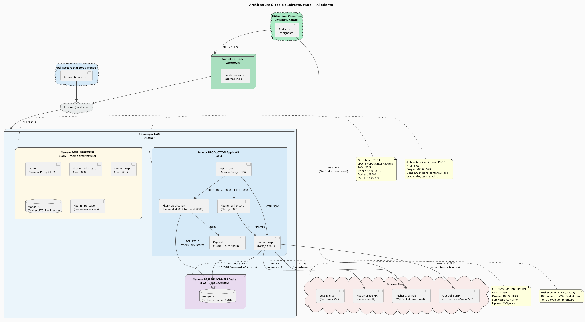

### 2.2 Environnements

| Environnement | Rôle | Hébergeur | Domaines actifs |
|---------------|------|-----------|-----------------|
| **Production** | Application live, utilisateurs réels | LWS — France | xkorienta.com, gradeforcast.com, xkorin.com |
| **Développement** | Tests, intégration continue, staging | LWS — France | (domaine de dev) |

> Les deux environnements partagent la même architecture Docker (infrastructure dupliquée). Le serveur de développement dispose d'un SSD là où la production utilise un HDD.

---

## 3. Spécifications des serveurs

### 3.1 Serveur Production

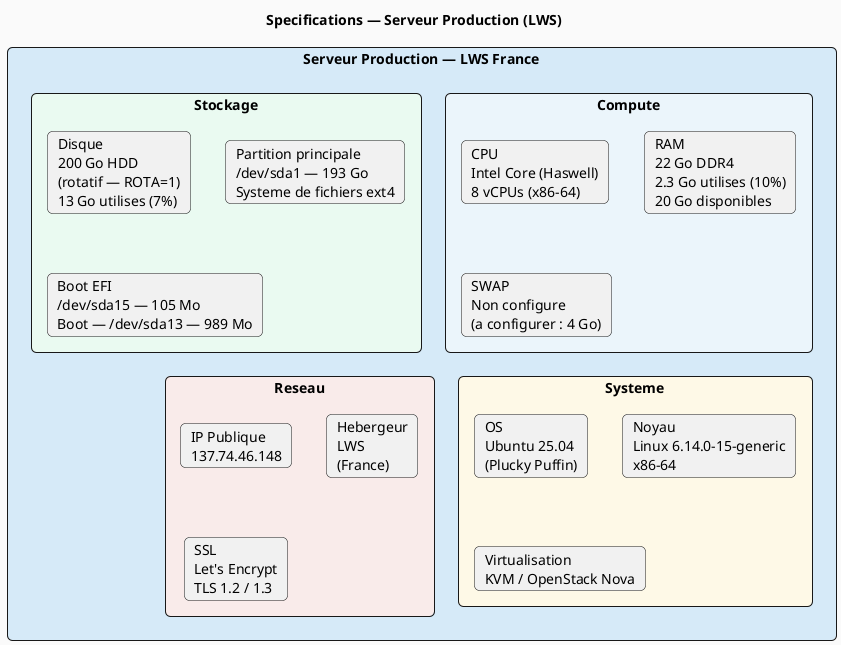

| Paramètre | Valeur |
|-----------|--------|
| **Hébergeur** | LWS — France |
| **Type** | VPS KVM |
| **CPU** | Intel Core (Haswell) — **8 vCPUs** |
| **RAM** | **22 Go** — 2,3 Go utilisés / 20 Go disponibles |
| **Swap** | Non configuré (à configurer) |
| **Stockage** | **200 Go HDD** (rotatif) — 13 Go utilisés (7%) |
| **OS** | Ubuntu 25.04 (Plucky Puffin) |
| **Noyau** | Linux 6.14.0-15-generic |
| **Virtualisation** | KVM |
| **IP publique** | 137.74.46.148 |
| **Runtime conteneurs** | Docker 28.5.0 |
| **Protocoles TLS** | 1.2 et 1.3 |
| **Certificats SSL** | Let's Encrypt (renouvellement automatique) |

### 3.2 Serveur Base de Données (dédié)

| Paramètre | Valeur |
|-----------|--------|
| **Hébergeur** | LWS — France |
| **Hostname** | vps-5e2088d6 |
| **Type** | VPS KVM |
| **CPU** | Intel Core (Haswell, no TSX) — **6 vCPUs** |
| **RAM** | **11 Go** — 1 Go utilisé / 10 Go disponible (buff/cache inclus) |
| **Swap** | Non configuré |
| **Stockage** | **100 Go HDD** (rotatif, ROTA=1) — 19 Go utilisés (20%) |
| **OS** | Ubuntu 25.04 (Plucky Puffin) |
| **Noyau** | Linux 6.14.0-15-generic |
| **Runtime** | Docker — conteneur `mongodb-server` (mongo:latest) |
| **Port** | 27017 (accessible depuis le serveur applicatif via réseau interne LWS) |
| **Applications servies** | Xkorienta et Xkorin |
| **Uptime** | 229 jours (stable) |
| **Charge CPU** | ~0 % au repos |

### 3.3 Serveur Développement

| Paramètre | Valeur |
|-----------|--------|
| **Hébergeur** | LWS — France |
| **Architecture** | Identique au serveur de production applicatif |
| **RAM** | **8 Go** |
| **Stockage** | **200 Go SSD** |
| **MongoDB** | Conteneur Docker intégré au serveur (pas de serveur BD séparé) |
| **Usage** | Intégration continue, tests, staging |

---

## 4. Architecture de déploiement Docker

### 4.1 Vue des conteneurs

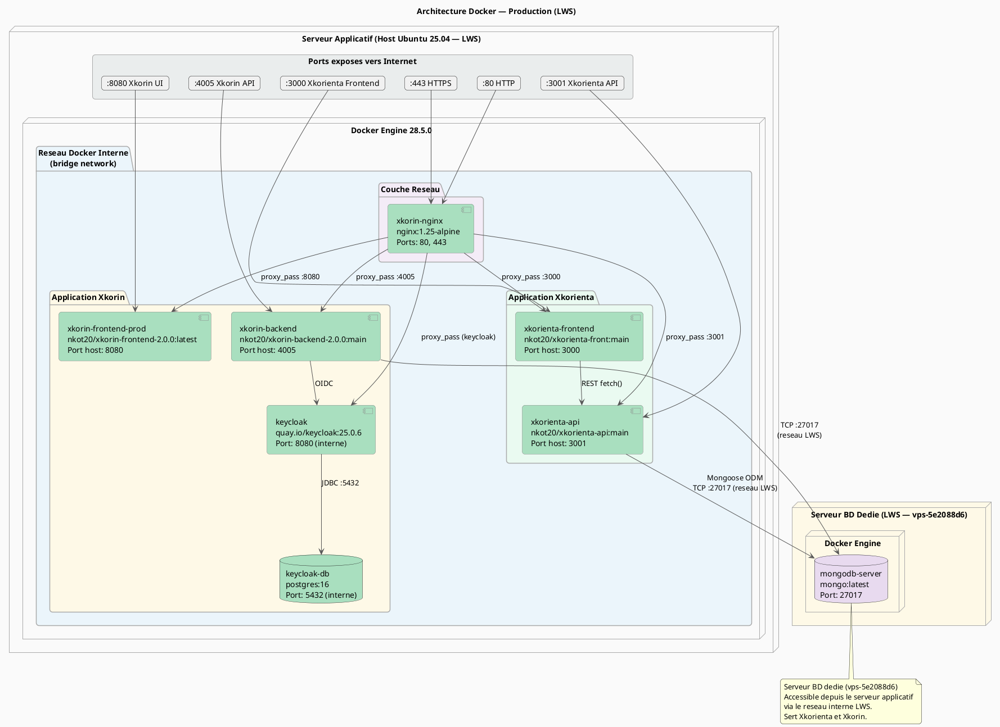

### 4.2 Matrice des conteneurs

**Serveur applicatif (production) :**

| Conteneur | Application | Image | Port hôte | Port interne |
|-----------|------------|-------|-----------|--------------|
| `xkorienta-frontend` | Xkorienta | nkot20/xkorienta-front:main | 3000 | 3000 |
| `xkorienta-api` | Xkorienta | nkot20/xkorienta-api:main | 3001 | 3001 |
| `xkorin-nginx` | Les deux | nginx:1.25-alpine | 80, 443 | 80, 443 |
| `xkorin-frontend-prod` | Xkorin | nkot20/xkorin-frontend-2.0.0:latest | 8080 | 80 |
| `xkorin-backend` | Xkorin | nkot20/xkorin-backend-2.0.0:main | 4005 | 4005 |
| `keycloak` | Xkorin | quay.io/keycloak:25.0.6 | — (interne) | 8080 |
| `keycloak-db` | Xkorin | postgres:16 | — (interne) | 5432 |

**Serveur base de données dédié (`vps-5e2088d6`) :**

| Conteneur | Application | Image | Port hôte | Port interne |
|-----------|------------|-------|-----------|--------------|
| `mongodb-server` | Xkorienta + Xkorin | mongo:latest | 27017 | 27017 |

### 4.3 Architecture réseau — MongoDB sur serveur dédié

MongoDB est déployé sur un **serveur VPS séparé** (`vps-5e2088d6`). Le serveur applicatif communique avec le serveur de base de données via le réseau interne LWS.

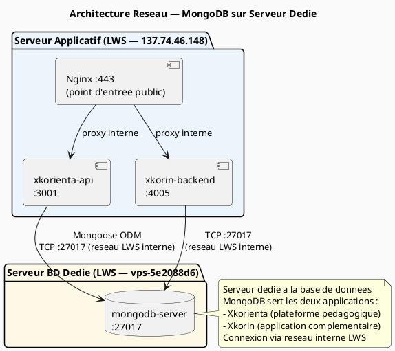

---

## 5. Architecture réseau et flux de données

### 5.1 Flux réseau complet

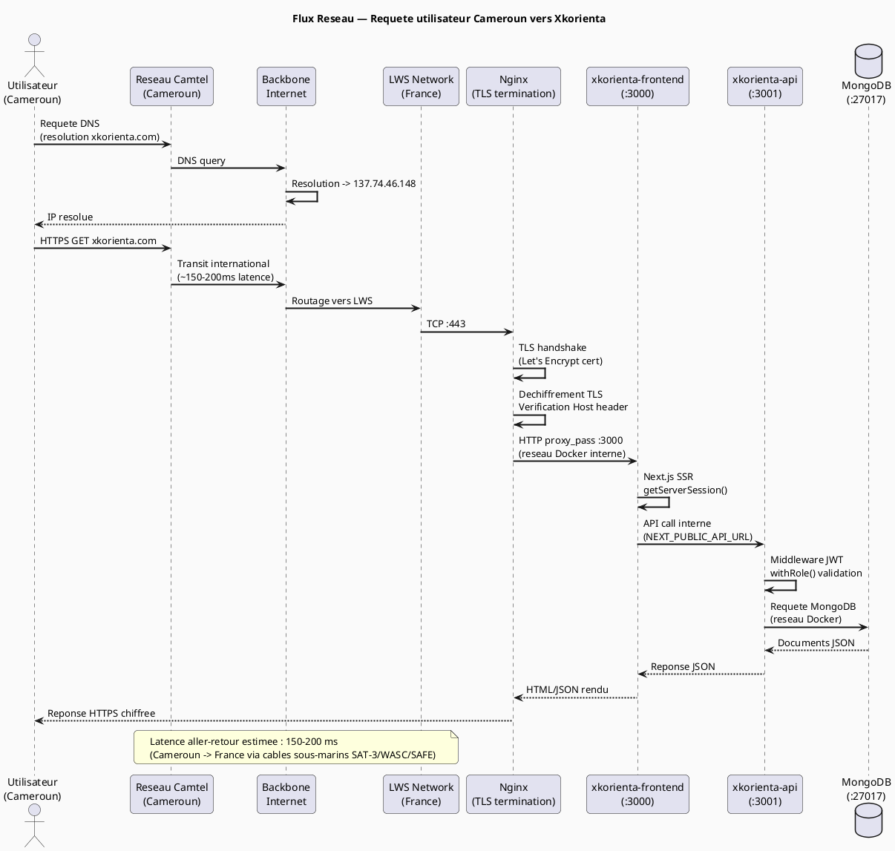

### 5.2 Configuration Nginx — Routage par domaine

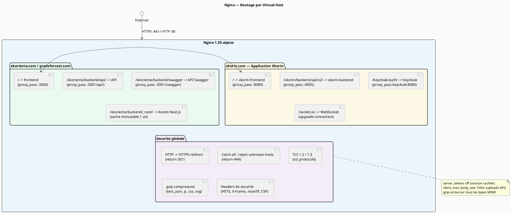

---

## 6. Architecture applicative

### 6.1 Stack technique complète

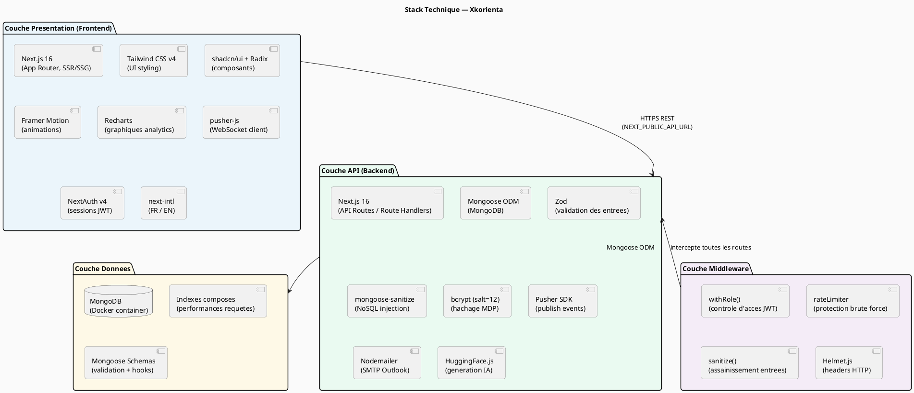

### 6.2 Architecture en couches — Backend

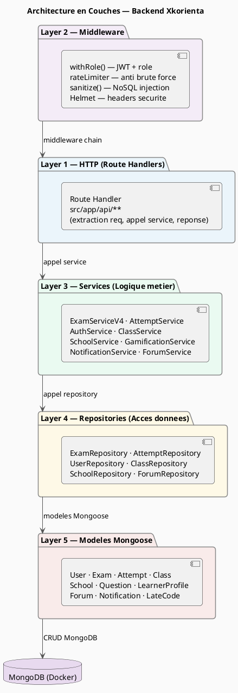

---

## 7. Base de données

### 7.1 Déploiement MongoDB

MongoDB est déployé en tant que **conteneur Docker** (`mongodb-server`) sur un **serveur VPS dédié** (`vps-5e2088d6`), distinct du serveur applicatif. Ce serveur héberge la base de données partagée par les deux applications (Xkorienta et Xkorin). Le serveur applicatif y accède via le réseau interne LWS sur le port 27017.

**Spécifications du serveur MongoDB dédié (relevées en production) :**

| Paramètre | Valeur |
|-----------|--------|
| Hostname | vps-5e2088d6 |
| CPU | 6 vCPUs Intel Haswell |
| RAM | 11 GiB (1 GiB utilisé, 10 GiB disponible) |
| Disque | 100 Go HDD (ROTA=1) — 19 Go utilisés |
| Swap | Non configuré |
| Uptime | 229 jours |
| Image Docker | mongo:latest |
| Conteneur | mongodb-server |
| Port | 27017 |
| Applications servies | Xkorienta + Xkorin |

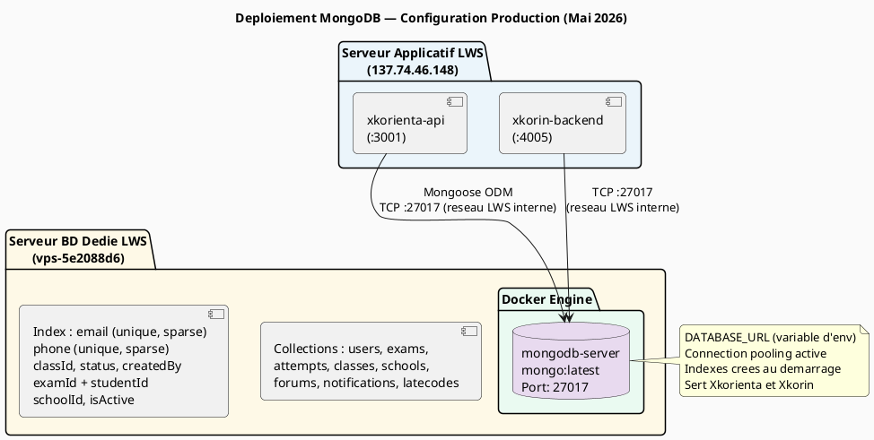

### 7.2 Modèle de données — Entités principales

| Collection | Rôle | Cardinalité clé |
|------------|------|-----------------|
| `users` | Tous les comptes (étudiant, enseignant, admin) | N |
| `learnerprofiles` | Profil gamification et progression | 1:1 avec users |
| `schools` | Établissements scolaires | N |
| `classes` | Classes dans une école | N:1 avec schools |
| `exams` | Examens créés par les enseignants | N:1 avec classes |
| `questions` | Questions d'un examen | N:1 avec exams |
| `attempts` | Tentatives de passage d'examen | N:1 avec exams, N:1 avec users |
| `forums` | Forums de classe | N:1 avec classes |
| `notifications` | Notifications utilisateur | N:1 avec users |
| `latecodes` | Codes d'accès retardataire | N:1 avec exams |

---

## 8. Services externes

### 8.1 Carte des intégrations

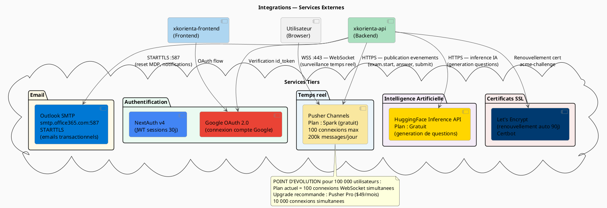

### 8.2 Tableau des services externes

| Service | Protocole | Port | Plan actuel | Limite actuelle | Plan cible (100k users) |
|---------|-----------|------|-------------|-----------------|------------------------|
| **Pusher Channels** | WSS / HTTPS | 443 | Spark (gratuit) | **100 connexions** | Pro ($49/mois) = 10 000 |
| **Google OAuth** | HTTPS | 443 | Gratuit | 1M req/jour | — |
| **Outlook SMTP** | STARTTLS | 587 | Outlook.com | 300 mails/jour | Microsoft 365 Business |
| **HuggingFace** | HTTPS | 443 | Gratuit | 30K tokens/mois | Pro ($9/mois) |
| **Let's Encrypt** | HTTPS/ACME | 443 | Gratuit | ∞ | — |

---

## 9. Sécurité de l'infrastructure

### 9.1 Matrice de sécurité

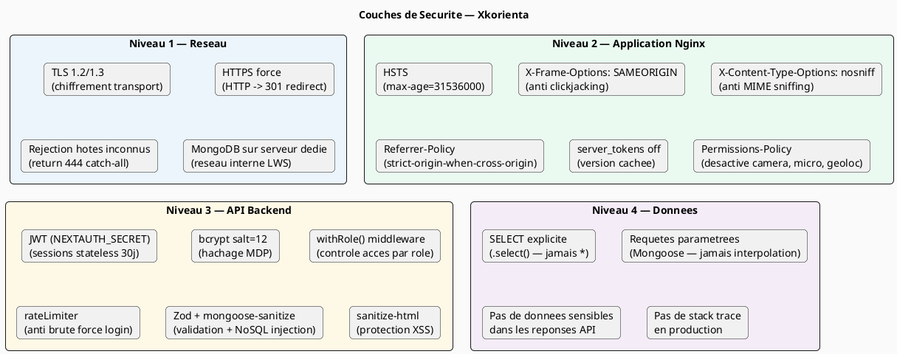

### 9.2 Flux d'authentification

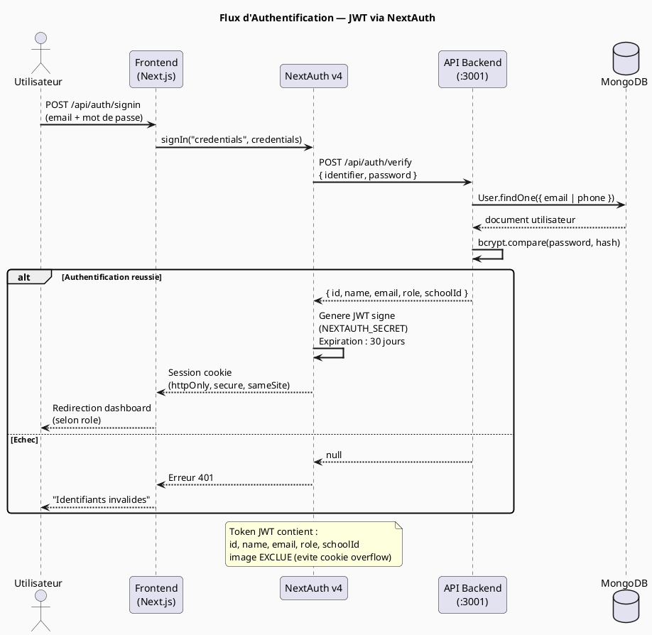

---

## 10. Analyse de charge et capacité

### 10.1 Objectif de charge

| Métrique | Valeur cible |
|----------|--------------|
| Utilisateurs totaux | **100 000** |
| Utilisateurs simultanés (pic examens) | **5 000 – 10 000** |
| Requêtes API par utilisateur actif (exam) | **~10 req/min** |
| Débit pic | **~1 000 – 1 500 req/sec** |
| Durée pic de charge | **2h** (matin 8h–10h) |
| Disponibilité cible | **≥ 99,5 %** |

### 10.2 Capacité du serveur actuel

```plantuml
@startuml LOAD_Capacity
skinparam backgroundColor #FAFAFA
skinparam roundcorner 10

title Analyse de Capacite — Serveur Production (LWS)

rectangle "Ressources disponibles" as Resources #EBF5FB {

  rectangle "CPU — 8 vCPUs (Serveur Applicatif)" as CPU_Block {
    card "Node.js xkorienta-api\n1-2 vCPUs en charge normale\n4-5 vCPUs en pic d'examens" as CPU1
    card "Node.js xkorienta-frontend\n1 vCPU" as CPU2
    card "Nginx\n<0.5 vCPU" as CPU4
    card "Stack Xkorin\n1-2 vCPUs" as CPU3
    card "Marge libre\n~2-4 vCPUs" as CPU5
  }

  rectangle "RAM — 22 Go (Serveur Applicatif)" as RAM_Block {
    card "OS + Docker engine\n~1 Go" as RAM1
    card "Nginx\n~100 Mo" as RAM2
    card "xkorienta-api (Node.js)\n~512 Mo - 2 Go" as RAM3
    card "xkorienta-frontend (Node.js)\n~512 Mo - 1 Go" as RAM4
    card "Stack Xkorin (keycloak, backend, frontend)\n~2 Go" as RAM6
    card "Marge libre\n~16 - 18 Go" as RAM7
  }

  rectangle "Serveur BD Dedie — 6 vCPUs / 11 Go RAM" as DB_Block {
    card "MongoDB\n1-2 vCPUs / 2-4 Go RAM\n(donnees + index)" as DBRes
    card "Marge libre\n~4 vCPUs / ~7 Go RAM" as DBMargin
  }
}

rectangle "Capacite de traitement estimee" as Capacity #EAFAF1 {
  card "Node.js API (8 vCPUs)\n500 - 1 500 req/sec\n(avec replicas Docker)" as ReqSec
  card "MongoDB\n10 000 - 20 000 ops/sec\n(lecture avec index)" as DBOps
  card "Connexions WebSocket (Pusher)\n100 max (plan Spark)\nUpgrade requis avant mise en prod a grande echelle" as WS
  card "Bande passante LWS\n1 Gbit/s (uplink datacenter)" as BW
}

@enduml
```

### 10.3 Modélisation des scénarios de charge

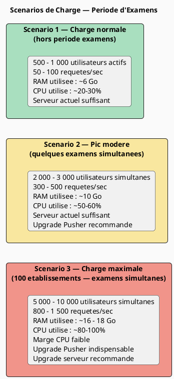

### 10.4 Répartition mémoire estimée en charge maximale

**Serveur applicatif (22 Go RAM) :**

| Composant | RAM estimée (charge max) |
|-----------|--------------------------|
| OS Ubuntu + noyau | 1,0 Go |
| Docker Engine | 0,5 Go |
| Nginx | 0,1 Go |
| xkorienta-api (Node.js) | 2,0 – 4,0 Go |
| xkorienta-frontend (Node.js) | 1,0 – 2,0 Go |
| Stack Xkorin (keycloak, backend, frontend) | 2,0 Go |
| **Total estimé** | **~7 – 10 Go** |
| **Marge disponible** | **~12 – 15 Go** |

**Serveur base de données dédié (11 Go RAM) :**

| Composant | RAM estimée (charge max) |
|-----------|--------------------------|
| OS Ubuntu + noyau | 0,5 Go |
| Docker Engine | 0,3 Go |
| MongoDB (données + cache + index) | 4,0 – 6,0 Go |
| **Total estimé** | **~5 – 7 Go** |
| **Marge disponible** | **~4 – 6 Go** |

---

## 11. Estimation des besoins en bande passante

### 11.1 Modèle de trafic par utilisateur

| Action | Volume de données | Fréquence |
|--------|------------------|-----------|
| Chargement page (1ère visite) | 500 Ko – 1 Mo | 1 fois (puis cache) |
| Requête API (exam question) | 5 – 20 Ko | ~10/min par étudiant |
| Soumission d'une réponse | 1 – 3 Ko | ~10/min par étudiant |
| Événement Pusher (temps réel) | < 1 Ko | ~2–5/min |
| Upload fichier (avatar, doc) | 0 – 5 Mo | Occasionnel |

### 11.2 Calcul de bande passante

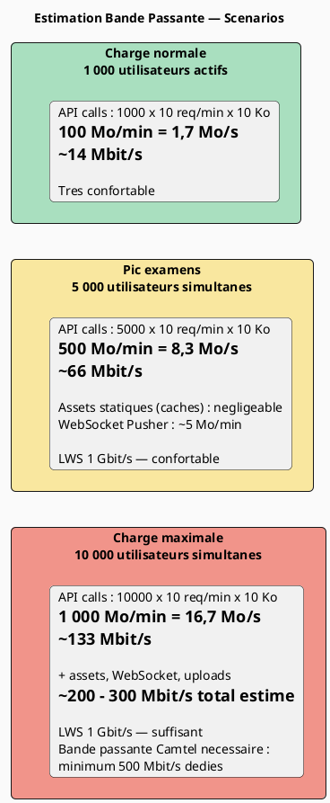

### 11.3 Latence réseau Cameroun → France

| Segment réseau | Latence estimée |
|----------------|----------------|
| Utilisateur → Réseau Camtel | < 5 ms |
| Réseau Cameroun → Backbone international | 20 – 50 ms |
| Backbone → LWS France (câbles sous-marins) | 80 – 150 ms |
| **Latence totale aller-retour (RTT)** | **~150 – 200 ms** |

> **Note Camtel :** La présence d'un point de cache CDN ou d'un serveur miroir au Cameroun réduirait la latence à **< 20 ms** pour les ressources statiques (pages, JS, CSS), améliorant significativement l'expérience utilisateur locale.

---

## 12. Points d'évolution et plan de croissance

### 12.1 Points d'évolution identifiés

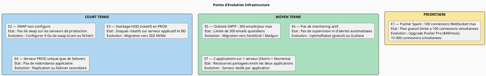

### 12.2 Plan d'évolution pour 100 000 utilisateurs

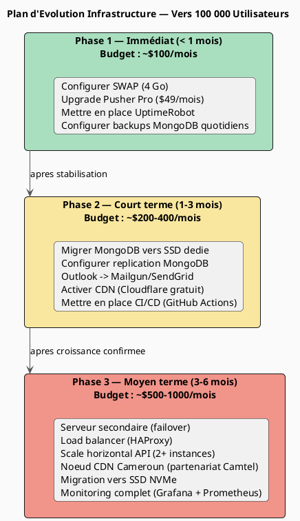

---

## 13. Recommandations pour le partenariat Camtel

### 13.1 Besoins identifiés côté Camtel

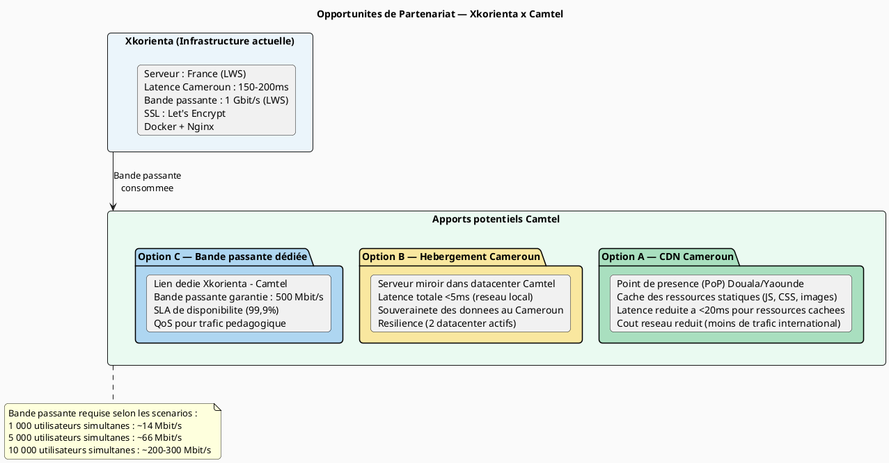

### 13.2 Synthèse technique pour Camtel

| Critère | État actuel | Cible (100k users) |
|---------|------------|-------------------|
| **Serveur** | 1 VPS LWS 8 vCPUs / 22 Go RAM | 2 VPS (prod + failover) ou dédié |
| **Bande passante** | 1 Gbit/s (LWS datacenter) | **≥ 500 Mbit/s côté Cameroun** |
| **Latence Cameroun** | 150 – 200 ms | < 20 ms (avec CDN local Camtel) |
| **WebSocket** | 100 connexions max (Pusher Spark) | 10 000 connexions (Pusher Pro) |
| **Base de données** | MongoDB sur serveur dédié — 6 vCPUs, 11 Go RAM, HDD — sert Xkorienta + Xkorin | MongoDB SSD + réplication |
| **Disponibilité** | ~98 % estimé | ≥ 99,5 % avec SLA Camtel |
| **SSL** | Let's Encrypt (gratuit) | Maintenu |
| **Monitoring** | Aucun | Grafana + alertes Camtel |

### 13.3 Architecture cible avec partenariat Camtel

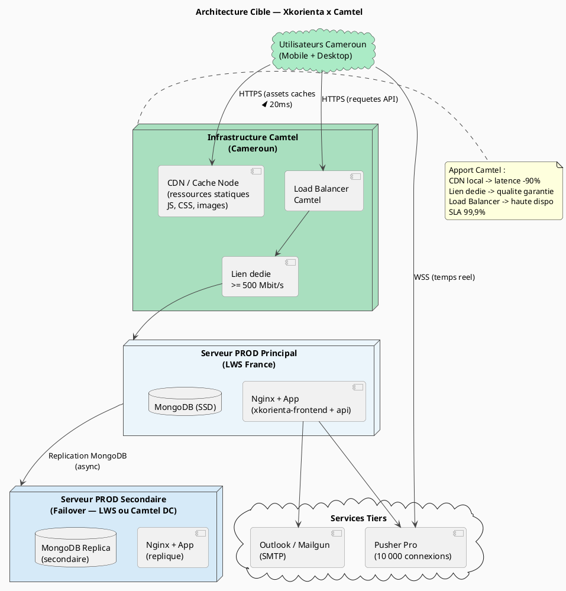

---

## Annexe A — Checklist d'évolutions planifiées

| Priorité | Action | Responsable | Coût mensuel |
|----------|--------|-------------|--------------|
| 🔴 Prioritaire | Configurer SWAP (4 Go) sur le **serveur BD dédié** (`vps-5e2088d6`) | DevOps | 0 |
| 🔴 Prioritaire | Configurer SWAP (4 Go) sur le **serveur PROD applicatif** | DevOps | 0 |
| 🔴 Prioritaire | Upgrade Pusher → Pro ou équivalent | Tech | $49/mois |
| 🟠 Court terme | Mettre en place UptimeRobot (monitoring) | DevOps | 0 (gratuit) |
| 🟠 Court terme | Configurer backups MongoDB automatiques | DevOps | ~$5/mois (stockage) |
| 🟠 Court terme | Migrer SMTP vers Mailgun ou SendGrid | Tech | $0-15/mois |
| 🟡 Moyen terme | Activer Cloudflare CDN (plan gratuit) | DevOps | 0 |
| 🟡 Moyen terme | Migrer disque BD de HDD vers SSD (serveur dédié) | Infra | Upgrade LWS |
| 🟡 Moyen terme | Mettre en place second serveur (failover) | Infra | ~$30-80/mois |

---

## Annexe B — Commandes de diagnostic rapide

```bash
# Etat des conteneurs
docker ps -a --format "table {{.Names}}\t{{.Status}}\t{{.Ports}}"

# Consommation RAM par conteneur
docker stats --no-stream --format "table {{.Name}}\t{{.MemUsage}}\t{{.CPUPerc}}"

# Espace disque
df -h /

# Charge systeme
uptime && free -h
```

---

*Document rédigé pour présentation à Camtel (Cameroon Telecommunications)*
*Xkorienta — Plateforme d'évaluation et d'orientation scolaire — Mai 2026*
*Version 1.0 — Confidentiel*
