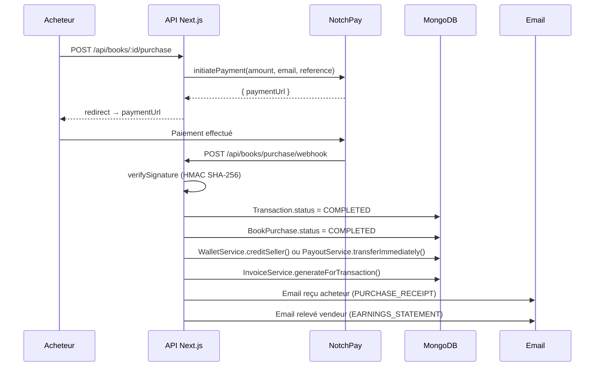
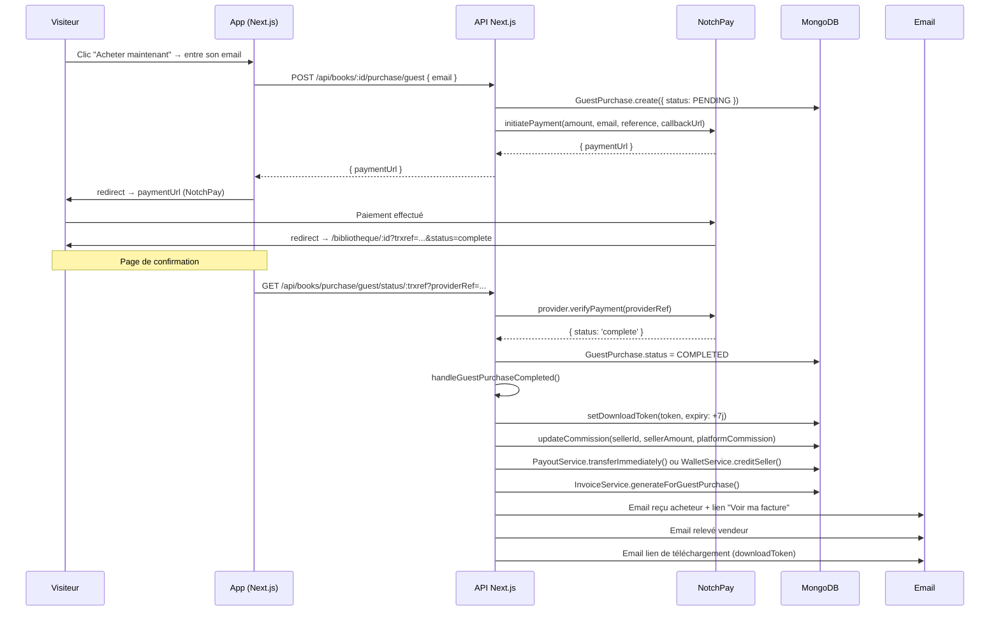

# Processus de Facturation — Xkorienta

**Version :** 1.0  
**Date :** Mai 2026  
**Concerne :** Module invoices, commissions, virements vendeurs

---

## Table des matières

1. [Vue d'ensemble](#1-vue-densemble)
2. [Modèles de données](#2-modèles-de-données)
3. [Flux acheteur avec compte](#3-flux-acheteur-avec-compte)
4. [Flux acheteur invité (sans compte)](#4-flux-acheteur-invité-sans-compte)
5. [Commissions et virements vendeurs](#5-commissions-et-virements-vendeurs)
6. [Accès aux factures](#6-accès-aux-factures)
7. [API Reference](#7-api-reference)
8. [Variables d'environnement](#8-variables-denvironnement)

---

## 1. Vue d'ensemble

La plateforme génère deux types de documents financiers après chaque achat de livre :

| Type | Destinataire | Déclencheur |
|---|---|---|
| `PURCHASE_RECEIPT` | Acheteur | Paiement confirmé |
| `EARNINGS_STATEMENT` | Vendeur (enseignant) | Paiement confirmé |

Les deux documents sont envoyés automatiquement par email. Ils sont également consultables en HTML via des endpoints dédiés.

### Deux parcours d'achat

```
Acheteur avec compte  → Transaction Mongoose → InvoiceService.generateForTransaction()
Acheteur invité       → GuestPurchase         → InvoiceService.generateForGuestPurchase()
```

---

## 2. Modèles de données

### Invoice (`src/models/Invoice.ts`)

```ts
{
  invoiceNumber:    string          // INV-YYYY-XXXXXX (séquentiel)
  type:             'PURCHASE_RECEIPT' | 'EARNINGS_STATEMENT'

  // Acheteur avec compte
  recipientId?:     ObjectId        // null pour les invités
  transactionId?:   ObjectId        // null pour les invités

  // Acheteur invité
  guestPurchaseId?: ObjectId        // référence à GuestPurchase
  isGuestPurchase?: boolean

  paymentReference: string          // ex : GUEST-E2C51E-8CBD8997
  productType:      TransactionType
  productDescription: string

  subtotal:         number
  discountAmount:   number
  discountPercent:  number
  total:            number
  currency:         string          // XAF, EUR, USD

  platformCommission?: number
  sellerAmount?:       number

  buyerName:   string
  buyerEmail?: string
  sellerName?: string

  status:    'ISSUED' | 'SENT' | 'VOIDED'
  issuedAt:  Date
  sentAt?:   Date
}
```

### GuestPurchase (`src/models/GuestPurchase.ts`)

Représente un achat sans compte. Champs liés à la facturation :

```ts
{
  bookId:           ObjectId
  email:            string          // email de l'acheteur invité
  paymentReference: string
  finalAmount:      number
  currency:         string
  status:           'PENDING' | 'COMPLETED' | 'FAILED'

  downloadToken?:       string      // token sécurisé pour téléchargement + accès facture
  downloadTokenExpiry?: Date        // valide 7 jours

  // Rempli après complétion
  sellerId?:          ObjectId
  sellerAmount?:      number
  platformCommission?: number
}
```

---

## 3. Flux acheteur avec compte



**Service déclencheur :** `src/lib/payment.ts` (EventBus `payment.completed`)

**Calcul de la commission :**
```
subtotal    = finalAmount / (1 - discountPercent / 100)
sellerAmount = finalAmount * (1 - commissionRate / 100)
platformCommission = finalAmount - sellerAmount
```

---

## 4. Flux acheteur invité (sans compte)



**Service déclencheur :** `GuestBookPurchaseService.handleGuestPurchaseCompleted()`

**Fichiers clés :**
```
src/lib/services/GuestBookPurchaseService.ts   ← logique métier
src/app/api/books/[id]/purchase/guest/route.ts ← initiation
src/app/api/books/purchase/guest/status/[reference]/route.ts ← vérification statut
src/app/api/books/guest-download/route.ts      ← téléchargement via token
```

---

## 5. Commissions et virements vendeurs

### Calcul

```
commissionRate  = BookConfig.commissionRate (défaut : 5%)
sellerAmount    = finalAmount * (1 - commissionRate / 100)
platformCommission = finalAmount - sellerAmount
```

Implémenté dans `BookConfigService.calculatePricing()`.

### Stratégie de versement (Option A — NotchPay direct)

À chaque vente, le système vérifie si le vendeur a configuré son mobile money (`User.paymentInfo`) :

```
Vendeur a paymentInfo.mobileMoneyPhone ?
  ├── OUI → PayoutService.transferImmediately()
  │          POST https://api.notchpay.co/transfers
  │          Payout créé (référence EARN-xxx) pour audit trail
  │          Fonds envoyés immédiatement au vendeur
  └── NON → WalletService.creditSeller()
             Crédit du wallet interne Mongoose
             Le vendeur demande un virement manuel via /api/seller/payout
```

### Configuration mobile money vendeur

L'enseignant renseigne ces champs dans son profil (`User.paymentInfo`) :

```ts
paymentInfo: {
  mobileMoneyPhone:    string   // ex: "+237699123456"
  mobileMoneyProvider: 'orange' | 'mtn' | 'other'
  mobileMoneyName:     string   // nom complet du compte Mobile Money
}
```

### Mappage canal NotchPay

| `mobileMoneyProvider` | Canal NotchPay |
|---|---|
| `orange` | `cm.orange` |
| `mtn` | `cm.mtn` |
| `other` | `cm.mobile` |

### Audit trail (modèle Payout)

Chaque virement crée un document `Payout` :

```ts
{
  userId:            ObjectId         // vendeur
  amount:            number
  currency:          Currency
  recipientPhone:    string
  recipientName:     string
  recipientProvider: MobileMoneyProvider
  status:            'PENDING' | 'PROCESSING' | 'COMPLETED' | 'FAILED'
  payoutReference:   string           // EARN-xxx (auto) ou PAY-xxx (manuel)
  providerTransferId?: string         // ID retourné par NotchPay
  failureReason?:    string
  processedAt?:      Date
}
```

---

## 6. Accès aux factures

### Acheteur avec compte

- Liste : `GET /api/invoices?type=PURCHASE_RECEIPT&page=1`
- Détail JSON : `GET /api/invoices/:invoiceNumber`
- HTML (impression) : `GET /api/invoices/:invoiceNumber/html`

Accès protégé par session NextAuth. L'utilisateur ne voit que ses propres factures (`invoice.recipientId === session.user.id`).

### Acheteur invité

Pas de session. L'accès se fait via le **downloadToken** reçu par email :

```
GET /api/invoices/:invoiceNumber/html?token=<downloadToken>
```

**Validation :**
1. `GuestPurchase.findOne({ downloadToken: token, status: 'COMPLETED' })`
2. `invoice.guestPurchaseId === guestPurchase._id`
3. Si valide → HTML servi sans authentification

Le lien est inclus automatiquement dans l'email de reçu invité (bouton « Voir / Imprimer ma facture »).

### Vendeur (relevé de gains)

- Liste : `GET /api/invoices?type=EARNINGS_STATEMENT`
- HTML : `GET /api/invoices/:invoiceNumber/html`

Accès protégé par session. Le vendeur ne voit que ses relevés (`invoice.recipientId === session.user.id`).

---

## 7. API Reference

### Factures

| Méthode | URL | Auth | Description |
|---|---|---|---|
| `GET` | `/api/invoices` | Session | Liste paginée des factures de l'utilisateur |
| `GET` | `/api/invoices/:invoiceNumber` | Session | Détail JSON d'une facture |
| `GET` | `/api/invoices/:invoiceNumber/html` | Session ou `?token=` | Facture HTML (impression / PDF) |

**Query params `GET /api/invoices` :**

| Param | Type | Défaut | Description |
|---|---|---|---|
| `type` | `PURCHASE_RECEIPT \| EARNINGS_STATEMENT` | — | Filtre par type |
| `page` | `number` | `1` | Numéro de page |
| `limit` | `number` | `20` | Résultats par page (max 50) |

### Achat invité

| Méthode | URL | Auth | Description |
|---|---|---|---|
| `POST` | `/api/books/:id/purchase/guest` | Aucune | Initier un achat invité |
| `GET` | `/api/books/purchase/guest/status/:trxref` | Aucune | Vérifier le statut après retour NotchPay |
| `GET` | `/api/books/guest-download?token=` | Token | Télécharger le livre |

**Body `POST /api/books/:id/purchase/guest` :**
```json
{ "email": "acheteur@example.com" }
```

**Response :**
```json
{
  "success": true,
  "data": {
    "paymentUrl": "https://pay.notchpay.co/...",
    "reference": "GUEST-E2C51E-8CBD8997",
    "finalAmount": 2500,
    "currency": "XAF"
  }
}
```

### Wallet & virements vendeurs

| Méthode | URL | Auth | Description |
|---|---|---|---|
| `GET` | `/api/seller/wallet` | Session | Solde et statistiques du wallet |
| `GET` | `/api/seller/earnings` | Session | Historique des gains |
| `POST` | `/api/seller/payout` | Session | Demander un virement manuel |
| `GET` | `/api/seller/payout` | Session | Historique des virements |

**Body `POST /api/seller/payout` :**
```json
{
  "amount": 5000,
  "currency": "XAF",
  "recipientPhone": "+237699123456",
  "recipientName": "Jean Dupont",
  "recipientProvider": "mtn"
}
```

---

## 8. Variables d'environnement

| Variable | Description | Obligatoire |
|---|---|---|
| `NOTCHPAY_PUBLIC_KEY` | Clé publique NotchPay (initiation) | Oui |
| `NOTCHPAY_SECRET_KEY` | Clé secrète NotchPay (transfers) | Oui |
| `NOTCHPAY_HASH` | Hash webhook HMAC SHA-256 | Oui |
| `NEXT_PUBLIC_APP_URL` | URL base de l'app (liens emails) | Oui |
| `NEXT_PUBLIC_API_URL` | URL base de l'API (si différente) | Non |
| `EXCHANGE_RATE_API_KEY` | Taux de change multi-devises | Non |

---

## Annexe — Architecture des couches

```
Route Handler
    └── InvoiceService / GuestBookPurchaseService / PayoutService
            └── invoiceRepository / guestPurchaseRepository / payoutRepository
                    └── MongoDB (Mongoose)
                    └── NotchPay API (via PaymentSDK)
                    └── Email (via NodemailerAdapter)
```

**Principe :** Aucun accès à la base de données ni appel API externe dans les route handlers. Tout passe par les services.

**Gestion des erreurs :** Les blocs commission et facturation sont enveloppés en `try/catch` indépendants — un échec de facturation ne bloque pas l'envoi du lien de téléchargement.
