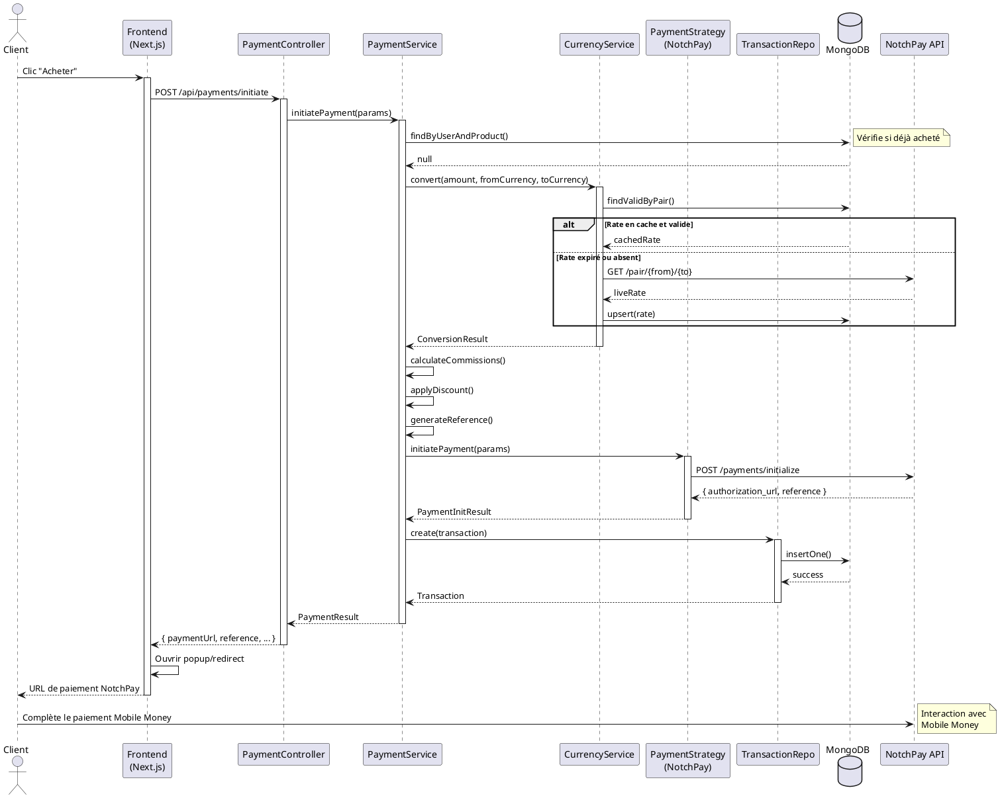
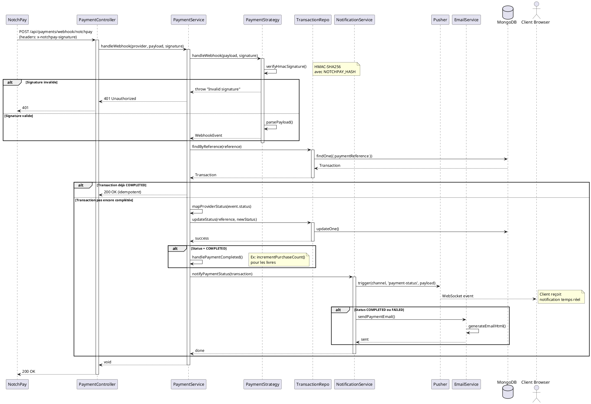
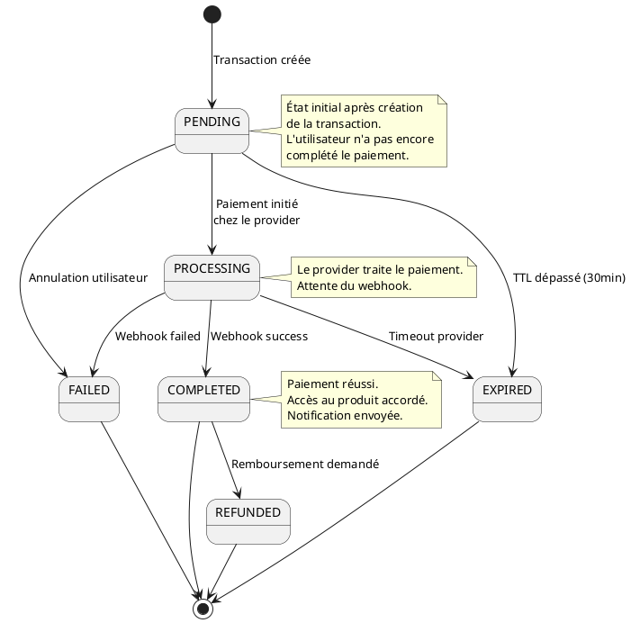

# Document d'Analyse et de Conception - Module de Paiement Xkorienta

**Version:** 1.0  
**Date:** Avril 2026  
**Auteur:** Équipe Technique QuizLock

---

## Table des Matières

1. [Introduction](#1-introduction)
2. [Analyse des Besoins](#2-analyse-des-besoins)
3. [Architecture Technique](#3-architecture-technique)
4. [Modèles de Données](#4-modèles-de-données)
5. [Diagrammes UML](#5-diagrammes-uml)
6. [Flux de Processus](#6-flux-de-processus)
7. [API REST](#7-api-rest)
8. [Sécurité](#8-sécurité)
9. [Extensibilité](#9-extensibilité)
10. [Configuration](#10-configuration)

---

## 1. Introduction

### 1.1 Contexte

QuizLock est une plateforme éducative permettant aux élèves et enseignants d'accéder à des ressources pédagogiques, des examens et des livres numériques. Le module de paiement gère toutes les transactions financières de la plateforme.

### 1.2 Objectifs

- **Généricité** : Supporter tout type de produit (livres, abonnements, cours, recharges)
- **Multi-devises** : Gérer XAF, EUR, USD avec conversion en temps réel
- **Asynchronicité** : Supporter les paiements Mobile Money via webhooks
- **Extensibilité** : Permettre l'ajout de nouveaux prestataires de paiement
- **Notifications temps réel** : Informer l'utilisateur du statut via Pusher

### 1.3 Prestataire de Paiement

**NotchPay** est le prestataire principal, supportant :

- Mobile Money (Orange, MTN, etc.)
- Cartes bancaires
- Paiements QR Code

Documentation : https://developer.notchpay.co/

---

## 2. Analyse des Besoins

### 2.1 Besoins Fonctionnels

| ID    | Besoin                                              | Priorité |
| ----- | --------------------------------------------------- | -------- |
| BF-01 | Initier un paiement pour tout type de produit       | Haute    |
| BF-02 | Recevoir et traiter les webhooks du prestataire     | Haute    |
| BF-03 | Convertir les devises automatiquement               | Haute    |
| BF-04 | Notifier l'utilisateur en temps réel du statut      | Haute    |
| BF-05 | Gérer les abonnements récurrents (mensuel/annuel)   | Moyenne  |
| BF-06 | Appliquer des remises sur les transactions          | Moyenne  |
| BF-07 | Calculer et répartir les commissions                | Moyenne  |
| BF-08 | Fournir un historique des transactions              | Moyenne  |
| BF-09 | Expirer automatiquement les transactions en attente | Basse    |
| BF-10 | Envoyer des emails de confirmation/échec            | Basse    |

### 2.2 Besoins Non-Fonctionnels

| ID     | Besoin        | Contrainte                            |
| ------ | ------------- | ------------------------------------- |
| BNF-01 | Performance   | < 2s pour initier un paiement         |
| BNF-02 | Disponibilité | 99.9% uptime                          |
| BNF-03 | Sécurité      | Validation HMAC des webhooks          |
| BNF-04 | Idempotence   | Pas de double traitement des webhooks |
| BNF-05 | Traçabilité   | Historique complet des statuts        |
| BNF-06 | Scalabilité   | Support de 1000+ transactions/jour    |

### 2.3 Cas d'Utilisation

```
┌─────────────────────────────────────────────────────────────────┐
│                      Module de Paiement                         │
├─────────────────────────────────────────────────────────────────┤
│                                                                 │
│  ┌─────────┐                                    ┌─────────────┐│
│  │  User   │───► Acheter un livre              │   Admin     ││
│  │(Client) │───► S'abonner à un forfait        │  (Staff)    ││
│  └────┬────┘───► Consulter historique          └──────┬──────┘│
│       │         ───► Vérifier statut paiement         │       │
│       │                                               │       │
│       │         ┌───────────────────────────┐         │       │
│       └─────────│      PaymentService       │─────────┘       │
│                 └───────────────────────────┘                 │
│                              │                                 │
│                 ┌────────────┴────────────┐                   │
│                 ▼                         ▼                   │
│          ┌───────────┐             ┌───────────┐              │
│          │ NotchPay  │             │  Stripe   │              │
│          │ Strategy  │             │ Strategy  │              │
│          └───────────┘             └───────────┘              │
│                                                                │
└────────────────────────────────────────────────────────────────┘
```

---

## 3. Architecture Technique

### 3.1 Vue d'Ensemble

```
┌────────────────────────────────────────────────────────────────────────┐
│                            FRONTEND (Next.js)                          │
│  ┌─────────────┐  ┌─────────────┐  ┌─────────────┐  ┌─────────────┐   │
│  │   Checkout  │  │ Subscription│  │  Payment    │  │   History   │   │
│  │   Page      │  │    Page     │  │   Status    │  │    Page     │   │
│  └──────┬──────┘  └──────┬──────┘  └──────┬──────┘  └──────┬──────┘   │
└─────────┼────────────────┼────────────────┼────────────────┼──────────┘
          │                │                │                │
          ▼                ▼                ▼                ▼
┌────────────────────────────────────────────────────────────────────────┐
│                          API LAYER (Next.js API Routes)                │
│  ┌─────────────────┐  ┌───────────────────┐  ┌─────────────────────┐  │
│  │ PaymentController│  │SubscriptionCtrl   │  │  CurrencyController │  │
│  └────────┬────────┘  └─────────┬─────────┘  └──────────┬──────────┘  │
└───────────┼─────────────────────┼───────────────────────┼─────────────┘
            │                     │                       │
            ▼                     ▼                       ▼
┌────────────────────────────────────────────────────────────────────────┐
│                          SERVICE LAYER                                 │
│  ┌─────────────────┐  ┌─────────────────┐  ┌─────────────────────────┐│
│  │  PaymentService │  │SubscriptionSvc  │  │    CurrencyService      ││
│  └────────┬────────┘  └────────┬────────┘  └────────────┬────────────┘│
│           │                    │                        │              │
│           ▼                    │                        ▼              │
│  ┌─────────────────────────┐   │           ┌────────────────────────┐ │
│  │PaymentNotificationService│   │           │  ExchangeRate API      │ │
│  └────────────┬────────────┘   │           │  (exchangerate-api.com)│ │
│               │                │           └────────────────────────┘ │
│               ▼                │                                       │
│        ┌──────────┐            │                                       │
│        │  Pusher  │            │                                       │
│        └──────────┘            │                                       │
└────────────────────────────────┼───────────────────────────────────────┘
                                 │
            ┌────────────────────┼────────────────────┐
            ▼                    ▼                    ▼
┌────────────────────────────────────────────────────────────────────────┐
│                       STRATEGY LAYER                                   │
│         ┌──────────────────────────────────────────┐                  │
│         │       PaymentStrategyFactory             │                  │
│         └──────────────────┬───────────────────────┘                  │
│                            │                                           │
│              ┌─────────────┼─────────────┐                            │
│              ▼             ▼             ▼                            │
│      ┌───────────┐  ┌───────────┐  ┌───────────┐                      │
│      │ NotchPay  │  │  Stripe   │  │  Future   │                      │
│      │ Strategy  │  │ Strategy  │  │ Provider  │                      │
│      └─────┬─────┘  └─────┬─────┘  └───────────┘                      │
│            │              │                                            │
└────────────┼──────────────┼────────────────────────────────────────────┘
             │              │
             ▼              ▼
      ┌────────────┐  ┌────────────┐
      │  NotchPay  │  │   Stripe   │
      │    API     │  │    API     │
      └────────────┘  └────────────┘

┌────────────────────────────────────────────────────────────────────────┐
│                       REPOSITORY LAYER                                 │
│  ┌───────────────────┐ ┌─────────────────┐ ┌────────────────────────┐ │
│  │TransactionRepository│ │PlanRepository   │ │SubscriptionRepository │ │
│  └─────────┬─────────┘ └────────┬────────┘ └───────────┬────────────┘ │
│            │                    │                      │               │
└────────────┼────────────────────┼──────────────────────┼───────────────┘
             │                    │                      │
             ▼                    ▼                      ▼
┌────────────────────────────────────────────────────────────────────────┐
│                          MONGODB (Mongoose)                            │
│  ┌─────────────┐ ┌──────────┐ ┌──────────────┐ ┌────────────────────┐ │
│  │ Transaction │ │   Plan   │ │ Subscription │ │   ExchangeRate     │ │
│  └─────────────┘ └──────────┘ └──────────────┘ └────────────────────┘ │
└────────────────────────────────────────────────────────────────────────┘
```

### 3.2 Patterns de Conception

| Pattern           | Application                            | Justification                                                 |
| ----------------- | -------------------------------------- | ------------------------------------------------------------- |
| **Strategy**      | `IPaymentStrategy`, `NotchPayStrategy` | Permet de changer de prestataire sans modifier le code client |
| **Factory**       | `PaymentStrategyFactory`               | Crée la bonne stratégie selon le provider configuré           |
| **Repository**    | `TransactionRepository`, etc.          | Abstrait l'accès aux données, facilite les tests              |
| **Service Layer** | `PaymentService`, `CurrencyService`    | Encapsule la logique métier                                   |
| **Observer**      | Pusher notifications                   | Notifie les clients des changements de statut                 |

### 3.3 Technologies

| Composant                | Technologie        | Version |
| ------------------------ | ------------------ | ------- |
| Backend                  | Next.js API Routes | 14.x    |
| Base de données          | MongoDB            | 7.x     |
| ODM                      | Mongoose           | 8.x     |
| Notifications temps réel | Pusher             | -       |
| Email                    | Nodemailer         | -       |
| Validation               | Zod                | -       |

---

## 4. Modèles de Données

### 4.1 Transaction

La table centrale qui enregistre toutes les transactions financières.

```typescript
interface ITransaction {
  _id: ObjectId;
  userId: ObjectId; // Référence vers User
  type: TransactionType; // BOOK_PURCHASE | SUBSCRIPTION | COURSE | TOP_UP
  productId: ObjectId; // Référence polymorphe (Book, Plan, Course)
  productModel: string; // 'Book' | 'Plan' | 'Course'

  // Montants
  originalAmount: number; // Montant original (devise du produit)
  originalCurrency: Currency; // XAF | EUR | USD
  convertedAmount: number; // Montant après conversion
  paymentCurrency: Currency; // Devise de paiement choisie
  exchangeRate: number; // Taux de change appliqué
  discountPercent: number; // Réduction appliquée (0-100)
  finalAmount: number; // Montant final payé

  // Commissions
  platformCommission: number; // Commission plateforme (5% par défaut)
  sellerAmount: number; // Montant reversé au vendeur
  sellerId?: ObjectId; // Vendeur (pour les livres)

  // Paiement
  paymentReference: string; // Référence unique (ex: BOOK-AB12CD-XXXXXX)
  paymentProvider: string; // 'notchpay' | 'stripe'
  providerTransactionId?: string;

  // Statut
  status: TransactionStatus; // PENDING | PROCESSING | COMPLETED | FAILED | REFUNDED | EXPIRED
  statusHistory: StatusEntry[]; // Historique des changements de statut

  // Métadonnées
  metadata: Record<string, unknown>;
  webhookReceivedAt?: Date;
  completedAt?: Date;
  expiresAt: Date; // TTL pour les transactions en attente

  createdAt: Date;
  updatedAt: Date;
}
```

### 4.2 Plan (Forfait d'abonnement)

```typescript
interface IPlan {
  _id: ObjectId;
  code: string; // FREEMIUM | PREMIUM_MONTHLY | PREMIUM_YEARLY | INSTITUTION
  name: string;
  description: string;

  prices: PlanPrice[]; // Prix par devise et intervalle
  features: string[]; // Liste des fonctionnalités incluses
  limits: PlanLimits; // Limites d'utilisation

  isActive: boolean;
  sortOrder: number;
  isFree: boolean;

  createdAt: Date;
  updatedAt: Date;
}

interface PlanPrice {
  currency: Currency; // XAF | EUR | USD
  amount: number;
  interval: SubscriptionInterval; // MONTHLY | YEARLY
}

interface PlanLimits {
  maxExamsPerMonth?: number;
  maxClassesJoined?: number;
  downloadBooks: boolean;
  prioritySupport: boolean;
  aiAssistance: boolean;
  offlineAccess: boolean;
}
```

### 4.3 Subscription (Abonnement utilisateur)

```typescript
interface ISubscription {
  _id: ObjectId;
  userId: ObjectId;
  planId: ObjectId;

  status: SubscriptionPlanStatus; // ACTIVE | CANCELLED | EXPIRED | PAST_DUE
  interval: SubscriptionInterval; // MONTHLY | YEARLY

  currentPeriodStart: Date;
  currentPeriodEnd: Date;
  cancelledAt?: Date;

  // Paiement
  lastTransactionId?: ObjectId;
  currency: Currency;
  amount: number;

  autoRenew: boolean;
  renewalReminders: RenewalReminder[];

  createdAt: Date;
  updatedAt: Date;
}
```

### 4.4 ExchangeRate (Taux de change)

```typescript
interface IExchangeRate {
  _id: ObjectId;
  baseCurrency: Currency;
  targetCurrency: Currency;
  rate: number;
  inverseRate: number;
  source: string; // 'exchangerate-api.com'
  fetchedAt: Date;
  expiresAt: Date; // TTL de 1 heure

  createdAt: Date;
  updatedAt: Date;
}
```

### 4.5 Énumérations

```typescript
enum TransactionType {
  BOOK_PURCHASE = "BOOK_PURCHASE",
  SUBSCRIPTION = "SUBSCRIPTION",
  COURSE = "COURSE",
  TOP_UP = "TOP_UP",
}

enum TransactionStatus {
  PENDING = "PENDING", // Transaction créée, en attente
  PROCESSING = "PROCESSING", // Paiement en cours
  COMPLETED = "COMPLETED", // Paiement réussi
  FAILED = "FAILED", // Paiement échoué
  REFUNDED = "REFUNDED", // Remboursé
  EXPIRED = "EXPIRED", // Expiré (TTL dépassé)
}

enum Currency {
  XAF = "XAF", // Franc CFA
  EUR = "EUR", // Euro
  USD = "USD", // Dollar US
}

enum SubscriptionInterval {
  MONTHLY = "MONTHLY",
  YEARLY = "YEARLY",
}

enum SubscriptionPlanStatus {
  ACTIVE = "ACTIVE",
  CANCELLED = "CANCELLED",
  EXPIRED = "EXPIRED",
  PAST_DUE = "PAST_DUE",
}

enum PaymentProvider {
  NOTCHPAY = "notchpay",
  STRIPE = "stripe",
}
```

---

## 5. Diagrammes UML

### 5.1 Diagramme de Classes (Domaine Métier)

```plantuml
@startuml QuizLock Payment Domain Model

' Style
skinparam classAttributeIconSize 0
skinparam classFontSize 12
skinparam class {
    BackgroundColor #FEFECE
    BorderColor #A80036
    ArrowColor #A80036
}
skinparam stereotypeCPosition top

' ====================
' ENUMS
' ====================
enum TransactionType <<enumeration>> {
    BOOK_PURCHASE
    SUBSCRIPTION
    COURSE
    TOP_UP
}

enum TransactionStatus <<enumeration>> {
    PENDING
    PROCESSING
    COMPLETED
    FAILED
    REFUNDED
    EXPIRED
}

enum Currency <<enumeration>> {
    XAF
    EUR
    USD
}

enum SubscriptionInterval <<enumeration>> {
    MONTHLY
    YEARLY
}

enum SubscriptionPlanStatus <<enumeration>> {
    ACTIVE
    CANCELLED
    EXPIRED
    PAST_DUE
}

enum PaymentProvider <<enumeration>> {
    NOTCHPAY
    STRIPE
}

' ====================
' MAIN ENTITIES
' ====================
class User {
    +_id: ObjectId
    +email: string
    +name: string
    +subscriptionStatus: SubscriptionStatus
    --
    +hasActiveSubscription(): boolean
    +hasPurchased(productId): boolean
}

class Transaction {
    +_id: ObjectId
    +userId: ObjectId
    +type: TransactionType
    +productId: ObjectId
    +productModel: string
    --
    +originalAmount: number
    +originalCurrency: Currency
    +convertedAmount: number
    +paymentCurrency: Currency
    +exchangeRate: number
    +discountPercent: number
    +finalAmount: number
    --
    +platformCommission: number
    +sellerAmount: number
    +sellerId: ObjectId
    --
    +paymentReference: string
    +paymentProvider: PaymentProvider
    +providerTransactionId: string
    +status: TransactionStatus
    +statusHistory: StatusHistoryEntry[]
    --
    +metadata: Record<string, unknown>
    +webhookReceivedAt: Date
    +completedAt: Date
    +expiresAt: Date
    --
    +isCompleted(): boolean
    +isPending(): boolean
    +isExpired(): boolean
    +addStatusEntry(status, reason): void
}

class StatusHistoryEntry <<value object>> {
    +status: TransactionStatus
    +at: Date
    +reason: string
}

class GuestPurchase {
    +_id: ObjectId
    +bookId: ObjectId
    +email: string
    +paymentReference: string
    +paymentProvider: string
    +status: 'PENDING' | 'COMPLETED' | 'FAILED'
    +downloadToken: string
    +downloadTokenExpiry: Date
    +downloadCount: number
    +maxDownloads: number
    +finalAmount: number
    +currency: Currency
    +expiresAt: Date
    --
    +isTokenValid(): boolean
    +canDownload(): boolean
}

class Plan {
    +_id: ObjectId
    +code: string
    +name: string
    +description: string
    +prices: PlanPrice[]
    +features: string[]
    +limits: PlanLimits
    +isActive: boolean
    +sortOrder: number
    +isFree: boolean
    --
    +getPriceFor(currency, interval): PlanPrice
    +hasFeature(feature): boolean
}

class PlanPrice <<value object>> {
    +currency: Currency
    +amount: number
    +interval: SubscriptionInterval
}

class PlanLimits <<value object>> {
    +maxExamsPerMonth: number
    +maxClassesJoined: number
    +downloadBooks: boolean
    +prioritySupport: boolean
    +aiAssistance: boolean
    +offlineAccess: boolean
}

class Subscription {
    +_id: ObjectId
    +userId: ObjectId
    +planId: ObjectId
    +status: SubscriptionPlanStatus
    +interval: SubscriptionInterval
    +currentPeriodStart: Date
    +currentPeriodEnd: Date
    +cancelledAt: Date
    +lastTransactionId: ObjectId
    +currency: Currency
    +amount: number
    +autoRenew: boolean
    +renewalReminders: RenewalReminder[]
    --
    +isActive(): boolean
    +daysUntilExpiry(): number
    +cancel(): void
    +renew(): void
}

class RenewalReminder <<value object>> {
    +sentAt: Date
    +type: 'EMAIL' | 'PUSH' | 'SMS'
}

class ExchangeRate {
    +_id: ObjectId
    +baseCurrency: Currency
    +targetCurrency: Currency
    +rate: number
    +inverseRate: number
    +source: string
    +fetchedAt: Date
    +expiresAt: Date
    --
    +isExpired(): boolean
    +convert(amount): number
}

class Book {
    +_id: ObjectId
    +title: string
    +price: number
    +currency: Currency
    +submittedBy: ObjectId
    +purchaseCount: number
    --
    +isFree(): boolean
    +incrementPurchaseCount(): void
}

' ====================
' STRATEGY PATTERN
' ====================
interface IPaymentStrategy <<interface>> {
    +providerName: string
    +initiatePayment(params): Promise<PaymentInitResult>
    +verifyPayment(reference): Promise<PaymentVerifyResult>
    +handleWebhook(payload, signature): Promise<WebhookEvent>
}

class NotchPayStrategy implements IPaymentStrategy {
    +providerName: 'notchpay'
    -publicKey: string
    -hash: string
    --
    +initiatePayment(params): Promise<PaymentInitResult>
    +verifyPayment(reference): Promise<PaymentVerifyResult>
    +handleWebhook(payload, signature): Promise<WebhookEvent>
    -mapStatus(status): string
}

class StripeStrategy implements IPaymentStrategy {
    +providerName: 'stripe'
    -secretKey: string
    -webhookSecret: string
}

class PaymentStrategyFactory <<factory>> {
    {static} +create(provider: PaymentProvider): IPaymentStrategy
}

' ====================
' SERVICES (orchestration)
' ====================
class PaymentService <<service>> {
    {static} +initiatePayment(params): Promise<PaymentResult>
    {static} +handleWebhook(provider, payload, signature): void
    {static} +verifyPayment(reference): TransactionStatus
    {static} +getTransactionByReference(ref): Transaction
    {static} +getUserTransactions(userId): Transaction[]
    {static} +expireStaleTransactions(): number
    {static} -getProductDetails(type, productId, currency): ProductDetails
    {static} -handlePaymentCompleted(transaction): void
    {static} -mapProviderStatus(status): TransactionStatus
    {static} -generateReference(type, productId): string
}

class CurrencyService <<service>> {
    {static} +convert(amount, from, to): ConversionResult
    {static} +getRate(from, to): number
    {static} +refreshRates(base): void
    {static} +getSupportedCurrencies(): string[]
    {static} -fetchLiveRate(apiKey, from, to): number
    {static} -getFallbackRate(from, to): number
}

class BookPurchaseService <<service>> {
    {static} +initiatePurchase(input): PurchaseResult
    {static} +handleWebhook(payload, signature): void
    {static} +hasAccess(userId, bookId): boolean
    {static} +getPurchasedBooks(userId): BookPurchase[]
}

class GuestBookPurchaseService <<service>> {
    {static} +initiateGuestPurchase(bookId, email, callbackUrl): GuestPurchaseResult
    {static} +handleGuestPurchaseCompleted(purchase): void
    {static} +validateDownloadToken(token): {bookId, id}
    {static} -sendDownloadEmail(email, title, token, amount, currency): boolean
}

class SubscriptionService <<service>> {
    {static} +activateSubscription(reference): void
}

class PaymentNotificationService <<service>> {
    {static} +notifyPaymentStatus(transaction): void
    {static} +notifySubscriptionActivated(userId, sub, plan): void
    {static} +notifySubscriptionExpiring(userId, plan, days, date): void
}

' ====================
' ENTITY RELATIONS
' ====================
User "1" -- "0..*" Transaction : passe >
User "1" -- "0..1" Subscription : possède >
User "1" -- "0..*" Book : soumet >

Transaction "0..*" -- "1" User : appartient à >
Transaction "*" --> "1" TransactionType : a un type
Transaction "*" --> "1" TransactionStatus : a un statut
Transaction "*" --> "1" Currency : devise originale
Transaction "*" --> "1" Currency : devise de paiement
Transaction "*" --> "1" PaymentProvider : utilise
Transaction "1" *-- "0..*" StatusHistoryEntry : contient

GuestPurchase "0..*" -- "1" Book : achète >
GuestPurchase "*" --> "1" Currency : payé en
GuestPurchase "*" --> "1" PaymentProvider : via

Subscription "0..*" -- "1" Plan : souscrit à >
Subscription "*" --> "1" SubscriptionPlanStatus
Subscription "*" --> "1" SubscriptionInterval
Subscription "1" *-- "0..*" RenewalReminder
Subscription "0..*" -- "0..1" Transaction : dernière transaction

Plan "1" *-- "1..*" PlanPrice : définit
Plan "1" *-- "1" PlanLimits : limite
Plan "*" --> "1" Currency : via PlanPrice

ExchangeRate "*" --> "1" Currency : base
ExchangeRate "*" --> "1" Currency : cible

Book "*" --> "1" Currency : prix en
Book "0..*" -- "1" User : soumis par

' ====================
' STRATEGY RELATIONS
' ====================
PaymentStrategyFactory ..> IPaymentStrategy : crée
PaymentStrategyFactory ..> NotchPayStrategy : instancie
PaymentStrategyFactory ..> StripeStrategy : instancie
PaymentStrategyFactory ..> PaymentProvider : sélectionne via

' ====================
' SERVICE → STRATEGY (orchestration)
' ====================
PaymentService ..> PaymentStrategyFactory : utilise
PaymentService ..> IPaymentStrategy : "initiatePayment()\nverifyPayment()\nhandleWebhook()"
PaymentService ..> Transaction : crée / met à jour
PaymentService ..> CurrencyService : convertit via
PaymentService ..> PaymentNotificationService : notifie via

BookPurchaseService ..> PaymentService : délègue paiement
BookPurchaseService ..> GuestBookPurchaseService : guest checkout
BookPurchaseService ..> IPaymentStrategy : "handleWebhook()\n(vérification signature)"

GuestBookPurchaseService ..> PaymentStrategyFactory : utilise
GuestBookPurchaseService ..> IPaymentStrategy : initiatePayment()
GuestBookPurchaseService ..> GuestPurchase : crée / met à jour
GuestBookPurchaseService ..> Book : vérifie prix

CurrencyService ..> ExchangeRate : lit / cache

SubscriptionService ..> Transaction : lit référence
SubscriptionService ..> Subscription : active / renouvelle

note bottom of PaymentService
  Point d'entrée central pour tout paiement.
  Lit Transaction.paymentProvider pour savoir
  quelle IPaymentStrategy instancier via la Factory.
end note

note bottom of BookPurchaseService
  Webhook unifié : /api/payments/webhook/notchpay
  Traite Transaction + BookPurchase legacy
  + GuestPurchase dans un seul appel.
end note

@enduml
```



### 5.2 Diagramme de Séquence - Initiation de Paiement



### 5.3 Diagramme de Séquence - Webhook et Notification



### 5.4 Diagramme d'États - Transaction



---

## 6. Flux de Processus

### 6.1 Flux d'Achat d'un Livre

```
┌─────────────────────────────────────────────────────────────────────────┐
│                        FLUX D'ACHAT DE LIVRE                            │
├─────────────────────────────────────────────────────────────────────────┤
│                                                                         │
│  1. INITIATION                                                          │
│     ┌──────┐    ┌──────────────┐    ┌──────────────┐                   │
│     │Client│───►│ Sélectionne  │───►│ POST /api/   │                   │
│     │      │    │ un livre     │    │ payments/    │                   │
│     └──────┘    │ payant       │    │ initiate     │                   │
│                 └──────────────┘    └──────┬───────┘                   │
│                                            │                            │
│  2. VALIDATION & CONVERSION                │                            │
│     ┌──────────────────────────────────────┼───────────────────────┐   │
│     │ PaymentService                       ▼                       │   │
│     │  • Vérifier si déjà acheté          ┌──────────────────┐    │   │
│     │  • Récupérer prix du livre   ──────►│ CurrencyService  │    │   │
│     │  • Convertir devise si besoin       │ (XAF→EUR→...)    │    │   │
│     │  • Calculer commission (5%)         └──────────────────┘    │   │
│     │  • Appliquer réduction éventuelle                           │   │
│     └───────────────────────────────────────────────────────────────┘   │
│                                            │                            │
│  3. INITIALISATION NOTCHPAY               │                            │
│     ┌──────────────────────────────────────┼───────────────────────┐   │
│     │ NotchPayStrategy                     ▼                       │   │
│     │  • POST /payments/initialize        ┌──────────────────┐    │   │
│     │  • Reçoit authorization_url         │   NotchPay API   │    │   │
│     │                                     └──────────────────┘    │   │
│     └───────────────────────────────────────────────────────────────┘   │
│                                            │                            │
│  4. ENREGISTREMENT TRANSACTION            │                            │
│     ┌──────────────────────────────────────┼───────────────────────┐   │
│     │ TransactionRepository                ▼                       │   │
│     │  • status = PENDING                 ┌──────────────────┐    │   │
│     │  • expiresAt = now + 30min          │     MongoDB      │    │   │
│     │  • statusHistory = [PENDING]        └──────────────────┘    │   │
│     └───────────────────────────────────────────────────────────────┘   │
│                                            │                            │
│  5. RETOUR AU CLIENT                      │                            │
│     ┌──────────────────────────────────────▼───────────────────────┐   │
│     │ Response: { paymentUrl, reference, finalAmount, ... }        │   │
│     │ → Client redirigé vers NotchPay                              │   │
│     └───────────────────────────────────────────────────────────────┘   │
│                                                                         │
│  6. PAIEMENT MOBILE MONEY                                               │
│     ┌──────────────────────────────────────────────────────────────┐   │
│     │                                                              │   │
│     │  ┌──────┐    ┌──────────────┐    ┌──────────────────────┐   │   │
│     │  │Client│───►│  NotchPay   │───►│  Orange/MTN Money    │   │   │
│     │  │      │    │  Checkout   │    │  Validation          │   │   │
│     │  └──────┘    └──────────────┘    └──────────────────────┘   │   │
│     │                                                              │   │
│     └───────────────────────────────────────────────────────────────┘   │
│                                                                         │
│  7. WEBHOOK & NOTIFICATION                                              │
│     ┌───────────────────────────────────────────────────────────────┐  │
│     │                          ┌───────────────────────────────────┐│  │
│     │  NotchPay ──webhook───►  │ POST /api/payments/webhook/notchpay│  │
│     │                          └───────────────┬───────────────────┘│  │
│     │                                          │                    │  │
│     │                                          ▼                    │  │
│     │  ┌────────────────────────────────────────────────────────┐  │  │
│     │  │ PaymentService.handleWebhook()                         │  │  │
│     │  │  • Vérifier signature HMAC                            │  │  │
│     │  │  • Mettre à jour status → COMPLETED                   │  │  │
│     │  │  • Incrémenter purchaseCount du livre                 │  │  │
│     │  │  • Notifier via Pusher + Email                        │  │  │
│     │  └────────────────────────────────────────────────────────┘  │  │
│     │                                                              │  │
│     │                          ┌──────────────────────────────────┐│  │
│     │                          │ Client reçoit notification       ││  │
│     │  ◄──────Pusher──────────│ "Achat confirmé !"               ││  │
│     │                          └──────────────────────────────────┘│  │
│     └───────────────────────────────────────────────────────────────┘  │
│                                                                         │
└─────────────────────────────────────────────────────────────────────────┘
```

### 6.2 Flux d'Abonnement

```
┌─────────────────────────────────────────────────────────────────────────┐
│                        FLUX D'ABONNEMENT                                │
├─────────────────────────────────────────────────────────────────────────┤
│                                                                         │
│  1. SÉLECTION DU FORFAIT                                                │
│     ┌──────┐                                                            │
│     │Client│──► Liste des forfaits (/api/plans)                         │
│     │      │◄── FREEMIUM, PREMIUM_MONTHLY, PREMIUM_YEARLY, INSTITUTION  │
│     └──────┘                                                            │
│         │                                                               │
│         ▼ Choix: PREMIUM_MONTHLY + EUR + callback                       │
│                                                                         │
│  2. POST /api/subscriptions/subscribe                                   │
│     ┌───────────────────────────────────────────────────────────────┐  │
│     │ SubscriptionController → SubscriptionService                   │  │
│     │   • Vérifie pas d'abonnement actif existant                   │  │
│     │   • Récupère prix (5,000 XAF/mois ou 10 EUR/mois)             │  │
│     │   • Appelle PaymentService.initiatePayment()                  │  │
│     └───────────────────────────────────────────────────────────────┘  │
│                                                                         │
│  3. PAIEMENT (identique au flux livre)                                  │
│     → Création Transaction type=SUBSCRIPTION                           │
│     → Redirection NotchPay                                              │
│     → Webhook après paiement                                            │
│                                                                         │
│  4. ACTIVATION ABONNEMENT (après webhook COMPLETED)                     │
│     ┌───────────────────────────────────────────────────────────────┐  │
│     │ SubscriptionService.activateSubscription()                     │  │
│     │   • Crée/met à jour Subscription                               │  │
│     │   • status = ACTIVE                                            │  │
│     │   • currentPeriodStart = now                                   │  │
│     │   • currentPeriodEnd = now + 1 mois                            │  │
│     │   • Notifie via Pusher 'subscription-activated'                │  │
│     └───────────────────────────────────────────────────────────────┘  │
│                                                                         │
│  5. RENOUVELLEMENT AUTOMATIQUE                                          │
│     ┌───────────────────────────────────────────────────────────────┐  │
│     │ Cron Job quotidien:                                            │  │
│     │   • Trouve abonnements expirant dans 7j → rappel               │  │
│     │   • Trouve abonnements expirés + autoRenew=true → renouvelle   │  │
│     │   • Trouve abonnements expirés + autoRenew=false → EXPIRED     │  │
│     └───────────────────────────────────────────────────────────────┘  │
│                                                                         │
└─────────────────────────────────────────────────────────────────────────┘
```

---

## 7. API REST

### 7.1 Endpoints Paiement

> **Webhook unifié** : un seul URL à configurer chez NotchPay pour **tous** les paiements de la plateforme (livres authentifiés, livres guest, abonnements, cours…) :
>
> - **Local (tunnel ngrok)** : `https://<ton-tunnel>.ngrok-free.app/api/payments/webhook/notchpay`
> - **Production** : `https://ton-domaine.com/api/payments/webhook/notchpay`
>
> L'ancienne route `/api/books/purchase/webhook` est **dépréciée** mais reste fonctionnelle (elle délègue au webhook unifié).

| Méthode | Endpoint                           | Description                                                                         | Auth   |
| ------- | ---------------------------------- | ----------------------------------------------------------------------------------- | ------ |
| POST    | `/api/payments/initiate`           | Initier un paiement                                                                 | User   |
| GET     | `/api/payments/status/:reference`  | Statut d'une transaction                                                            | User   |
| GET     | `/api/payments/verify/:reference`  | Vérifier auprès du provider                                                         | User   |
| GET     | `/api/payments/history`            | Historique des transactions                                                         | User   |
| POST    | `/api/payments/webhook/notchpay`   | **Webhook unifié NotchPay** (livres auth + guest, abonnements, cours, recharges...) | Public |
| GET     | `/api/admin/payments/transactions` | Liste toutes les transactions                                                       | Admin  |
| GET     | `/api/admin/payments/stats`        | Statistiques de paiement                                                            | Admin  |

#### POST /api/payments/initiate

**Request:**

```json
{
  "type": "BOOK_PURCHASE",
  "productId": "65abc123...",
  "paymentCurrency": "XAF",
  "callbackUrl": "https://quizlock.cm/payment/success",
  "discountPercent": 10,
  "metadata": {
    "source": "mobile_app"
  }
}
```

**Response (200):**

```json
{
  "success": true,
  "data": {
    "paymentUrl": "https://pay.notchpay.co/checkout/xxx",
    "reference": "BOOK-ABC123-XYZ789",
    "provider": "notchpay",
    "originalAmount": 5000,
    "originalCurrency": "XAF",
    "convertedAmount": 5000,
    "paymentCurrency": "XAF",
    "exchangeRate": 1,
    "discountPercent": 10,
    "finalAmount": 4500
  }
}
```

### 7.2 Endpoints Abonnement

| Méthode | Endpoint                       | Description             | Auth |
| ------- | ------------------------------ | ----------------------- | ---- |
| POST    | `/api/subscriptions/subscribe` | S'abonner à un forfait  | User |
| GET     | `/api/subscriptions/mine`      | Mon abonnement actif    | User |
| GET     | `/api/subscriptions/history`   | Historique abonnements  | User |
| POST    | `/api/subscriptions/cancel`    | Annuler mon abonnement  | User |
| POST    | `/api/subscriptions/renew`     | Renouveler manuellement | User |

### 7.3 Endpoints Forfaits

| Méthode | Endpoint               | Description               | Auth   |
| ------- | ---------------------- | ------------------------- | ------ |
| GET     | `/api/plans`           | Liste des forfaits actifs | Public |
| GET     | `/api/plans/:id`       | Détails d'un forfait      | Public |
| POST    | `/api/admin/plans`     | Créer un forfait          | Admin  |
| PUT     | `/api/admin/plans/:id` | Modifier un forfait       | Admin  |
| DELETE  | `/api/admin/plans/:id` | Désactiver un forfait     | Admin  |

### 7.4 Endpoints Devises

| Méthode | Endpoint                        | Description              | Auth   |
| ------- | ------------------------------- | ------------------------ | ------ |
| GET     | `/api/currencies`               | Liste devises supportées | Public |
| GET     | `/api/currencies/rates`         | Taux de change actuels   | Public |
| POST    | `/api/currencies/convert`       | Convertir un montant     | Public |
| POST    | `/api/admin/currencies/refresh` | Rafraîchir les taux      | Admin  |

---

## 8. Sécurité

### 8.1 Authentification des Webhooks

```typescript
// Validation HMAC-SHA256
const expected = crypto
  .createHmac("sha256", process.env.NOTCHPAY_HASH)
  .update(rawPayload)
  .digest("hex");

if (expected !== signature) {
  throw new Error("Invalid webhook signature");
}
```

### 8.2 Idempotence

Chaque webhook est traité une seule fois grâce à la vérification du statut :

```typescript
// Dans PaymentService.handleWebhook()
if (transaction.status === TransactionStatus.COMPLETED) {
  return; // Déjà traité, rien à faire
}
```

### 8.3 Protection des Endpoints

| Endpoint                  | Protection                             |
| ------------------------- | -------------------------------------- |
| `/api/payments/initiate`  | JWT required, rate limit 10/min        |
| `/api/payments/webhook/*` | Signature HMAC, IP whitelist optionnel |
| `/api/admin/*`            | JWT + role ADMIN                       |
| `/api/currencies/convert` | Rate limit 100/min                     |

### 8.4 Variables d'Environnement Sensibles

```
NOTCHPAY_PUBLIC_KEY=pk_live_xxxxx
NOTCHPAY_SECRET_KEY=sk_live_xxxxx  # Ne jamais exposer côté client
NOTCHPAY_HASH=webhook_secret_xxxxx
EXCHANGE_RATE_API_KEY=xxxxx
```

---

## 9. Extensibilité

### 9.1 Ajouter un Nouveau Provider de Paiement

1. **Créer la stratégie** :

```typescript
// src/lib/strategies/payment/StripeStrategy.ts
export class StripeStrategy implements IPaymentStrategy {
  readonly providerName = "stripe";

  async initiatePayment(params: PaymentInitParams): Promise<PaymentInitResult> {
    // Intégration Stripe
  }

  async verifyPayment(reference: string): Promise<PaymentVerifyResult> {
    // Vérification Stripe
  }

  async handleWebhook(
    payload: unknown,
    signature: string,
  ): Promise<WebhookEvent> {
    // Webhook Stripe
  }
}
```

2. **Enregistrer dans la factory** :

```typescript
// src/lib/strategies/payment/PaymentStrategyFactory.ts
case PaymentProvider.STRIPE:
    return new StripeStrategy()
```

3. **Ajouter l'enum** :

```typescript
enum PaymentProvider {
  NOTCHPAY = "notchpay",
  STRIPE = "stripe", // Nouveau
}
```

4. **Créer la route webhook** :

```typescript
// src/app/api/payments/webhook/stripe/route.ts
```

### 9.2 Ajouter un Nouveau Type de Produit

Pour ajouter le paiement de cours par exemple :

1. **Ajouter dans l'enum** :

```typescript
enum TransactionType {
  // ...
  COURSE = "COURSE",
}
```

2. **Étendre `getProductDetails()`** :

```typescript
case TransactionType.COURSE: {
    const course = await courseRepository.findById(productId)
    return {
        amount: course.price,
        currency: course.currency,
        description: `Achat cours: ${course.title}`,
        sellerId: course.instructorId
    }
}
```

3. **Étendre `handlePaymentCompleted()`** :

```typescript
case TransactionType.COURSE:
    await courseRepository.grantAccess(transaction.userId, transaction.productId)
    break
```

---

## 10. Configuration

### 10.1 Variables d'Environnement

```bash
# ====================
# PAYMENT - NOTCHPAY
# ====================
NOTCHPAY_PUBLIC_KEY="pk_test_xxxxx"
NOTCHPAY_SECRET_KEY="sk_test_xxxxx"
NOTCHPAY_HASH="your-webhook-hash-secret"

# Default payment provider
DEFAULT_PAYMENT_PROVIDER="notchpay"

# ====================
# EXCHANGE RATE API
# ====================
EXCHANGE_RATE_API_KEY="your-api-key"
EXCHANGE_RATE_BASE_CURRENCY="XAF"

# ====================
# PAYMENT CONFIG
# ====================
PAYMENT_TRANSACTION_TTL_MINUTES="30"
PAYMENT_DEFAULT_COMMISSION_RATE="5"

# ====================
# PUSHER (Notifications)
# ====================
PUSHER_APP_ID="xxxxx"
PUSHER_KEY="xxxxx"
PUSHER_SECRET="xxxxx"
PUSHER_CLUSTER="eu"
```

### 10.2 Forfaits par Défaut

```javascript
const defaultPlans = [
  {
    code: "FREEMIUM",
    name: "Gratuit",
    description: "Accès limité pour découvrir la plateforme",
    isFree: true,
    prices: [],
    features: ["5 examens/mois", "2 classes max", "Contenu de base"],
    limits: {
      maxExamsPerMonth: 5,
      maxClassesJoined: 2,
      downloadBooks: false,
      prioritySupport: false,
      aiAssistance: false,
      offlineAccess: false,
    },
  },
  {
    code: "PREMIUM_MONTHLY",
    name: "Premium Mensuel",
    description: "Accès complet mensuel",
    isFree: false,
    prices: [
      { currency: "XAF", amount: 5000, interval: "MONTHLY" },
      { currency: "EUR", amount: 10, interval: "MONTHLY" },
      { currency: "USD", amount: 11, interval: "MONTHLY" },
    ],
    features: [
      "Examens illimités",
      "Classes illimitées",
      "Téléchargement livres",
      "Support prioritaire",
    ],
    limits: {
      maxExamsPerMonth: null,
      maxClassesJoined: null,
      downloadBooks: true,
      prioritySupport: true,
      aiAssistance: true,
      offlineAccess: true,
    },
  },
  // ...
];
```

---

## Annexes

### A. Glossaire

| Terme           | Définition                                                    |
| --------------- | ------------------------------------------------------------- |
| **Transaction** | Enregistrement d'un paiement dans notre système               |
| **Reference**   | Identifiant unique d'une transaction (ex: BOOK-ABC123-XYZ789) |
| **Webhook**     | Callback HTTP envoyé par NotchPay pour notifier du statut     |
| **Provider**    | Prestataire de paiement (NotchPay, Stripe...)                 |
| **Commission**  | Pourcentage prélevé par la plateforme (5% par défaut)         |
| **TTL**         | Time To Live - durée de validité d'une transaction en attente |

### B. Codes d'Erreur

| Code                    | Message                                 | Cause                                  |
| ----------------------- | --------------------------------------- | -------------------------------------- |
| `ALREADY_PURCHASED`     | "You have already purchased this item"  | L'utilisateur a déjà acheté ce produit |
| `PRODUCT_NOT_FOUND`     | "Book not found"                        | Le produit demandé n'existe pas        |
| `PRODUCT_NOT_AVAILABLE` | "Book is not available for purchase"    | Le produit n'est pas en vente          |
| `FREE_PRODUCT`          | "This book is free, no purchase needed" | Tentative de payer un produit gratuit  |
| `INVALID_SIGNATURE`     | "Invalid NotchPay webhook signature"    | Signature HMAC invalide                |
| `TRANSACTION_NOT_FOUND` | "Transaction not found"                 | Référence de transaction inconnue      |

### C. Références

- [Documentation NotchPay](https://developer.notchpay.co/)
- [Exchange Rate API](https://www.exchangerate-api.com/docs/)
- [Pusher Documentation](https://pusher.com/docs/)
- [Mongoose Documentation](https://mongoosejs.com/docs/)

---

**Document généré automatiquement - QuizLock © 2026**

---

## 11. Versements Vendeurs, Commissions et Factures

> **Ajout — Avril 2026**

### 11.1 Flux d'argent complet

```
Élève paie 5 000 XAF
        │
        ▼
NotchPay collecte → Compte QuizLock (5 000 XAF)
        │
        ├──► Commission plateforme : 250 XAF (5%) → revenus QuizLock
        │
        └──► Gains professeur    : 4 750 XAF → crédités sur son Wallet virtuel
                                                    │
                                        ┌───────────┴────────────┐
                                        ▼                        ▼
                                 Visible temps réel       Demande de virement
                                 GET /api/seller/wallet   POST /api/seller/payout
                                                                  │
                                                                  ▼
                                                     NotchPay Transfer API
                                                     → Orange/MTN Money prof
```

**Modèle choisi : Wallet virtuel**
L'argent est d'abord accumulé dans un wallet interne (MongoDB), puis le professeur
demande un virement quand il le souhaite. Avantages : moins de frais de transfert,
visibilité immédiate des gains, regroupement possible de plusieurs ventes.

### 11.2 Nouveaux modèles de données

#### Invoice

```typescript
interface IInvoice {
  invoiceNumber: string; // INV-2026-000001 (séquentiel)
  type: InvoiceType; // PURCHASE_RECEIPT | EARNINGS_STATEMENT
  recipientId: ObjectId; // Destinataire (acheteur ou vendeur)
  transactionId: ObjectId;
  paymentReference: string;
  productType: TransactionType;
  productDescription: string;
  subtotal: number;
  discountAmount: number;
  discountPercent: number;
  total: number;
  currency: string;
  platformCommission?: number; // EARNINGS_STATEMENT uniquement
  sellerAmount?: number; // EARNINGS_STATEMENT uniquement
  buyerName: string;
  buyerEmail?: string;
  sellerName?: string;
  status: InvoiceStatus; // ISSUED | SENT | VOIDED
  issuedAt: Date;
  sentAt?: Date;
}
```

#### Wallet

```typescript
interface IWallet {
  userId: ObjectId; // Le vendeur
  currency: Currency;
  balance: number; // Solde disponible pour virement
  totalEarned: number; // Cumul de gains depuis la création
  totalWithdrawn: number; // Cumul des virements effectués
  lastUpdatedAt: Date;
}
```

#### Payout

```typescript
interface IPayout {
  userId: ObjectId;
  walletId: ObjectId;
  amount: number;
  currency: Currency;
  recipientPhone: string;
  recipientName: string;
  recipientProvider: MobileMoneyProvider; // orange | mtn | other
  status: PayoutStatus; // PENDING | PROCESSING | COMPLETED | FAILED
  payoutReference: string;
  providerTransferId?: string;
  processedAt?: Date;
  failureReason?: string;
}
```

### 11.3 Qui reçoit quelle facture

| Acteur                                     | Type                 | Déclencheur                     | Canal                                |
| ------------------------------------------ | -------------------- | ------------------------------- | ------------------------------------ |
| **Élève** (acheteur)                       | `PURCHASE_RECEIPT`   | Paiement COMPLETED              | Email + historique `/api/invoices`   |
| **Enseignant** (acheteur d'un autre livre) | `PURCHASE_RECEIPT`   | Paiement COMPLETED              | Email + historique `/api/invoices`   |
| **Enseignant** (vendeur)                   | `EARNINGS_STATEMENT` | Paiement de son livre COMPLETED | Email + gains `/api/seller/earnings` |
| **Admin**                                  | Tous types           | À la demande                    | `/api/admin/invoices`                |

### 11.4 Nouveaux endpoints

| Méthode | Endpoint                  | Description                   | Auth                  |
| ------- | ------------------------- | ----------------------------- | --------------------- |
| GET     | `/api/invoices`           | Mes factures (acheteur)       | User                  |
| GET     | `/api/invoices/:num`      | Détails d'une facture         | Destinataire ou Admin |
| GET     | `/api/invoices/:num/html` | Facture HTML (impression/PDF) | Destinataire ou Admin |
| GET     | `/api/seller/wallet`      | Solde wallet vendeur          | User                  |
| GET     | `/api/seller/earnings`    | Relevés de gains              | User                  |
| GET     | `/api/seller/payout`      | Historique virements          | User                  |
| POST    | `/api/seller/payout`      | Demander un virement          | User                  |
| GET     | `/api/admin/invoices`     | Toutes les factures           | Admin                 |

### 11.5 Variables d'environnement ajoutées

```bash
# Déjà présente — nécessaire pour les virements (transfer API)
NOTCHPAY_SECRET_KEY="sk_live_xxxxx"
```

### 11.6 Prérequis pour le professeur

Le professeur doit renseigner ses informations Mobile Money dans son profil :

```typescript
user.paymentInfo = {
  mobileMoneyPhone: "+237690000000",
  mobileMoneyProvider: "orange", // ou 'mtn'
  mobileMoneyName: "Jean Dupont",
};
```

Endpoint à créer : `PUT /api/profile/payment-info`
