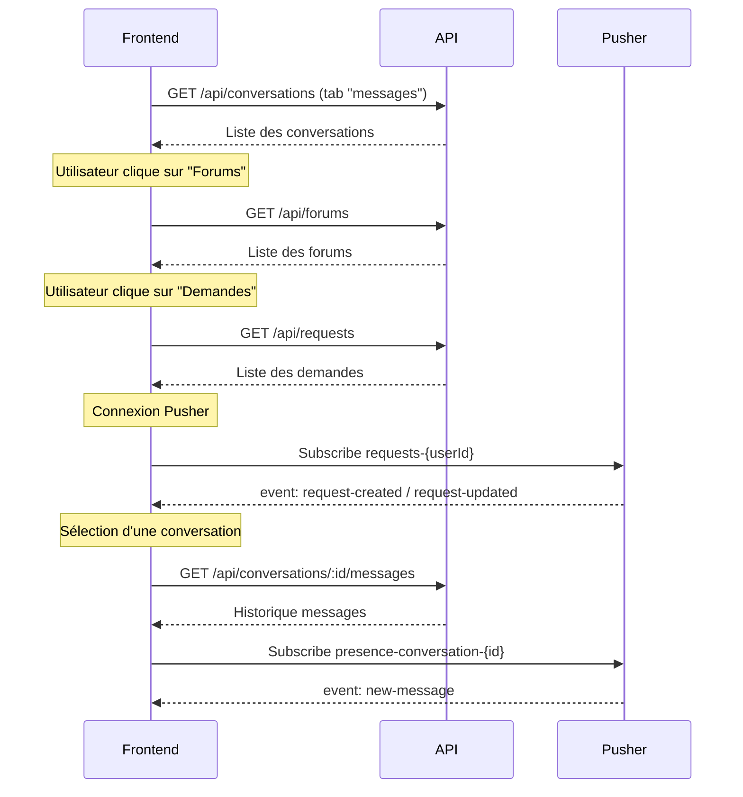

# Module 23 — Centre de Communication (Messages Hub)

> **Audience** : Équipe frontend externe  
> **Base URL** : `{{baseUrl}}` (ex: `http://localhost:3001`)  
> **Auth** : Cookie `next-auth.session-token`  
> **Pages concernées** :  
> - `/teacher/messages` → Enseignant  
> - `/student/messages` → Étudiant  
> **Real-Time** : Pusher — voir section dédiée en bas de document

---

## Vue d'ensemble

La page Messages Hub est divisée en **4 onglets** pour les deux rôles :

| Onglet | Endpoint principal | Enseignant | Étudiant |
|--------|-------------------|-----------|---------|
| `messages` | `/api/conversations` | ✅ Lire + envoyer | ✅ Lire + envoyer |
| `forums` | `/api/forums` | ✅ CRUD complet | 👁️ Lecture + posts |
| `requests` | `/api/requests` | ✅ Accepter / Refuser / Prendre en charge | ✅ Créer / Annuler |
| `assistance` | — | 🚧 Coming soon | 🚧 Coming soon |

---

## Partie 1 — Messagerie Instantanée (`tab=messages`)

### 1.1 Lister ses conversations

```
GET /api/conversations
```

**Paramètres query** :

| Paramètre | Type | Description |
|-----------|------|-------------|
| `limit` | number | Nombre max de conversations (défaut : 20) |
| `page` | number | Pagination |

**Réponse 200** :
```json
{
  "success": true,
  "data": [
    {
      "_id": "conv_id",
      "type": "DIRECT",
      "title": null,
      "participants": [
        { "_id": "user_id", "name": "Alice", "image": "/uploads/..." }
      ],
      "lastMessage": {
        "content": "Bonjour !",
        "senderId": { "name": "Alice" },
        "sentAt": "2025-05-28T10:30:00.000Z"
      }
    }
  ],
  "pagination": { "total": 5, "page": 1, "limit": 20 }
}
```

> Le composant `ConversationList` appelle cet endpoint au montage.

---

### 1.2 Créer ou récupérer une conversation directe

```
POST /api/conversations
```

**Body** :
```json
{
  "participantIds": ["userId_destinataire"],
  "type": "DIRECT"
}
```

> Si une conversation `DIRECT` entre ces deux participants existe déjà, l'API la retourne sans créer de doublon.

**Réponse 200 / 201** :
```json
{
  "success": true,
  "data": {
    "_id": "conv_id",
    "type": "DIRECT",
    "participants": [...]
  }
}
```

> Déclenché via le composant `NewConversationModal`. Après création, `onConversationCreated(conv)` est appelé pour sélectionner la conversation et rafraîchir la liste.

---

### 1.3 Lire les messages d'une conversation

```
GET /api/conversations/:id/messages
```

**Paramètres query** :

| Paramètre | Type | Description |
|-----------|------|-------------|
| `limit` | number | Messages à charger (défaut : 50) |
| `before` | ISO date | Pagination par curseur — charge les messages antérieurs |

**Réponse 200** :
```json
{
  "success": true,
  "data": {
    "messages": [
      {
        "_id": "msg_id",
        "content": "Salut !",
        "senderId": { "_id": "user_id", "name": "Alice", "image": "..." },
        "sentAt": "2025-05-28T10:30:00.000Z",
        "readBy": ["user_id_1", "user_id_2"]
      }
    ],
    "hasMore": true
  }
}
```

> Cet appel marque également les messages comme lus (`readBy`) en base.

---

### 1.4 Envoyer un message

```
POST /api/conversations/:id/messages
```

**Body** :
```json
{
  "content": "Bonjour, avez-vous vu le cours ?"
}
```

**Réponse 201** :
```json
{
  "success": true,
  "data": {
    "_id": "msg_id",
    "content": "Bonjour, avez-vous vu le cours ?",
    "senderId": "user_id",
    "sentAt": "2025-05-28T10:31:00.000Z"
  }
}
```

#### 🔌 Temps réel (Pusher)

Après l'envoi, le backend déclenche un événement Pusher :
- **Channel** : `presence-conversation-{conversationId}` ou `private-conversation-{conversationId}`
- **Event** : `new-message`
- **Payload** : `{ message: { _id, content, senderId, sentAt } }`

> Le composant `ChatWindow` s'abonne à ce channel via `useChannel` / `ChatProvider`.

---

## Partie 2 — Forums (`tab=forums`)

### 2.1 Lister les forums

```
GET /api/forums
```

**Paramètres query** :

| Paramètre | Type | Description |
|-----------|------|-------------|
| `classId` | string | Filtrer par classe |
| `type` | string | `CLASS`, `SUBJECT`, `GENERAL` |

**Réponse 200** :
```json
{
  "success": true,
  "data": [
    {
      "_id": "forum_id",
      "name": "Forum Maths S2",
      "description": "Questions sur le semestre 2",
      "type": "CLASS",
      "postCount": 12,
      "members": ["id1", "id2"],
      "lastPostAt": "2025-05-27T15:00:00.000Z",
      "relatedClass": { "name": "CMN-L1" },
      "relatedSubject": { "name": "Mathématiques" },
      "createdBy": { "_id": "teacher_id", "name": "Prof. Martin" },
      "isPrivate": false,
      "allowStudentPosts": true
    }
  ]
}
```

> Chargé à l'activation de l'onglet "Forums". Les étudiants voient uniquement les forums de leurs classes.

---

### 2.2 Détails d'un forum

```
GET /api/forums/:id
```

**Réponse 200** :
```json
{
  "success": true,
  "data": {
    "_id": "forum_id",
    "name": "Forum Maths S2",
    "description": "Questions sur le semestre 2",
    "type": "CLASS",
    "postCount": 12,
    "members": [...],
    "relatedClass": { "name": "CMN-L1" },
    "relatedSubject": { "name": "Mathématiques" },
    "createdBy": { "_id": "teacher_id", "name": "Prof. Martin" },
    "isPrivate": false,
    "allowStudentPosts": true,
    "createdAt": "2025-01-10T09:00:00.000Z",
    "lastPostAt": "2025-05-27T15:00:00.000Z"
  }
}
```

> Utilisé dans la modale "Détails" côté enseignant.

---

### 2.3 Modifier un forum _(Enseignant — créateur uniquement)_

```
PUT /api/forums/:id
```

**Body** :
```json
{
  "name": "Nouveau nom",
  "description": "Nouvelle description",
  "isPrivate": false,
  "allowStudentPosts": true
}
```

**Réponse 200** :
```json
{ "success": true, "data": { ...forum_mis_a_jour } }
```

**Erreur 403** si l'utilisateur n'est pas le créateur.

---

### 2.4 Archiver un forum _(Enseignant — créateur uniquement)_

```
DELETE /api/forums/:id
```

> Soft-delete : le forum est archivé côté serveur, il disparaît des listes mais les données sont conservées.

**Réponse 200** :
```json
{ "success": true, "message": "Forum archivé." }
```

---

### 2.5 Créer un forum _(Enseignant)_

> Accessible via `/teacher/forums/create` (lien externe depuis la page messages).

```
POST /api/forums
```

**Body** :
```json
{
  "name": "Forum Physique S1",
  "description": "Questions et discussions",
  "type": "CLASS",
  "classId": "class_id",
  "subjectId": "subject_id",
  "isPrivate": false,
  "allowStudentPosts": true,
  "requireApproval": false
}
```

---

### 2.6 Posts d'un forum

> Accessible via `/teacher/forums/:id` ou `/student/forums/:id`.

**Lister les posts** :
```
GET /api/forums/:forumId/posts?page=1&limit=20
```

**Créer un post** :
```
POST /api/forums/:forumId/posts
```
```json
{ "title": "Titre optionnel", "content": "Mon message ici" }
```

**Répondre à un post** :
```
POST /api/forums/:forumId/posts/:postId/replies
```
```json
{ "content": "Ma réponse" }
```

---

## Partie 3 — Demandes d'Assistance (`tab=requests`)

### 3.1 Lister les demandes

```
GET /api/requests
```

**Comportement par rôle** :
- **Enseignant** : reçoit toutes les demandes qui lui sont adressées + les demandes `AVAILABLE` (externes non assignées) + les demandes d'école non assignées.
- **Étudiant** : reçoit uniquement ses propres demandes.

**Paramètres query** :

| Paramètre | Type | Valeurs possibles |
|-----------|------|------------------|
| `status` | string | `PENDING`, `ACCEPTED`, `REJECTED`, `COMPLETED`, `CANCELLED`, `AVAILABLE` |
| `type` | string | `TUTORING`, `EVALUATION`, `REMEDIATION`, `ASSISTANCE` |

**Réponse 200** :
```json
{
  "success": true,
  "data": [
    {
      "_id": "req_id",
      "studentId": {
        "_id": "student_id",
        "name": "Bob",
        "image": "...",
        "studentCode": "STU-001"
      },
      "teacherId": { "_id": "teacher_id", "name": "Prof. Martin" },
      "type": "TUTORING",
      "subject": { "name": "Mathématiques" },
      "title": "Aide sur les intégrales",
      "message": "Je bloque sur les intégrales doubles...",
      "priority": "MEDIUM",
      "status": "PENDING",
      "teacherType": "SCHOOL",
      "payment": { "amount": 0, "currency": "XAF", "status": "PENDING" },
      "createdAt": "2025-05-28T08:00:00.000Z"
    }
  ]
}
```

#### Logique d'affichage côté Enseignant

| Condition | Badge affiché | Action disponible |
|-----------|--------------|------------------|
| `status=AVAILABLE` + `teacherType=EXTERNAL` | `Externe • {montant}` | Bouton **Prendre en charge** |
| `status=PENDING` + `teacherType=SCHOOL` + pas de `teacherId` | `École • Disponible` | Bouton **Prendre en charge** |
| `status=PENDING` + assigné au prof connecté | — | Boutons **Accepter** / **Refuser** |
| Autres statuts | Badge statut | — |

---

### 3.2 Créer une demande _(Étudiant)_

```
POST /api/requests
```

**Body** :
```json
{
  "type": "TUTORING",
  "title": "Aide sur les équations du second degré",
  "message": "Je ne comprends pas le discriminant...",
  "priority": "MEDIUM",
  "teacherId": "teacher_id"
}
```

| Champ | Type | Requis | Valeurs |
|-------|------|--------|---------|
| `type` | string | ✅ | `TUTORING`, `EVALUATION`, `REMEDIATION`, `ASSISTANCE` |
| `title` | string | ✅ | — |
| `message` | string | ✅ | — |
| `priority` | string | — | `LOW`, `MEDIUM`, `HIGH`, `URGENT` (défaut : `MEDIUM`) |
| `teacherId` | string | — | ID de l'enseignant ciblé |
| `subjectId` | string | — | ID de la matière |
| `teacherType` | string | — | `SCHOOL` (défaut) ou `EXTERNAL` |

**Réponse 201** :
```json
{ "success": true, "data": { ...demande_créée } }
```

---

### 3.3 Accepter / Refuser une demande _(Enseignant)_

```
PUT /api/requests/:id
```

**Accepter** :
```json
{
  "status": "ACCEPTED",
  "responseMessage": "Je serai disponible jeudi à 14h."
}
```

**Refuser** :
```json
{
  "status": "REJECTED",
  "responseMessage": "Je ne suis pas disponible cette semaine."
}
```

**Réponse 200** :
```json
{ "success": true, "data": { ...demande_mise_a_jour } }
```

---

### 3.4 Prendre en charge une demande _(Enseignant — demandes non assignées)_

```
POST /api/requests/:id/claim
```

> Utilisé pour les demandes `AVAILABLE` (externes) ou les demandes d'école sans `teacherId`. Assigne automatiquement l'enseignant connecté.

**Réponse 200** :
```json
{ "success": true, "data": { ...demande_mise_a_jour } }
```

---

### 3.5 Annuler une demande _(Étudiant)_

```
DELETE /api/requests/:id
```

> Disponible uniquement si `status === "PENDING"`.

**Réponse 200** :
```json
{ "success": true }
```

---

### 3.6 Messagerie du ticket d'assistance

Une fois une demande acceptée, un fil de messages est disponible (composant `TicketChat`).

**Lire les messages du ticket** :
```
GET /api/requests/:id/messages
```

**Réponse 200** :
```json
{
  "success": true,
  "data": [
    {
      "_id": "msg_id",
      "senderId": { "_id": "user_id", "name": "Prof. Martin" },
      "content": "Bonjour, on peut se voir jeudi ?",
      "sentAt": "2025-05-28T09:00:00.000Z"
    }
  ]
}
```

**Envoyer un message dans le ticket** :
```
POST /api/requests/:id/messages
```
```json
{ "content": "Oui, jeudi à 14h c'est parfait." }
```

---

## Partie 4 — Intégration Temps Réel (Pusher)

La page Messages Hub est enveloppée dans `<PusherProvider>`. Voici les channels à écouter :

### Channels et événements

| Channel | Événement | Déclencheur | Action frontend |
|---------|-----------|-------------|----------------|
| `presence-conversation-{id}` | `new-message` | Nouveau message dans une conversation | Ajouter le message au fil |
| `private-conversation-{id}` | `new-message` | Nouveau message | Ajouter le message au fil |
| `requests-{userId}` | `request-created` | Nouvelle demande reçue (enseignant) | Ajouter la demande en tête de liste |
| `requests-{userId}` | `request-updated` | Statut d'une demande modifié (étudiant) | Mettre à jour la demande dans la liste |

### Exemple d'abonnement (hook `useChannel`)

```typescript
// Enseignant — nouvelle demande reçue
useChannel(
  session?.user?.id ? `requests-${session.user.id}` : null,
  'request-created',
  (data) => {
    setRequests(prev => [data.request, ...prev])
  }
)

// Étudiant — mise à jour d'une demande
useChannel(
  session?.user?.id ? `requests-${session.user.id}` : null,
  'request-updated',
  (data) => {
    setRequests(prev => prev.map(r => r._id === data.request._id ? data.request : r))
  }
)
```

---

## Partie 5 — Récupérer les enseignants _(Étudiant, formulaire nouvelle demande)_

```
GET /api/teachers
```

> Utilisé pour peupler le `<select>` "Enseignant" dans le formulaire de nouvelle demande.

**Réponse 200** :
```json
{
  "success": true,
  "data": [
    {
      "_id": "teacher_id",
      "name": "Prof. Martin",
      "image": "...",
      "subjects": [{ "name": "Mathématiques" }]
    }
  ]
}
```

---

## Codes d'erreur courants

| Code | Signification |
|------|---------------|
| `401` | Non authentifié — rediriger vers `/login` |
| `403` | Opération interdite (ex: modifier un forum dont on n'est pas créateur) |
| `404` | Ressource introuvable |
| `409` | Conflit (ex: demande déjà prise en charge) |

---

## Flux complet — Séquence d'initialisation de la page


