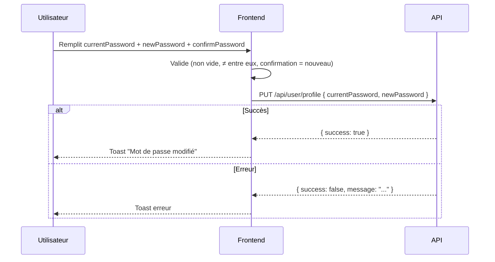
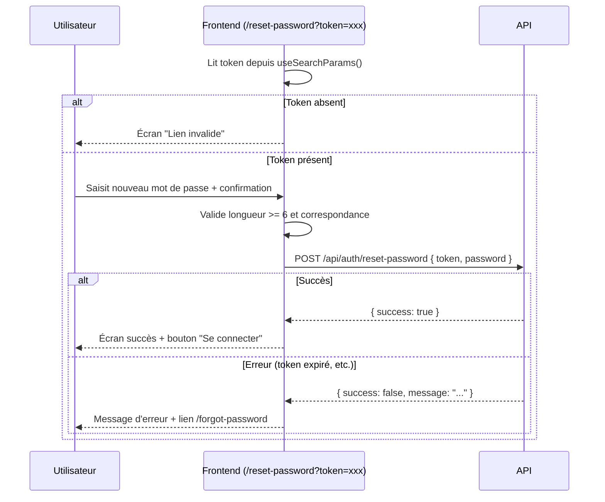

# Module 24 — Paramètres du Compte & Réinitialisation du Mot de Passe

> **Audience** : Équipe frontend externe  
> **Base URL** : `{{baseUrl}}` (ex: `http://localhost:3001`)  
> **Auth** : Cookie `next-auth.session-token`  
> **Pages concernées** :  
> - `/settings` → Tous les rôles  
> - `/reset-password?token=...` → Public (non authentifié)

---

## Vue d'ensemble

### Page `/settings` — Onglets disponibles

| Onglet | Valeur | Rôles | Endpoints |
|--------|--------|-------|-----------|
| Général | `general` | Tous | `GET /api/user/profile`, `POST /api/user/profile/avatar`, `PUT /api/user/profile` |
| Sécurité | `security` | Tous | `PUT /api/user/profile`, `POST /api/user/email/change` |
| Mes achats | `purchases` | Tous | `GET /api/invoices?type=PURCHASE_RECEIPT` |
| Mes gains | `earnings` | **Enseignant uniquement** | `GET /api/seller/wallet`, `GET /api/seller/payment-info`, `PUT /api/seller/payment-info`, `DELETE /api/seller/payment-info`, `POST /api/seller/payout`, `GET /api/seller/payout`, `GET /api/invoices?type=EARNINGS_STATEMENT` |
| Apparence | `appearance` | Tous | — (coming soon) |
| Notifications | `notifications` | Tous | — (coming soon) |

> L'onglet **Mes gains** n'est affiché que si `session.user.role === "TEACHER"`.

---

## Partie 1 — Onglet Général (Profil)

### 1.1 Charger le profil

```
GET /api/user/profile
```

**Auth requise** : Oui

**Réponse 200** :
```json
{
  "user": {
    "_id": "user_id",
    "name": "Alice Dupont",
    "email": "alice@exemple.com",
    "image": "/uploads/avatars/alice.jpg",
    "role": "TEACHER"
  }
}
```

> Chargé au montage pour récupérer l'URL de l'avatar stocké côté serveur.  
> L'URL relative est transformée en URL absolue : `${NEXT_PUBLIC_API_URL}${path}`.

---

### 1.2 Mettre à jour le nom

```
PUT /api/user/profile
```

**Body** :
```json
{ "name": "Alice Martin" }
```

**Réponse 200** :
```json
{
  "success": true,
  "user": { "_id": "...", "name": "Alice Martin", "email": "...", "image": "..." }
}
```

> Après succès, `update()` de NextAuth est appelé pour rafraîchir la session côté client.

---

### 1.3 Changer la photo de profil (avatar)

```
POST /api/user/profile/avatar
Content-Type: multipart/form-data
```

**Body (FormData)** :

| Champ | Type | Contraintes |
|-------|------|-------------|
| `avatar` | File | Formats : `image/jpeg`, `image/png`, `image/webp` — Max : **2 MB** |

**Validation côté frontend** (avant envoi) :
- Format autorisé : JPG, PNG, WEBP uniquement
- Taille maximale : 2 MB

**Réponse 200** :
```json
{
  "success": true,
  "user": { "image": "/uploads/avatars/alice-new.jpg" }
}
```

> L'URL retournée est relative. Construire l'URL absolue :
> ```typescript
> const absoluteUrl = `${process.env.NEXT_PUBLIC_API_URL}${res.user.image}`
> ```

**Erreurs courantes** :

| Code | Message | Cause |
|------|---------|-------|
| `400` | Format non supporté | Fichier hors JPG/PNG/WEBP |
| `413` | Image trop lourde | Fichier > 2 MB |

---

## Partie 2 — Onglet Sécurité

### 2.1 Changer le mot de passe

```
PUT /api/user/profile
```

**Body** :
```json
{
  "currentPassword": "ancien_mdp",
  "newPassword": "nouveau_mdp_fort"
}
```

**Validations frontend avant envoi** :
- `currentPassword` ≠ vide
- `newPassword` ≠ vide
- `newPassword` ≠ `currentPassword`
- `confirmPassword === newPassword`

**Réponse 200** :
```json
{ "success": true }
```

**Erreur 400** :
```json
{ "success": false, "message": "Mot de passe actuel incorrect" }
```

---

### 2.2 Changer l'adresse email

```
POST /api/user/email/change
```

> Envoie un email de confirmation à la nouvelle adresse. L'utilisateur doit cliquer sur le lien pour valider le changement. Il devra se reconnecter après.

**Body** :
```json
{
  "newEmail": "nouvelle@exemple.com",
  "password": "mot_de_passe_actuel"
}
```

**Validations frontend** :
- `newEmail` ≠ email actuel
- `password` non vide

**Réponse 200** :
```json
{
  "success": true,
  "message": "Email de confirmation envoyé."
}
```

> Après succès, afficher un bandeau de confirmation indiquant que le lien expire dans **1 heure**.

**Erreurs courantes** :

| Code | Message | Cause |
|------|---------|-------|
| `400` | Email déjà utilisé | L'adresse cible est prise |
| `401` | Mot de passe incorrect | `password` invalide |

---

## Partie 3 — Onglet Mes Achats (Tous rôles)

### 3.1 Lister les factures d'achat

```
GET /api/invoices?type=PURCHASE_RECEIPT&page=1&limit=10
```

**Paramètres query** :

| Paramètre | Type | Description |
|-----------|------|-------------|
| `type` | string | **Fixe** : `PURCHASE_RECEIPT` |
| `page` | number | Page courante (défaut : 1) |
| `limit` | number | Éléments par page (défaut : 10) |

**Réponse 200** :
```json
{
  "success": true,
  "data": {
    "invoices": [
      {
        "_id": "inv_id",
        "invoiceNumber": "INV-2025-0042",
        "productDescription": "Abonnement Premium — Mai 2025",
        "issuedAt": "2025-05-01T00:00:00.000Z",
        "total": 2500,
        "currency": "XAF",
        "status": "SENT"
      }
    ],
    "total": 3,
    "totalPages": 1,
    "page": 1
  }
}
```

**Statuts de facture** :

| Valeur | Label affiché | Couleur |
|--------|--------------|---------|
| `ISSUED` | Émise | Bleu |
| `SENT` | Envoyée | Vert |
| `VOIDED` | Annulée | Rouge |

---

### 3.2 Voir une facture en HTML

```
GET /api/invoices/:invoiceNumber/html
```

> Retourne le HTML brut de la facture. Ouvrir dans un nouvel onglet :
> ```typescript
> window.open(`${API_BASE_URL}/api/invoices/${invoiceNumber}/html`, '_blank')
> ```

---

### 3.3 Télécharger en PDF (impression)

> Pas d'endpoint PDF direct. Le frontend charge le HTML, l'injecte dans un `<iframe>` caché et déclenche `iframe.contentWindow.print()`.

```typescript
const url = `${API_BASE_URL}/api/invoices/${invoiceNumber}/html`
const res = await fetch(url, { credentials: 'include' })
const html = await res.text()
// → injecter dans iframe et appeler print()
```

---

## Partie 4 — Onglet Mes Gains _(Enseignant uniquement)_

> Cet onglet est masqué pour les étudiants (`session.user.role !== "TEACHER"`).

### 4.1 Consulter le wallet

```
GET /api/seller/wallet
```

**Réponse 200** :
```json
{
  "success": true,
  "data": {
    "balance": 12500,
    "totalEarned": 35000,
    "totalWithdrawn": 22500,
    "currency": "XAF",
    "lastUpdatedAt": "2025-05-27T20:00:00.000Z"
  }
}
```

| Champ | Description |
|-------|-------------|
| `balance` | Solde disponible pour virement |
| `totalEarned` | Total cumulé depuis la création du compte |
| `totalWithdrawn` | Total des virements effectués |

---

### 4.2 Lire la configuration Mobile Money (virement automatique)

```
GET /api/seller/payment-info
```

**Réponse 200** :
```json
{
  "success": true,
  "data": {
    "mobileMoneyPhone": "+237690000000",
    "mobileMoneyProvider": "orange",
    "mobileMoneyName": "Alice DUPONT"
  }
}
```

> `data` peut être `null` si aucune configuration n'est définie.  
> Si `null`, afficher un avertissement invitant à configurer le virement automatique.

---

### 4.3 Configurer / Modifier le Mobile Money

```
PUT /api/seller/payment-info
```

**Body** :
```json
{
  "mobileMoneyPhone": "+237690000000",
  "mobileMoneyProvider": "orange",
  "mobileMoneyName": "Alice DUPONT"
}
```

| Champ | Type | Valeurs |
|-------|------|---------|
| `mobileMoneyPhone` | string | Format international (+237...) |
| `mobileMoneyProvider` | string | `orange`, `mtn`, `other` |
| `mobileMoneyName` | string | Nom exact enregistré chez l'opérateur |

**Réponse 200** :
```json
{ "success": true, "data": { ...config_sauvegardée } }
```

---

### 4.4 Désactiver le virement automatique

```
DELETE /api/seller/payment-info
```

> Les gains restent dans le wallet et nécessiteront un virement manuel.

**Réponse 200** :
```json
{ "success": true, "message": "Virement automatique désactivé." }
```

---

### 4.5 Demander un virement manuel (payout)

```
POST /api/seller/payout
```

**Body** :
```json
{
  "amount": 5000,
  "currency": "XAF",
  "recipientPhone": "+237690000000",
  "recipientName": "Alice DUPONT",
  "recipientProvider": "orange"
}
```

**Règles de validation** :
- `amount` minimum : **500 XAF**
- `amount` maximum : solde disponible (`wallet.balance`)
- `recipientPhone` et `recipientName` obligatoires

**Réponse 200** :
```json
{ "success": true, "data": { ...payout_créé } }
```

**Erreur 400** :
```json
{ "success": false, "message": "Solde insuffisant" }
```

---

### 4.6 Historique des virements

```
GET /api/seller/payout?limit=5
```

**Paramètres query** :

| Paramètre | Type | Description |
|-----------|------|-------------|
| `page` | number | Pagination |
| `limit` | number | Éléments par page |

**Réponse 200** :
```json
{
  "success": true,
  "data": [
    {
      "_id": "payout_id",
      "amount": 5000,
      "currency": "XAF",
      "recipientPhone": "+237690000000",
      "recipientName": "Alice DUPONT",
      "recipientProvider": "orange",
      "status": "COMPLETED",
      "createdAt": "2025-05-20T14:00:00.000Z"
    }
  ]
}
```

**Statuts de virement** :

| Valeur | Label | Icône |
|--------|-------|-------|
| `PENDING` | En attente | Clock |
| `PROCESSING` | En cours | Loader (spin) |
| `COMPLETED` | Effectué | CheckCircle |
| `FAILED` | Échoué | AlertCircle |

---

### 4.7 Relevés de ventes (EARNINGS_STATEMENT)

```
GET /api/invoices?type=EARNINGS_STATEMENT&page=1&limit=10
```

> Même structure de réponse que les factures d'achat (section 3.1).  
> Un relevé est généré pour chaque livre vendu. Le montant affiché est positif (gain).

---

## Partie 5 — Page Reset Password (`/reset-password?token=...`)

> Cette page est **publique** (non authentifiée). Elle est accessible via le lien envoyé par email lors d'une demande de réinitialisation.

### 5.1 Soumettre le nouveau mot de passe

```
POST /api/auth/reset-password
```

**Paramètre URL** : `?token=<token_de_l_email>`

**Body** :
```json
{
  "token": "eyJhbGciOiJ...",
  "password": "nouveau_mot_de_passe"
}
```

**Validations frontend** :
- `token` présent dans l'URL (`useSearchParams().get("token")`) — sinon afficher l'écran "Lien invalide"
- `password.length >= 6`
- `password === confirmPassword`

**Réponse 200** :
```json
{ "success": true }
```

**Erreurs** :

| Code | Message | Cause |
|------|---------|-------|
| `400` | Token invalide ou expiré | Token inexistant ou TTL dépassé |
| `400` | Mot de passe trop court | `password.length < 6` |

### 5.2 États de l'interface

| État | Déclencheur | Affichage |
|------|-------------|-----------|
| Lien invalide | `token === null` au chargement | Icône erreur + lien vers `/forgot-password` |
| Formulaire | État initial | Champs mot de passe + indicateurs de validation |
| Succès | `data.success === true` | Icône succès + bouton "Se connecter" → `/login` |
| Erreur | `data.success === false` | Message d'erreur inline en rouge |

---

## Codes d'erreur courants

| Code | Signification |
|------|---------------|
| `400` | Données invalides (format, règles métier) |
| `401` | Non authentifié ou mauvais mot de passe |
| `403` | Opération interdite pour ce rôle |
| `413` | Fichier trop volumineux |

---

## Flux — Changement de mot de passe (Settings)



---

## Flux — Reset Password (page publique)


