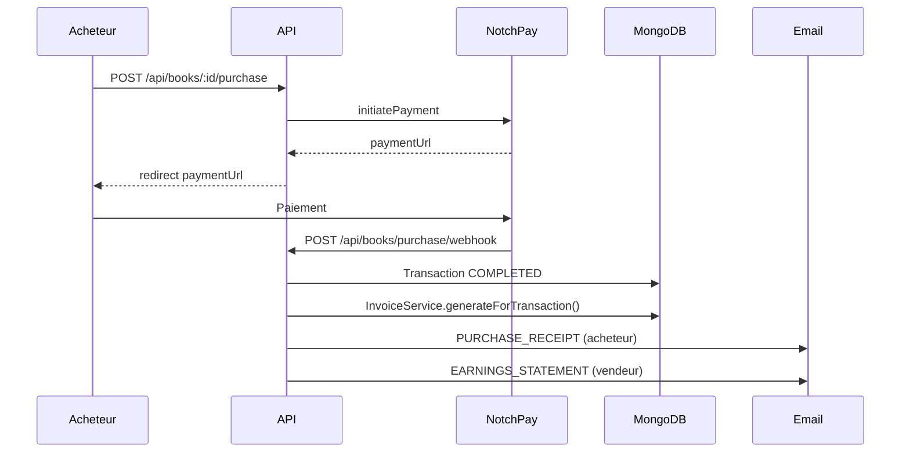
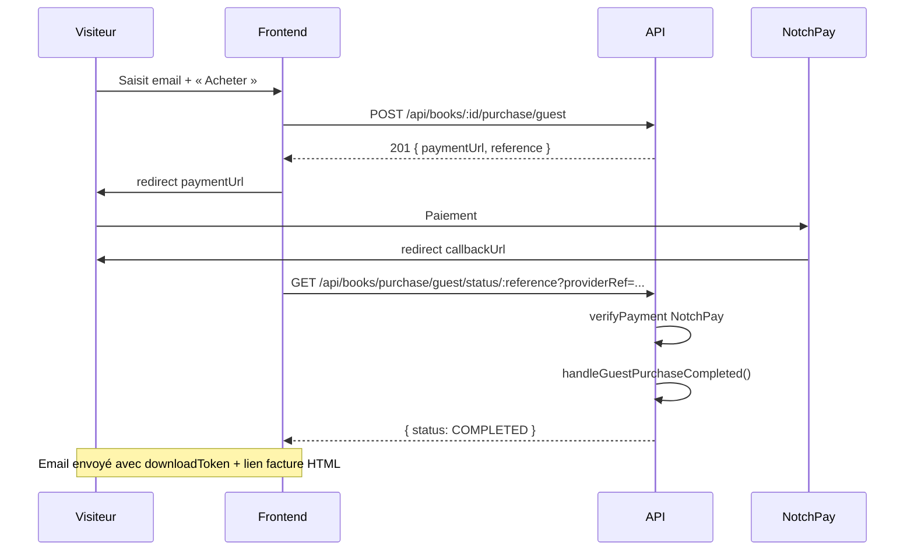

# Module — Facturation & Paiements (Livres, Vendeurs)

> **Audience** : Équipe frontend (web, mobile Flutter, intégrations externes)  
> **Base URL backend** : `{{baseUrl}}` (ex: `http://localhost:3001` · prod `https://xkorienta.com/xkorienta/backend`)  
> **Auth** : Cookie session NextAuth (`credentials: 'include'`) pour les routes protégées  
> **Dernière mise à jour** : juin 2026

---

## En bref

Après chaque achat de livre (compte ou invité), le backend génère automatiquement :

| Type facture | Destinataire | Usage UI |
|---|---|---|
| `PURCHASE_RECEIPT` | Acheteur | Reçu d'achat — historique « Mes achats » |
| `EARNINGS_STATEMENT` | Vendeur (enseignant) | Relevé de gains — dashboard vendeur |
| `SCHOOL_INSCRIPTION` | Établissement | Facture inscription scolaire (module inscriptions) |

Les factures sont consultables en **JSON** ou **HTML** (impression / export PDF côté client).

---

## Table des matières

1. [Enums & types (kit d'implémentation)](#1-enums--types-kit-dimplémentation)
2. [Vue d'ensemble des flux](#2-vue-densemble-des-flux)
3. [Flux acheteur avec compte](#3-flux-acheteur-avec-compte)
4. [Flux acheteur invité](#4-flux-acheteur-invité)
5. [Commissions & virements vendeurs](#5-commissions--virements-vendeurs)
6. [Accès aux factures](#6-accès-aux-factures)
7. [API Reference](#7-api-reference)
8. [Kit d'intégration frontend](#8-kit-dintégration-frontend)
9. [Variables d'environnement](#9-variables-denvironnement)

---

## 1. Enums & types (kit d'implémentation)

### Enums

```typescript
type InvoiceType =
  | 'PURCHASE_RECEIPT'
  | 'EARNINGS_STATEMENT'
  | 'SCHOOL_INSCRIPTION'

type InvoiceStatus = 'ISSUED' | 'SENT' | 'VOIDED'

type Currency = 'XAF' | 'EUR' | 'USD'

type PayoutStatus = 'PENDING' | 'PROCESSING' | 'COMPLETED' | 'FAILED'

type MobileMoneyProvider = 'orange' | 'mtn' | 'other'

type GuestPurchaseStatus = 'PENDING' | 'COMPLETED' | 'FAILED'
```

### Modèle Invoice (réponse API)

```typescript
interface Invoice {
  _id: string
  invoiceNumber: string          // INV-2026-000042
  type: InvoiceType
  recipientId?: string
  transactionId?: string
  guestPurchaseId?: string
  isGuestPurchase?: boolean
  paymentReference: string
  productType: string
  productDescription: string
  subtotal: number
  discountAmount: number
  discountPercent: number
  total: number
  currency: Currency
  platformCommission?: number
  sellerAmount?: number
  buyerName: string
  buyerEmail?: string
  sellerName?: string
  status: InvoiceStatus
  issuedAt: string
  sentAt?: string
  createdAt: string
  updatedAt: string
}
```

### Pagination

```typescript
interface PaginatedInvoices {
  invoices: Invoice[]
  total: number
  page: number
  limit: number
  totalPages: number
}
```

### Wallet vendeur

```typescript
interface SellerWallet {
  balance: number
  totalEarned: number
  totalWithdrawn: number
  currency: Currency
  lastUpdatedAt: string | null
}
```

### Payout

```typescript
interface Payout {
  _id: string
  userId: string
  amount: number
  currency: Currency
  recipientPhone: string
  recipientName: string
  recipientProvider: MobileMoneyProvider
  status: PayoutStatus
  payoutReference: string
  providerTransferId?: string
  failureReason?: string
  processedAt?: string
}
```

---

## 2. Vue d'ensemble des flux

```
Acheteur avec compte  → Transaction → InvoiceService.generateForTransaction()
Acheteur invité       → GuestPurchase → InvoiceService.generateForGuestPurchase()
```

Les deux parcours passent par **NotchPay** (Mobile Money / carte). La facturation est déclenchée **après confirmation du paiement** (webhook ou vérification statut invité).

---

## 3. Flux acheteur avec compte



**Commission :**
```
sellerAmount       = finalAmount × (1 - commissionRate / 100)
platformCommission = finalAmount - sellerAmount
```
(`commissionRate` défaut : 5 % — voir `BookConfig`)

---

## 4. Flux acheteur invité



### Points clés côté client

1. **`callbackUrl` optionnel** — si absent, le backend utilise `{APP_URL}/bibliotheque/:id?payment=return&mode=guest`
2. Après retour NotchPay, extraire `trxref` / `reference` et `providerRef` des query params
3. Poller `GET .../guest/status/:reference?providerRef=...` jusqu'à `status !== 'PENDING'`
4. Le **téléchargement** et la **facture HTML** utilisent le `downloadToken` reçu par email (valide 7 jours)

---

## 5. Commissions & virements vendeurs

### Versement automatique à chaque vente

```
Vendeur a paymentInfo.mobileMoneyPhone ?
  ├── OUI → PayoutService.transferImmediately() (NotchPay transfer)
  └── NON → WalletService.creditSeller() (solde interne)
```

### Configuration mobile money (profil enseignant)

```typescript
interface PaymentInfo {
  mobileMoneyPhone: string      // "+237699123456"
  mobileMoneyProvider: MobileMoneyProvider
  mobileMoneyName: string
}
```

| `mobileMoneyProvider` | Canal NotchPay |
|---|---|
| `orange` | `cm.orange` |
| `mtn` | `cm.mtn` |
| `other` | `cm.mobile` |

### Virement manuel (wallet → Mobile Money)

`POST /api/seller/payout` — le vendeur demande un retrait depuis son solde wallet.

---

## 6. Accès aux factures

### Utilisateur connecté

| Action | Endpoint |
|---|---|
| Liste reçus d'achat | `GET /api/invoices?type=PURCHASE_RECEIPT&page=1` |
| Liste relevés gains | `GET /api/invoices?type=EARNINGS_STATEMENT&page=1` |
| Détail JSON | `GET /api/invoices/:invoiceNumber` |
| HTML (impression) | `GET /api/invoices/:invoiceNumber/html` |

Règle : `invoice.recipientId === session.user.id` (admins `DG_M4M`, `TECH_SUPPORT` : accès étendu).

### Acheteur invité (sans session)

```
GET /api/invoices/:invoiceNumber/html?token=<downloadToken>
```

Validation : token lié à la `GuestPurchase` complétée + `invoice.guestPurchaseId` correspondant.

### Téléchargement livre invité

```
GET /api/books/guest-download?token=<downloadToken>
```

Réponse : fichier binaire (`application/pdf` ou `application/epub+zip`).  
Erreurs : `400` token manquant · `403` invalide/expiré/limité.

---

## 7. API Reference

### 7.1 Factures

#### `GET {{baseUrl}}/api/invoices`

**Auth** : Session

| Query | Type | Défaut | Description |
|---|---|---|---|
| `type` | `InvoiceType` | — | Filtre optionnel |
| `page` | `number` | `1` | Page |
| `limit` | `number` | `20` | Max 50 |

**Réponse 200**

```json
{
  "success": true,
  "data": {
    "invoices": [
      {
        "invoiceNumber": "INV-2026-000042",
        "type": "PURCHASE_RECEIPT",
        "total": 2500,
        "currency": "XAF",
        "productDescription": "Mathématiques Tle C",
        "issuedAt": "2026-06-01T10:00:00.000Z",
        "status": "SENT"
      }
    ],
    "total": 12,
    "page": 1,
    "limit": 20,
    "totalPages": 1
  }
}
```

#### `GET {{baseUrl}}/api/invoices/:invoiceNumber`

**Auth** : Session (destinataire ou admin)

**Réponse 200** : `{ success: true, data: Invoice }`  
**404** : facture introuvable ou accès refusé

#### `GET {{baseUrl}}/api/invoices/:invoiceNumber/html`

**Auth** : Session **ou** `?token=<downloadToken>` (invité)

**Réponse 200** : `Content-Type: text/html` — document imprimable  
**401** / **403** / **404** : texte plain (pas JSON)

---

### 7.2 Achat invité

#### `POST {{baseUrl}}/api/books/:id/purchase/guest`

**Auth** : Aucune

**Body**

```json
{
  "email": "acheteur@example.com",
  "callbackUrl": "https://xkorienta.com/bibliotheque/abc123?payment=return&mode=guest"
}
```

| Champ | Requis | Description |
|---|---|---|
| `email` | ✅ | Email acheteur (reçu facture + lien téléchargement) |
| `callbackUrl` | ❌ | URL retour NotchPay — défaut généré côté serveur |

**Réponse 201**

```json
{
  "success": true,
  "data": {
    "paymentUrl": "https://pay.notchpay.co/pay/...",
    "reference": "GUEST-E2C51E-8CBD8997",
    "finalAmount": 2500,
    "currency": "XAF"
  }
}
```

**Erreurs** : `400` email invalide / livre gratuit · `404` livre · `409` déjà acheté

#### `GET {{baseUrl}}/api/books/purchase/guest/status/:reference`

**Auth** : Aucune

| Query | Description |
|---|---|
| `providerRef` | Référence NotchPay (`trxref` du retour paiement) — recommandé |

**Réponse 200**

```json
{
  "success": true,
  "data": {
    "reference": "GUEST-E2C51E-8CBD8997",
    "status": "COMPLETED",
    "email": "acheteur@example.com"
  }
}
```

`status` : `PENDING` | `COMPLETED` | `FAILED`  
Si `PENDING`, l'API tente une vérification NotchPay à la volée.

#### `GET {{baseUrl}}/api/books/guest-download?token=`

**Auth** : Token uniquement — fichier binaire en réponse.

---

### 7.3 Wallet & virements vendeur

#### `GET {{baseUrl}}/api/seller/wallet`

**Auth** : Session (enseignant)

```json
{
  "success": true,
  "data": {
    "balance": 15000,
    "totalEarned": 45000,
    "totalWithdrawn": 30000,
    "currency": "XAF",
    "lastUpdatedAt": "2026-06-01T..."
  }
}
```

Sans vente : `balance: 0`, `lastUpdatedAt: null`.

#### `GET {{baseUrl}}/api/seller/earnings`

**Auth** : Session — alias de `GET /api/invoices?type=EARNINGS_STATEMENT`.

#### `POST {{baseUrl}}/api/seller/payout`

**Auth** : Session

```json
{
  "amount": 5000,
  "currency": "XAF",
  "recipientPhone": "+237699123456",
  "recipientName": "Jean Dupont",
  "recipientProvider": "mtn"
}
```

**Réponse 201** : `{ success: true, data: Payout }`  
**400** : solde insuffisant / validation Zod

#### `GET {{baseUrl}}/api/seller/payout`

**Auth** : Session — historique paginé (`?page=1&limit=20`).

---

## 8. Kit d'intégration frontend

### 8.1 Liste des factures (écran « Mes achats »)

```typescript
async function fetchPurchaseReceipts(
  baseUrl: string,
  page = 1
): Promise<PaginatedInvoices> {
  const res = await fetch(
    `${baseUrl}/api/invoices?type=PURCHASE_RECEIPT&page=${page}&limit=20`,
    { credentials: 'include' }
  )
  if (!res.ok) throw new Error('Impossible de charger les factures')
  const json = await res.json()
  return json.data
}
```

### 8.2 Afficher / imprimer une facture

**Utilisateur connecté** — ouvrir dans un nouvel onglet ou WebView :

```typescript
const url = `${baseUrl}/api/invoices/${invoiceNumber}/html`
// fetch avec credentials: 'include' puis afficher le HTML
// ou window.open(url) si même domaine / cookies partagés
```

**Invité** (token depuis email) :

```typescript
const url = `${baseUrl}/api/invoices/${invoiceNumber}/html?token=${downloadToken}`
```

Pour export PDF mobile : rendre le HTML puis utiliser le module d'impression natif (share / print).

### 8.3 Flow checkout invité complet

```typescript
async function guestCheckout(
  baseUrl: string,
  bookId: string,
  email: string,
  callbackUrl: string
) {
  const res = await fetch(`${baseUrl}/api/books/${bookId}/purchase/guest`, {
    method: 'POST',
    headers: { 'Content-Type': 'application/json' },
    body: JSON.stringify({ email, callbackUrl }),
  })
  const json = await res.json()
  if (!res.ok) throw new Error(json.message)
  window.location.href = json.data.paymentUrl
}

async function pollGuestStatus(
  baseUrl: string,
  reference: string,
  providerRef?: string
): Promise<'COMPLETED' | 'FAILED' | 'PENDING'> {
  const qs = providerRef ? `?providerRef=${encodeURIComponent(providerRef)}` : ''
  const res = await fetch(
    `${baseUrl}/api/books/purchase/guest/status/${reference}${qs}`
  )
  const json = await res.json()
  return json.data.status
}
```

**Page retour paiement** : lire `trxref` / `reference` et `providerRef` depuis l'URL NotchPay, poller toutes les 2–3 s jusqu'à `COMPLETED` ou `FAILED`, afficher message « Vérifiez votre email ».

### 8.4 Dashboard vendeur

```typescript
// Solde
const walletRes = await fetch(`${baseUrl}/api/seller/wallet`, { credentials: 'include' })

// Relevés de gains (factures)
const earningsRes = await fetch(`${baseUrl}/api/seller/earnings?page=1`, { credentials: 'include' })

// Demande de virement
await fetch(`${baseUrl}/api/seller/payout`, {
  method: 'POST',
  credentials: 'include',
  headers: { 'Content-Type': 'application/json' },
  body: JSON.stringify({
    amount: 5000,
    currency: 'XAF',
    recipientPhone: '+237699123456',
    recipientName: 'Jean Dupont',
    recipientProvider: 'mtn',
  }),
})
```

### 8.5 États UI recommandés

| Écran | États |
|---|---|
| Liste factures | `loading` · `empty` · `error` · `data` |
| Checkout invité | `form` · `initiating` · `redirecting` · `polling` · `success` · `failed` |
| Wallet vendeur | `loading` · `zero-balance` · `data` · `payout-pending` |

---

## 9. Variables d'environnement

| Variable | Rôle |
|---|---|
| `NOTCHPAY_PUBLIC_KEY` | Initiation paiements |
| `NOTCHPAY_SECRET_KEY` | Transfers vendeurs |
| `NOTCHPAY_HASH` | Signature webhook HMAC SHA-256 |
| `NEXT_PUBLIC_APP_URL` | Liens emails + `callbackUrl` par défaut |
| `NEXTAUTH_URL` | Fallback URL app |

---

## Liens

| Module | Sujet |
|---|---|
| **25** | Abonnements & feature flags (plans premium) |
| **29** | Inscriptions établissements (`SCHOOL_INSCRIPTION`) |
